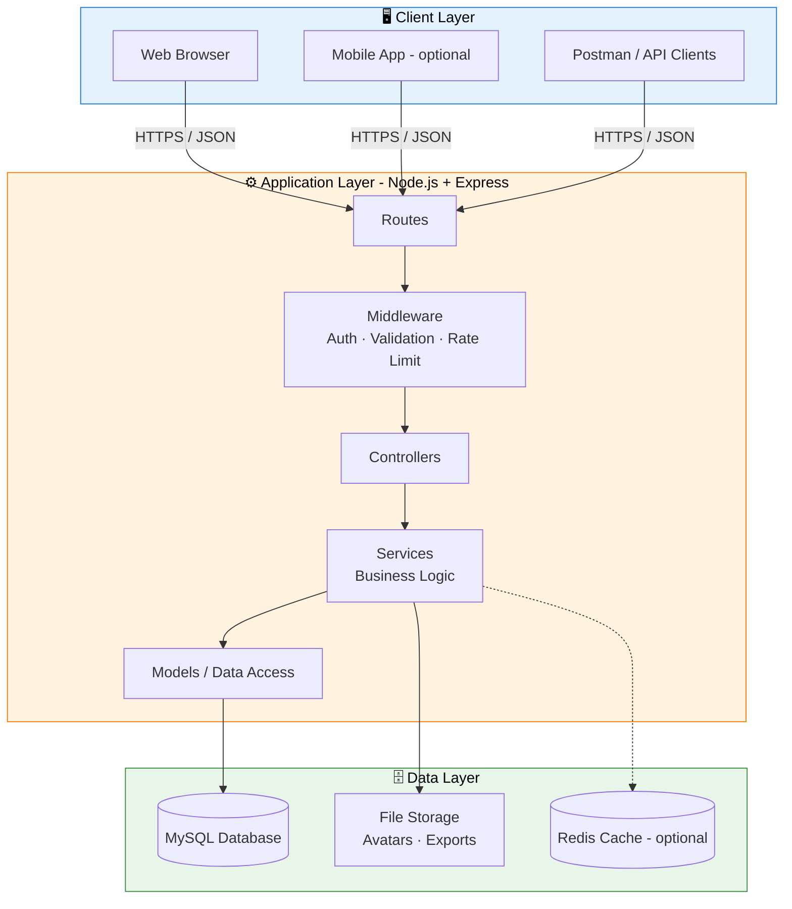
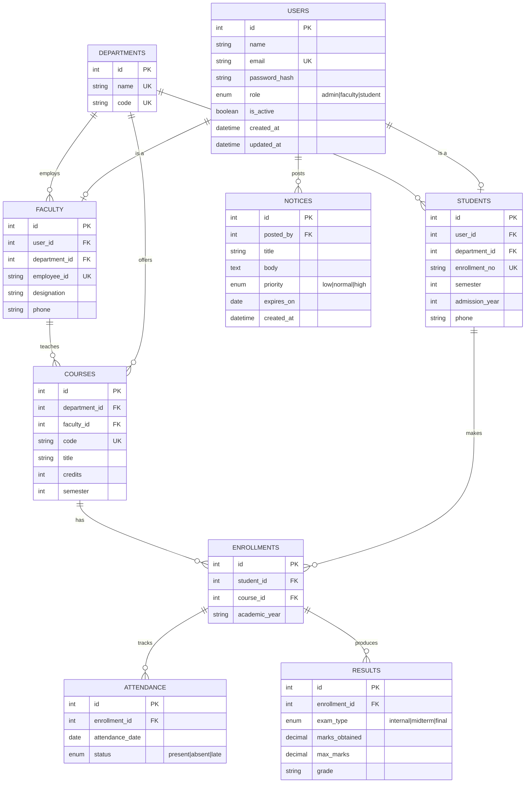
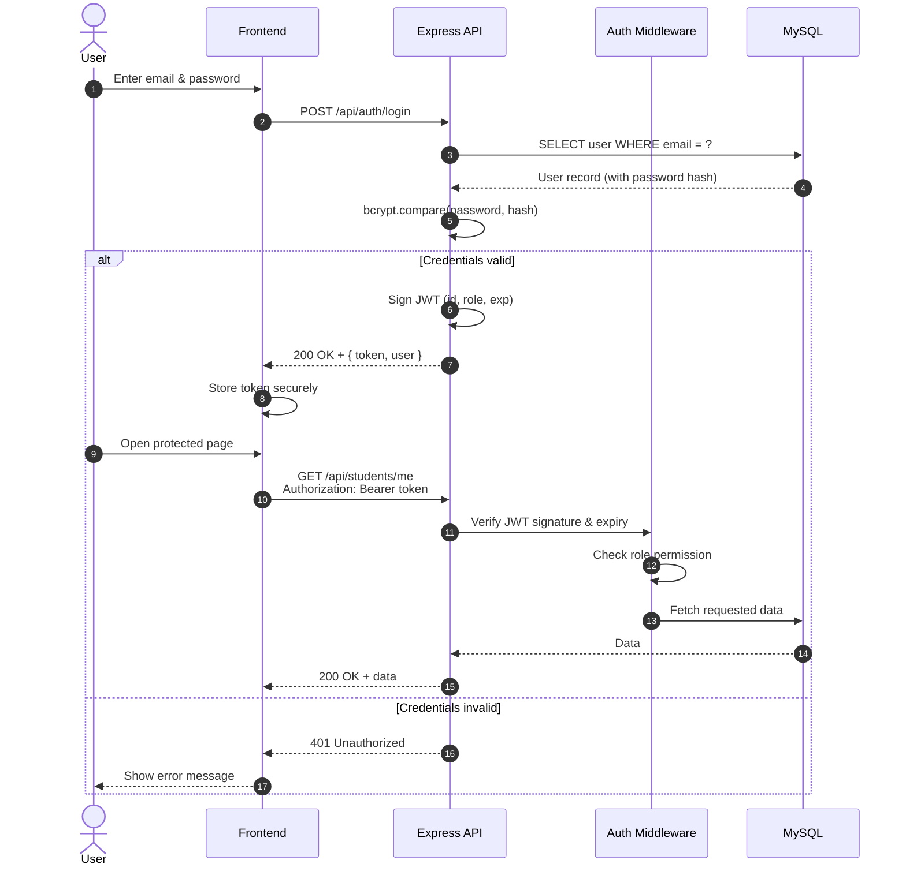
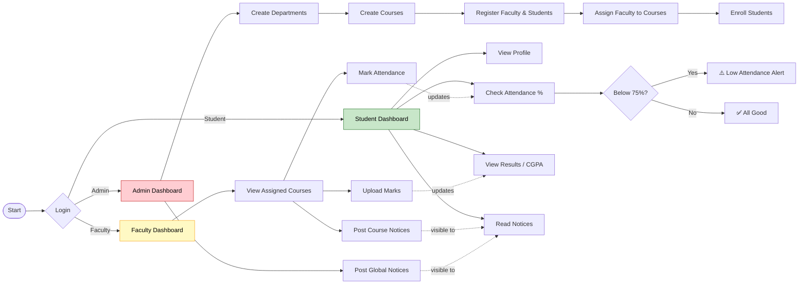

<div align="center">

# 🎓 ADITCMS

### A Modern, Role-Based Management System

**Centralize users, courses, attendance, results, and notices in one secure platform.**

[](LICENSE)
[](https://nodejs.org/)
[](https://expressjs.com/)
[](https://www.mysql.com/)
[]()
[](CONTRIBUTING.md)

[Live Demo](#) · [Documentation](#api-documentation) · [Report Bug](../../issues) · [Request Feature](../../issues)

</div>

---

> **Note:** This README uses a Node.js + Express + MySQL stack as its reference implementation.
> Replace anything in `[brackets]` and adjust commands so they match your real project.

---

## 📑 Table of Contents

1. [About the Project](#-about-the-project)
2. [Key Features](#-key-features)
3. [Tech Stack](#-tech-stack)
4. [System Architecture](#-system-architecture)
5. [Database Design (ER Diagram)](#-database-design-er-diagram)
6. [Authentication Flow](#-authentication-flow)
7. [Application Workflow](#-application-workflow)
8. [Getting Started](#-getting-started)
9. [Environment Configuration](#-environment-configuration)
10. [Database Setup](#-database-setup)
11. [Project Structure](#-project-structure)
12. [API Documentation](#-api-documentation)
13. [Code Examples](#-code-examples)
14. [Frontend Usage](#-frontend-usage)
15. [Testing](#-testing)
16. [Docker Deployment](#-docker-deployment)
17. [Production Deployment](#-production-deployment)
18. [Security](#-security)
19. [Performance](#-performance)
20. [Troubleshooting](#-troubleshooting)
21. [FAQ](#-faq)
22. [Roadmap](#-roadmap)
23. [Contributing](#-contributing)
24. [Changelog](#-changelog)
25. [License](#-license)
26. [Author](#-author)
27. [Acknowledgements](#-acknowledgements)

---

## 📖 About the Project

**ADITCMS** is a full-stack management system built to streamline the daily
operations of an educational institute or organization. It replaces scattered
spreadsheets, paper registers, and disconnected tools with a single, secure,
role-based web platform.

### The Problem

| Pain Point                         | Impact                                    |
|------------------------------------|-------------------------------------------|
| Paper-based attendance and records | Errors, lost data, slow reporting         |
| Multiple disconnected tools        | Duplicate entry, inconsistent information |
| No role separation                 | Security and privacy risks                |
| Manual result compilation          | Time-consuming and error-prone            |
| Notices shared via chat groups     | Missed announcements, no audit trail      |

### The Solution

ADITCMS provides:

- One **source of truth** for students, faculty, courses, and results
- **Role-based access control (RBAC)** so each user sees only what they should
- **REST API** that can power web, mobile, or third-party clients
- **Automated reports** and dashboards for quick decision-making
- **Audit-friendly** design with timestamps on every record

### Who Is It For?

| Role        | What they can do                                                   |
|-------------|--------------------------------------------------------------------|
| **Admin**   | Manage users, departments, courses, notices, and system settings   |
| **Faculty** | Mark attendance, upload results, post notices for their courses    |
| **Student** | View profile, attendance, results, timetable, and notices          |

---

## ✨ Key Features

### 🔐 Authentication & Security
- Email + password login with **bcrypt** hashing
- **JWT** access tokens with configurable expiry
- Role-based route protection (`admin`, `faculty`, `student`)
- Rate limiting on login to prevent brute-force attacks
- Secure HTTP headers using **Helmet**
- Centralized input validation and sanitization

### 👥 User Management
- Create, read, update, and deactivate users
- Profile management with avatar upload
- Password change and reset flow
- Search, filter, sort, and paginate user lists

### 🏫 Academic Management
- Department and course management
- Assign faculty to courses
- Enroll students in courses
- Semester and academic-year handling

### 🗓️ Attendance
- Faculty can mark attendance per course and date
- Students can view attendance percentage per course
- Low-attendance warnings (below configurable threshold)
- Export attendance reports to CSV

### 📝 Results & Grades
- Upload marks per exam type (internal, midterm, final)
- Automatic grade and percentage calculation
- Student result cards with semester-wise SGPA / CGPA
- Export result sheets to PDF or CSV

### 📢 Notices & Announcements
- Post notices to everyone, a department, or a specific course
- Priority levels (low, normal, high)
- Optional expiry date for automatic hiding

### 📊 Dashboard & Reports
- Admin overview: total users, courses, attendance trend
- Faculty overview: course list, pending tasks
- Student overview: attendance, latest results, notices

### 🧰 Developer Experience
- Clean layered architecture (routes → controllers → services → models)
- Consistent JSON response format and error handling
- Environment-based configuration
- Ready-to-use Docker and Docker Compose setup
- Automated tests with Jest and Supertest

---

## 🛠 Tech Stack

| Layer            | Technology                                              |
|------------------|---------------------------------------------------------|
| **Frontend**     | HTML5, CSS3, JavaScript (ES6+), [React / Bootstrap]     |
| **Backend**      | Node.js 18+, Express.js 4                               |
| **Database**     | MySQL 8 (via `mysql2` / [Sequelize / Prisma])           |
| **Auth**         | JSON Web Tokens (JWT), bcrypt                           |
| **Validation**   | express-validator / Joi                                 |
| **Security**     | Helmet, CORS, express-rate-limit                        |
| **Logging**      | Morgan, Winston                                         |
| **Testing**      | Jest, Supertest                                         |
| **DevOps**       | Docker, Docker Compose, GitHub Actions                  |
| **Tools**        | Git, Postman, VS Code, ESLint, Prettier                 |

---

## 🏗 System Architecture

The application follows a classic **three-tier architecture** with a clear
separation between presentation, business logic, and data storage.



### Layer Responsibilities

| Layer          | Responsibility                                                      |
|----------------|---------------------------------------------------------------------|
| **Routes**     | Map HTTP endpoints to controller functions                          |
| **Middleware** | Authentication, authorization, validation, logging, error handling  |
| **Controllers**| Parse requests, call services, format responses                     |
| **Services**   | Core business rules (grade calculation, attendance %, etc.)         |
| **Models**     | Database queries and data mapping                                   |

### Request Lifecycle

1. The client sends an HTTP request with a `Bearer` token.
2. Global middleware (CORS, Helmet, JSON parser, logger) runs first.
3. The route-level `authenticate` middleware verifies the JWT.
4. The `authorize` middleware checks the user's role.
5. The validator checks the request body, params, and query.
6. The controller calls the relevant service.
7. The service applies business logic and calls the model.
8. The model queries MySQL and returns data.
9. The controller sends a standardized JSON response.
10. Any thrown error is caught by the centralized error handler.

---

## 🗃 Database Design (ER Diagram)



### Table Summary

| Table          | Purpose                                                   |
|----------------|-----------------------------------------------------------|
| `users`        | Login credentials and role for every person in the system |
| `students`     | Student-specific profile data                             |
| `faculty`      | Faculty-specific profile data                             |
| `departments`  | Academic departments                                      |
| `courses`      | Courses offered by departments                            |
| `enrollments`  | Links students to courses for an academic year            |
| `attendance`   | Daily attendance records per enrollment                   |
| `results`      | Exam marks and grades per enrollment                      |
| `notices`      | Announcements posted by admin or faculty                  |

---

## 🔑 Authentication Flow



---

## 🔄 Application Workflow

The diagram below shows the typical academic workflow across all three roles.



---

## 🚀 Getting Started

### Prerequisites

Make sure the following are installed:

| Tool      | Version  | Check with          |
|-----------|----------|---------------------|
| Node.js   | 18+      | `node -v`           |
| npm       | 9+       | `npm -v`            |
| MySQL     | 8.x      | `mysql --version`   |
| Git       | 2.x      | `git --version`     |
| Docker    | optional | `docker --version`  |

### Installation

**1. Clone the repository**

```bash
git clone https://github.com/shahdhairyah/ADITCMS.git
cd ADITCMS
```

**2. Install backend dependencies**

```bash
cd server
npm install
```

**3. Install frontend dependencies** *(if you have a separate client)*

```bash
cd ../client
npm install
```

**4. Create your environment file**

```bash
cd ../server
cp .env.example .env
```

**5. Set up the database** (see [Database Setup](#-database-setup))

**6. Start the development servers**

```bash
# Terminal 1 - backend
cd server
npm run dev

# Terminal 2 - frontend
cd client
npm start
```

**7. Open the app**

| Service   | URL                          |
|-----------|------------------------------|
| Frontend  | http://localhost:3000        |
| Backend   | http://localhost:5000        |
| API Health| http://localhost:5000/health |

### Available Scripts

| Command             | Description                                |
|---------------------|--------------------------------------------|
| `npm start`         | Start the server in production mode        |
| `npm run dev`       | Start with nodemon (auto-reload)           |
| `npm test`          | Run the full test suite                    |
| `npm run test:watch`| Run tests in watch mode                    |
| `npm run lint`      | Lint the codebase with ESLint              |
| `npm run format`    | Format code with Prettier                  |
| `npm run db:migrate`| Run database migrations                    |
| `npm run db:seed`   | Seed the database with sample data         |

---

## ⚙️ Environment Configuration

Create a `.env` file inside the `server/` directory:

```env
# ─────────── Server ───────────
NODE_ENV=development
PORT=5000
CLIENT_URL=http://localhost:3000

# ─────────── Database ───────────
DB_HOST=localhost
DB_PORT=3306
DB_USER=aditcms_user
DB_PASSWORD=change_this_password
DB_NAME=aditcms

# ─────────── Authentication ───────────
JWT_SECRET=replace_with_a_long_random_string_at_least_32_chars
JWT_EXPIRES_IN=1d
BCRYPT_SALT_ROUNDS=12

# ─────────── Rate Limiting ───────────
RATE_LIMIT_WINDOW_MS=900000
RATE_LIMIT_MAX=100
LOGIN_RATE_LIMIT_MAX=5

# ─────────── Business Rules ───────────
MIN_ATTENDANCE_PERCENT=75

# ─────────── File Uploads ───────────
UPLOAD_DIR=uploads
MAX_FILE_SIZE_MB=2

# ─────────── Email (optional) ───────────
SMTP_HOST=smtp.example.com
SMTP_PORT=587
SMTP_USER=no-reply@example.com
SMTP_PASS=your_smtp_password
```

### Variable Reference

| Variable                 | Required | Default   | Description                               |
|--------------------------|----------|-----------|-------------------------------------------|
| `NODE_ENV`               | No       | `development` | Runtime environment                   |
| `PORT`                   | No       | `5000`    | Port the API listens on                   |
| `CLIENT_URL`             | Yes      | –         | Allowed CORS origin                       |
| `DB_HOST`                | Yes      | –         | MySQL host                                |
| `DB_PORT`                | No       | `3306`    | MySQL port                                |
| `DB_USER`                | Yes      | –         | MySQL username                            |
| `DB_PASSWORD`            | Yes      | –         | MySQL password                            |
| `DB_NAME`                | Yes      | –         | Database name                             |
| `JWT_SECRET`             | Yes      | –         | Secret key for signing tokens             |
| `JWT_EXPIRES_IN`         | No       | `1d`      | Token lifetime                            |
| `BCRYPT_SALT_ROUNDS`     | No       | `12`      | bcrypt cost factor                        |
| `MIN_ATTENDANCE_PERCENT` | No       | `75`      | Threshold for low-attendance warnings     |

> 💡 Generate a strong secret with:
> ```bash
> node -e "console.log(require('crypto').randomBytes(48).toString('hex'))"
> ```

---

## 🗄 Database Setup

### 1. Create the database and user

```sql
CREATE DATABASE aditcms
  CHARACTER SET utf8mb4
  COLLATE utf8mb4_unicode_ci;

CREATE USER 'aditcms_user'@'localhost' IDENTIFIED BY 'change_this_password';
GRANT ALL PRIVILEGES ON aditcms.* TO 'aditcms_user'@'localhost';
FLUSH PRIVILEGES;
```

### 2. Create the tables

```sql
USE aditcms;

-- ─────────────────────────── USERS ───────────────────────────
CREATE TABLE users (
  id            INT AUTO_INCREMENT PRIMARY KEY,
  name          VARCHAR(100)  NOT NULL,
  email         VARCHAR(150)  NOT NULL UNIQUE,
  password_hash VARCHAR(255)  NOT NULL,
  role          ENUM('admin','faculty','student') NOT NULL DEFAULT 'student',
  is_active     BOOLEAN       NOT NULL DEFAULT TRUE,
  avatar_url    VARCHAR(255)  NULL,
  created_at    DATETIME      NOT NULL DEFAULT CURRENT_TIMESTAMP,
  updated_at    DATETIME      NOT NULL DEFAULT CURRENT_TIMESTAMP
                              ON UPDATE CURRENT_TIMESTAMP,
  INDEX idx_users_role (role)
) ENGINE=InnoDB;

-- ───────────────────────── DEPARTMENTS ─────────────────────────
CREATE TABLE departments (
  id    INT AUTO_INCREMENT PRIMARY KEY,
  name  VARCHAR(120) NOT NULL UNIQUE,
  code  VARCHAR(10)  NOT NULL UNIQUE
) ENGINE=InnoDB;

-- ─────────────────────────── STUDENTS ──────────────────────────
CREATE TABLE students (
  id             INT AUTO_INCREMENT PRIMARY KEY,
  user_id        INT          NOT NULL UNIQUE,
  department_id  INT          NOT NULL,
  enrollment_no  VARCHAR(30)  NOT NULL UNIQUE,
  semester       TINYINT      NOT NULL DEFAULT 1,
  admission_year YEAR         NOT NULL,
  phone          VARCHAR(20)  NULL,
  FOREIGN KEY (user_id)       REFERENCES users(id)       ON DELETE CASCADE,
  FOREIGN KEY (department_id) REFERENCES departments(id) ON DELETE RESTRICT
) ENGINE=InnoDB;

-- ─────────────────────────── FACULTY ───────────────────────────
CREATE TABLE faculty (
  id             INT AUTO_INCREMENT PRIMARY KEY,
  user_id        INT          NOT NULL UNIQUE,
  department_id  INT          NOT NULL,
  employee_id    VARCHAR(30)  NOT NULL UNIQUE,
  designation    VARCHAR(80)  NULL,
  phone          VARCHAR(20)  NULL,
  FOREIGN KEY (user_id)       REFERENCES users(id)       ON DELETE CASCADE,
  FOREIGN KEY (department_id) REFERENCES departments(id) ON DELETE RESTRICT
) ENGINE=InnoDB;

-- ─────────────────────────── COURSES ───────────────────────────
CREATE TABLE courses (
  id             INT AUTO_INCREMENT PRIMARY KEY,
  department_id  INT          NOT NULL,
  faculty_id     INT          NULL,
  code           VARCHAR(20)  NOT NULL UNIQUE,
  title          VARCHAR(150) NOT NULL,
  credits        TINYINT      NOT NULL DEFAULT 3,
  semester       TINYINT      NOT NULL,
  FOREIGN KEY (department_id) REFERENCES departments(id) ON DELETE RESTRICT,
  FOREIGN KEY (faculty_id)    REFERENCES faculty(id)     ON DELETE SET NULL
) ENGINE=InnoDB;

-- ────────────────────────── ENROLLMENTS ────────────────────────
CREATE TABLE enrollments (
  id             INT AUTO_INCREMENT PRIMARY KEY,
  student_id     INT          NOT NULL,
  course_id      INT          NOT NULL,
  academic_year  VARCHAR(9)   NOT NULL,   -- e.g. 2025-2026
  UNIQUE KEY uq_enrollment (student_id, course_id, academic_year),
  FOREIGN KEY (student_id) REFERENCES students(id) ON DELETE CASCADE,
  FOREIGN KEY (course_id)  REFERENCES courses(id)  ON DELETE CASCADE
) ENGINE=InnoDB;

-- ─────────────────────────── ATTENDANCE ────────────────────────
CREATE TABLE attendance (
  id               INT AUTO_INCREMENT PRIMARY KEY,
  enrollment_id    INT          NOT NULL,
  attendance_date  DATE         NOT NULL,
  status           ENUM('present','absent','late') NOT NULL,
  UNIQUE KEY uq_attendance (enrollment_id, attendance_date),
  FOREIGN KEY (enrollment_id) REFERENCES enrollments(id) ON DELETE CASCADE,
  INDEX idx_attendance_date (attendance_date)
) ENGINE=InnoDB;

-- ───────────────────────────── RESULTS ─────────────────────────
CREATE TABLE results (
  id              INT AUTO_INCREMENT PRIMARY KEY,
  enrollment_id   INT           NOT NULL,
  exam_type       ENUM('internal','midterm','final') NOT NULL,
  marks_obtained  DECIMAL(5,2)  NOT NULL,
  max_marks       DECIMAL(5,2)  NOT NULL DEFAULT 100,
  grade           VARCHAR(3)    NULL,
  UNIQUE KEY uq_result (enrollment_id, exam_type),
  FOREIGN KEY (enrollment_id) REFERENCES enrollments(id) ON DELETE CASCADE,
  CHECK (marks_obtained >= 0 AND marks_obtained <= max_marks)
) ENGINE=InnoDB;

-- ────────────────────────────── NOTICES ────────────────────────
CREATE TABLE notices (
  id          INT AUTO_INCREMENT PRIMARY KEY,
  posted_by   INT           NOT NULL,
  title       VARCHAR(200)  NOT NULL,
  body        TEXT          NOT NULL,
  priority    ENUM('low','normal','high') NOT NULL DEFAULT 'normal',
  expires_on  DATE          NULL,
  created_at  DATETIME      NOT NULL DEFAULT CURRENT_TIMESTAMP,
  FOREIGN KEY (posted_by) REFERENCES users(id) ON DELETE CASCADE,
  INDEX idx_notices_created (created_at)
) ENGINE=InnoDB;
```

### 3. Seed sample data

```sql
INSERT INTO departments (name, code) VALUES
  ('Computer Engineering', 'CE'),
  ('Information Technology', 'IT'),
  ('Electronics & Communication', 'EC');

-- Password for all demo users below: Password@123
-- (hash generated with bcrypt, cost 12 - regenerate for your own setup)
INSERT INTO users (name, email, password_hash, role) VALUES
  ('System Admin', 'admin@example.com',   '$2b$12$replace.with.real.bcrypt.hash.admin', 'admin'),
  ('Prof. Mehta',  'faculty@example.com', '$2b$12$replace.with.real.bcrypt.hash.fac',   'faculty'),
  ('Dhairya Shah', 'student@example.com', '$2b$12$replace.with.real.bcrypt.hash.stu',   'student');
```

Or use the built-in script:

```bash
npm run db:migrate
npm run db:seed
```

### Demo Credentials

| Role    | Email                  | Password       |
|---------|------------------------|----------------|
| Admin   | `admin@example.com`    | `Password@123` |
| Faculty | `faculty@example.com`  | `Password@123` |
| Student | `student@example.com`  | `Password@123` |

> ⚠️ **Change or delete these accounts before deploying to production.**

---

## 📁 Project Structure

```text
ADITCMS/
│
├── client/                          # Frontend application
│   ├── public/
│   │   └── index.html
│   ├── src/
│   │   ├── assets/                  # Images, icons, fonts
│   │   ├── components/              # Reusable UI components
│   │   │   ├── Navbar.jsx
│   │   │   ├── Sidebar.jsx
│   │   │   ├── DataTable.jsx
│   │   │   └── ProtectedRoute.jsx
│   │   ├── pages/
│   │   │   ├── Login.jsx
│   │   │   ├── admin/
│   │   │   ├── faculty/
│   │   │   └── student/
│   │   ├── services/
│   │   │   └── api.js               # Axios instance + interceptors
│   │   ├── context/
│   │   │   └── AuthContext.jsx
│   │   ├── App.jsx
│   │   └── index.js
│   └── package.json
│
├── server/                          # Backend application
│   ├── src/
│   │   ├── config/
│   │   │   ├── db.js                # MySQL connection pool
│   │   │   └── env.js               # Validated environment variables
│   │   ├── controllers/
│   │   │   ├── auth.controller.js
│   │   │   ├── user.controller.js
│   │   │   ├── course.controller.js
│   │   │   ├── attendance.controller.js
│   │   │   ├── result.controller.js
│   │   │   └── notice.controller.js
│   │   ├── middleware/
│   │   │   ├── authenticate.js      # JWT verification
│   │   │   ├── authorize.js         # Role check
│   │   │   ├── validate.js          # Request validation
│   │   │   ├── rateLimiter.js
│   │   │   └── errorHandler.js      # Centralized error handling
│   │   ├── models/
│   │   │   ├── user.model.js
│   │   │   ├── course.model.js
│   │   │   ├── attendance.model.js
│   │   │   └── result.model.js
│   │   ├── routes/
│   │   │   ├── index.js
│   │   │   ├── auth.routes.js
│   │   │   ├── user.routes.js
│   │   │   ├── course.routes.js
│   │   │   ├── attendance.routes.js
│   │   │   ├── result.routes.js
│   │   │   └── notice.routes.js
│   │   ├── services/
│   │   │   ├── auth.service.js
│   │   │   ├── grade.service.js     # Grade + CGPA logic
│   │   │   └── attendance.service.js
│   │   ├── utils/
│   │   │   ├── ApiError.js
│   │   │   ├── asyncHandler.js
│   │   │   └── logger.js
│   │   ├── app.js                   # Express app setup
│   │   └── server.js                # Entry point
│   ├── database/
│   │   ├── schema.sql
│   │   └── seed.sql
│   ├── tests/
│   │   ├── auth.test.js
│   │   ├── attendance.test.js
│   │   └── grade.service.test.js
│   ├── uploads/                     # User-uploaded files (gitignored)
│   ├── .env.example
│   └── package.json
│
├── docs/
│   ├── screenshots/
│   └── postman/
│       └── ADITCMS.postman_collection.json
│
├── .github/
│   └── workflows/
│       └── ci.yml
│
├── docker-compose.yml
├── Dockerfile
├── .gitignore
├── LICENSE
├── CONTRIBUTING.md
└── README.md
```

---

## 📡 API Documentation

**Base URL:** `http://localhost:5000/api`

All endpoints return JSON. Protected endpoints require the header:

```http
Authorization: Bearer <your_jwt_token>
```

### Standard Response Format

**Success**

```json
{
  "success": true,
  "message": "Operation completed successfully",
  "data": { }
}
```

**Error**

```json
{
  "success": false,
  "message": "Human-readable error message",
  "errors": [
    { "field": "email", "message": "Must be a valid email address" }
  ]
}
```

### HTTP Status Codes

| Code | Meaning               | When it is used                               |
|------|-----------------------|-----------------------------------------------|
| 200  | OK                    | Request succeeded                             |
| 201  | Created               | Resource created                              |
| 400  | Bad Request           | Validation failed                             |
| 401  | Unauthorized          | Missing or invalid token                      |
| 403  | Forbidden             | Authenticated but not allowed                 |
| 404  | Not Found             | Resource does not exist                       |
| 409  | Conflict              | Duplicate record (e.g., email already exists) |
| 429  | Too Many Requests     | Rate limit exceeded                           |
| 500  | Internal Server Error | Unexpected server error                       |

### Endpoint Overview

| Module      | Method | Endpoint                          | Access           |
|-------------|--------|-----------------------------------|------------------|
| Auth        | POST   | `/auth/login`                     | Public           |
| Auth        | POST   | `/auth/change-password`           | Authenticated    |
| Auth        | GET    | `/auth/me`                        | Authenticated    |
| Users       | GET    | `/users`                          | Admin            |
| Users       | POST   | `/users`                          | Admin            |
| Users       | GET    | `/users/:id`                      | Admin            |
| Users       | PUT    | `/users/:id`                      | Admin            |
| Users       | DELETE | `/users/:id`                      | Admin            |
| Departments | GET    | `/departments`                    | Authenticated    |
| Departments | POST   | `/departments`                    | Admin            |
| Courses     | GET    | `/courses`                        | Authenticated    |
| Courses     | POST   | `/courses`                        | Admin            |
| Courses     | PUT    | `/courses/:id`                    | Admin            |
| Courses     | DELETE | `/courses/:id`                    | Admin            |
| Enrollments | POST   | `/enrollments`                    | Admin            |
| Attendance  | POST   | `/attendance`                     | Faculty          |
| Attendance  | GET    | `/attendance/me`                  | Student          |
| Attendance  | GET    | `/attendance/course/:courseId`    | Faculty, Admin   |
| Results     | POST   | `/results`                        | Faculty          |
| Results     | GET    | `/results/me`                     | Student          |
| Notices     | GET    | `/notices`                        | Authenticated    |
| Notices     | POST   | `/notices`                        | Admin, Faculty   |
| Notices     | DELETE | `/notices/:id`                    | Admin, Owner     |
| Health      | GET    | `/health`                         | Public           |

---

### 🔐 Authentication

#### `POST /auth/login`

Authenticate a user and receive a JWT.

**Request Body**

| Field      | Type   | Required | Rules                    |
|------------|--------|----------|--------------------------|
| `email`    | string | Yes      | Valid email              |
| `password` | string | Yes      | Minimum 8 characters     |

**Example Request**

```bash
curl -X POST http://localhost:5000/api/auth/login \
  -H "Content-Type: application/json" \
  -d '{
    "email": "student@example.com",
    "password": "Password@123"
  }'
```

**Success Response — `200 OK`**

```json
{
  "success": true,
  "message": "Login successful",
  "data": {
    "token": "eyJhbGciOiJIUzI1NiIsInR5cCI6IkpXVCJ9...",
    "expiresIn": "1d",
    "user": {
      "id": 3,
      "name": "Dhairya Shah",
      "email": "student@example.com",
      "role": "student"
    }
  }
}
```

**Error Response — `401 Unauthorized`**

```json
{
  "success": false,
  "message": "Invalid email or password"
}
```

**Error Response — `429 Too Many Requests`**

```json
{
  "success": false,
  "message": "Too many login attempts. Please try again in 15 minutes."
}
```

---

#### `GET /auth/me`

Return the currently authenticated user.

```bash
curl http://localhost:5000/api/auth/me \
  -H "Authorization: Bearer <token>"
```

**Response — `200 OK`**

```json
{
  "success": true,
  "data": {
    "id": 3,
    "name": "Dhairya Shah",
    "email": "student@example.com",
    "role": "student",
    "profile": {
      "enrollmentNo": "23CE001",
      "department": "Computer Engineering",
      "semester": 5
    }
  }
}
```

---

#### `POST /auth/change-password`

```bash
curl -X POST http://localhost:5000/api/auth/change-password \
  -H "Authorization: Bearer <token>" \
  -H "Content-Type: application/json" \
  -d '{
    "currentPassword": "Password@123",
    "newPassword": "NewStrong@456"
  }'
```

**Response — `200 OK`**

```json
{
  "success": true,
  "message": "Password updated successfully"
}
```

---

### 👥 Users (Admin Only)

#### `GET /users`

List users with pagination, search, and filters.

**Query Parameters**

| Param    | Type    | Default | Description                              |
|----------|---------|---------|------------------------------------------|
| `page`   | integer | `1`     | Page number                              |
| `limit`  | integer | `10`    | Items per page (max 100)                 |
| `role`   | string  | –       | Filter by `admin`, `faculty`, `student`  |
| `search` | string  | –       | Search by name or email                  |
| `sort`   | string  | `-created_at` | Prefix with `-` for descending     |

**Example Request**

```bash
curl "http://localhost:5000/api/users?role=student&search=dhairya&page=1&limit=5" \
  -H "Authorization: Bearer <admin_token>"
```

**Response — `200 OK`**

```json
{
  "success": true,
  "data": [
    {
      "id": 3,
      "name": "Dhairya Shah",
      "email": "student@example.com",
      "role": "student",
      "isActive": true,
      "createdAt": "2026-01-15T09:30:00.000Z"
    }
  ],
  "pagination": {
    "page": 1,
    "limit": 5,
    "totalItems": 1,
    "totalPages": 1
  }
}
```

---

#### `POST /users`

Create a new user. For `student` and `faculty` roles, include profile fields.

**Example — Create a Student**

```bash
curl -X POST http://localhost:5000/api/users \
  -H "Authorization: Bearer <admin_token>" \
  -H "Content-Type: application/json" \
  -d '{
    "name": "Riya Patel",
    "email": "riya.patel@example.com",
    "password": "Welcome@123",
    "role": "student",
    "profile": {
      "departmentId": 1,
      "enrollmentNo": "23CE014",
      "semester": 5,
      "admissionYear": 2023,
      "phone": "9876543210"
    }
  }'
```

**Response — `201 Created`**

```json
{
  "success": true,
  "message": "User created successfully",
  "data": {
    "id": 12,
    "name": "Riya Patel",
    "email": "riya.patel@example.com",
    "role": "student"
  }
}
```

**Error — `409 Conflict`**

```json
{
  "success": false,
  "message": "A user with this email already exists"
}
```

**Example — Create a Faculty Member**

```bash
curl -X POST http://localhost:5000/api/users \
  -H "Authorization: Bearer <admin_token>" \
  -H "Content-Type: application/json" \
  -d '{
    "name": "Prof. Anita Desai",
    "email": "anita.desai@example.com",
    "password": "Welcome@123",
    "role": "faculty",
    "profile": {
      "departmentId": 1,
      "employeeId": "EMP1042",
      "designation": "Assistant Professor",
      "phone": "9123456780"
    }
  }'
```

---

#### `GET /users/:id`

```bash
curl http://localhost:5000/api/users/12 \
  -H "Authorization: Bearer <admin_token>"
```

#### `PUT /users/:id`

```bash
curl -X PUT http://localhost:5000/api/users/12 \
  -H "Authorization: Bearer <admin_token>" \
  -H "Content-Type: application/json" \
  -d '{ "name": "Riya A. Patel", "isActive": true }'
```

#### `DELETE /users/:id`

Soft-deletes (deactivates) a user.

```bash
curl -X DELETE http://localhost:5000/api/users/12 \
  -H "Authorization: Bearer <admin_token>"
```

**Response — `200 OK`**

```json
{
  "success": true,
  "message": "User deactivated successfully"
}
```

---

### 🏫 Departments & Courses

#### `POST /departments` (Admin)

```bash
curl -X POST http://localhost:5000/api/departments \
  -H "Authorization: Bearer <admin_token>" \
  -H "Content-Type: application/json" \
  -d '{ "name": "Mechanical Engineering", "code": "ME" }'
```

#### `GET /courses`

**Query Parameters:** `departmentId`, `semester`, `facultyId`, `search`, `page`, `limit`

```bash
curl "http://localhost:5000/api/courses?departmentId=1&semester=5" \
  -H "Authorization: Bearer <token>"
```

**Response — `200 OK`**

```json
{
  "success": true,
  "data": [
    {
      "id": 21,
      "code": "CE501",
      "title": "Database Management Systems",
      "credits": 4,
      "semester": 5,
      "department": { "id": 1, "name": "Computer Engineering", "code": "CE" },
      "faculty": { "id": 2, "name": "Prof. Mehta" }
    },
    {
      "id": 22,
      "code": "CE502",
      "title": "Operating Systems",
      "credits": 4,
      "semester": 5,
      "department": { "id": 1, "name": "Computer Engineering", "code": "CE" },
      "faculty": { "id": 4, "name": "Prof. Anita Desai" }
    }
  ]
}
```

#### `POST /courses` (Admin)

```bash
curl -X POST http://localhost:5000/api/courses \
  -H "Authorization: Bearer <admin_token>" \
  -H "Content-Type: application/json" \
  -d '{
    "departmentId": 1,
    "facultyId": 2,
    "code": "CE503",
    "title": "Computer Networks",
    "credits": 3,
    "semester": 5
  }'
```

#### `POST /enrollments` (Admin)

Enroll one or more students into a course.

```bash
curl -X POST http://localhost:5000/api/enrollments \
  -H "Authorization: Bearer <admin_token>" \
  -H "Content-Type: application/json" \
  -d '{
    "courseId": 21,
    "academicYear": "2025-2026",
    "studentIds": [1, 2, 3, 4]
  }'
```

**Response — `201 Created`**

```json
{
  "success": true,
  "message": "4 students enrolled successfully",
  "data": { "enrolled": 4, "skipped": 0 }
}
```

---

### 🗓 Attendance

#### `POST /attendance` (Faculty)

Mark attendance for a course on a given date. Submitting again for the same
date **updates** the existing records.

```bash
curl -X POST http://localhost:5000/api/attendance \
  -H "Authorization: Bearer <faculty_token>" \
  -H "Content-Type: application/json" \
  -d '{
    "courseId": 21,
    "date": "2026-02-10",
    "records": [
      { "studentId": 1, "status": "present" },
      { "studentId": 2, "status": "absent"  },
      { "studentId": 3, "status": "late"    },
      { "studentId": 4, "status": "present" }
    ]
  }'
```

**Response — `201 Created`**

```json
{
  "success": true,
  "message": "Attendance recorded for 4 students",
  "data": {
    "courseId": 21,
    "date": "2026-02-10",
    "present": 2,
    "absent": 1,
    "late": 1
  }
}
```

#### `GET /attendance/me` (Student)

```bash
curl http://localhost:5000/api/attendance/me \
  -H "Authorization: Bearer <student_token>"
```

**Response — `200 OK`**

```json
{
  "success": true,
  "data": {
    "overallPercentage": 82.5,
    "minimumRequired": 75,
    "courses": [
      {
        "courseCode": "CE501",
        "courseTitle": "Database Management Systems",
        "totalClasses": 40,
        "attended": 36,
        "percentage": 90.0,
        "warning": false
      },
      {
        "courseCode": "CE502",
        "courseTitle": "Operating Systems",
        "totalClasses": 40,
        "attended": 27,
        "percentage": 67.5,
        "warning": true
      }
    ]
  }
}
```

#### `GET /attendance/course/:courseId` (Faculty, Admin)

Query: `from`, `to` (ISO dates), `format=csv` for export.

```bash
curl "http://localhost:5000/api/attendance/course/21?from=2026-02-01&to=2026-02-28&format=csv" \
  -H "Authorization: Bearer <faculty_token>" \
  -o attendance-ce501-feb.csv
```

---

### 📝 Results

#### `POST /results` (Faculty)

Upload marks for an exam in bulk.

```bash
curl -X POST http://localhost:5000/api/results \
  -H "Authorization: Bearer <faculty_token>" \
  -H "Content-Type: application/json" \
  -d '{
    "courseId": 21,
    "examType": "midterm",
    "maxMarks": 100,
    "marks": [
      { "studentId": 1, "marksObtained": 88 },
      { "studentId": 2, "marksObtained": 72.5 },
      { "studentId": 3, "marksObtained": 45 }
    ]
  }'
```

**Response — `201 Created`**

```json
{
  "success": true,
  "message": "Results saved for 3 students",
  "data": [
    { "studentId": 1, "marksObtained": 88,   "grade": "AA" },
    { "studentId": 2, "marksObtained": 72.5, "grade": "BB" },
    { "studentId": 3, "marksObtained": 45,   "grade": "DD" }
  ]
}
```

#### `GET /results/me` (Student)

```bash
curl "http://localhost:5000/api/results/me?semester=5" \
  -H "Authorization: Bearer <student_token>"
```

**Response — `200 OK`**

```json
{
  "success": true,
  "data": {
    "semester": 5,
    "sgpa": 8.42,
    "cgpa": 8.15,
    "subjects": [
      {
        "courseCode": "CE501",
        "title": "Database Management Systems",
        "credits": 4,
        "internal": 24,
        "midterm": 88,
        "final": 91,
        "grade": "AA",
        "gradePoints": 10
      },
      {
        "courseCode": "CE502",
        "title": "Operating Systems",
        "credits": 4,
        "internal": 20,
        "midterm": 72.5,
        "final": 70,
        "grade": "BB",
        "gradePoints": 8
      }
    ]
  }
}
```

#### Grading Scale

| Percentage | Grade | Grade Points |
|------------|-------|--------------|
| 90 – 100   | AA    | 10           |
| 80 – 89    | AB    | 9            |
| 70 – 79    | BB    | 8            |
| 60 – 69    | BC    | 7            |
| 50 – 59    | CC    | 6            |
| 40 – 49    | DD    | 5            |
| Below 40   | FF    | 0 (Fail)     |

**SGPA formula**

```text
SGPA = Σ (course_credits × grade_points) / Σ course_credits
```

---

### 📢 Notices

#### `GET /notices`

Returns non-expired notices, newest first, with high-priority notices pinned.

```bash
curl http://localhost:5000/api/notices \
  -H "Authorization: Bearer <token>"
```

**Response — `200 OK`**

```json
{
  "success": true,
  "data": [
    {
      "id": 8,
      "title": "Mid-Semester Exam Schedule Released",
      "body": "The mid-semester exam timetable is now available. Exams begin on 5 March.",
      "priority": "high",
      "postedBy": "System Admin",
      "expiresOn": "2026-03-10",
      "createdAt": "2026-02-20T08:00:00.000Z"
    },
    {
      "id": 7,
      "title": "Library Timing Change",
      "body": "The library will remain open until 8 PM on weekdays.",
      "priority": "normal",
      "postedBy": "System Admin",
      "expiresOn": null,
      "createdAt": "2026-02-18T11:15:00.000Z"
    }
  ]
}
```

#### `POST /notices` (Admin, Faculty)

```bash
curl -X POST http://localhost:5000/api/notices \
  -H "Authorization: Bearer <token>" \
  -H "Content-Type: application/json" \
  -d '{
    "title": "DBMS Assignment 2 Due Date Extended",
    "body": "The due date is extended to Friday, 28 February.",
    "priority": "high",
    "expiresOn": "2026-03-01"
  }'
```

#### `DELETE /notices/:id`

```bash
curl -X DELETE http://localhost:5000/api/notices/8 \
  -H "Authorization: Bearer <token>"
```

---

### ❤️ Health Check

```bash
curl http://localhost:5000/health
```

```json
{
  "status": "ok",
  "uptime": 12345.67,
  "database": "connected",
  "timestamp": "2026-02-20T10:00:00.000Z"
}
```

---

## 💻 Code Examples

### Express App Setup — `server/src/app.js`

```javascript
const express = require('express');
const cors = require('cors');
const helmet = require('helmet');
const morgan = require('morgan');
const rateLimit = require('express-rate-limit');

const env = require('./config/env');
const routes = require('./routes');
const errorHandler = require('./middleware/errorHandler');
const ApiError = require('./utils/ApiError');

const app = express();

// ── Security & parsing middleware ──
app.use(helmet());
app.use(cors({ origin: env.CLIENT_URL, credentials: true }));
app.use(express.json({ limit: '1mb' }));
app.use(express.urlencoded({ extended: true }));

// ── Logging ──
if (env.NODE_ENV !== 'test') {
  app.use(morgan('dev'));
}

// ── Global rate limiter ──
app.use(
  '/api',
  rateLimit({
    windowMs: env.RATE_LIMIT_WINDOW_MS,
    max: env.RATE_LIMIT_MAX,
    standardHeaders: true,
    legacyHeaders: false,
    message: { success: false, message: 'Too many requests, slow down.' },
  })
);

// ── Health check ──
app.get('/health', async (req, res) => {
  res.json({
    status: 'ok',
    uptime: process.uptime(),
    timestamp: new Date().toISOString(),
  });
});

// ── API routes ──
app.use('/api', routes);

// ── 404 handler ──
app.use((req, res, next) => next(new ApiError(404, 'Route not found')));

// ── Centralized error handler ──
app.use(errorHandler);

module.exports = app;
```

### Server Entry Point — `server/src/server.js`

```javascript
const app = require('./app');
const env = require('./config/env');
const { pool } = require('./config/db');
const logger = require('./utils/logger');

const server = app.listen(env.PORT, () => {
  logger.info(`ADITCMS API running on port ${env.PORT} [${env.NODE_ENV}]`);
});

// Graceful shutdown
const shutdown = async (signal) => {
  logger.info(`${signal} received. Shutting down gracefully...`);
  server.close(async () => {
    await pool.end();
    logger.info('HTTP server and DB pool closed.');
    process.exit(0);
  });
};

process.on('SIGTERM', () => shutdown('SIGTERM'));
process.on('SIGINT', () => shutdown('SIGINT'));
```

### Database Pool — `server/src/config/db.js`

```javascript
const mysql = require('mysql2/promise');
const env = require('./env');

const pool = mysql.createPool({
  host: env.DB_HOST,
  port: env.DB_PORT,
  user: env.DB_USER,
  password: env.DB_PASSWORD,
  database: env.DB_NAME,
  waitForConnections: true,
  connectionLimit: 10,
  queueLimit: 0,
});

module.exports = { pool };
```

### Custom Error Class — `server/src/utils/ApiError.js`

```javascript
class ApiError extends Error {
  constructor(statusCode, message, errors = null) {
    super(message);
    this.statusCode = statusCode;
    this.errors = errors;
    Error.captureStackTrace(this, this.constructor);
  }
}

module.exports = ApiError;
```

### Async Handler — `server/src/utils/asyncHandler.js`

```javascript
// Wraps async route handlers so thrown errors reach the error middleware
module.exports = (fn) => (req, res, next) =>
  Promise.resolve(fn(req, res, next)).catch(next);
```

### Authentication Middleware — `server/src/middleware/authenticate.js`

```javascript
const jwt = require('jsonwebtoken');
const env = require('../config/env');
const ApiError = require('../utils/ApiError');

module.exports = (req, res, next) => {
  const header = req.headers.authorization || '';
  const [scheme, token] = header.split(' ');

  if (scheme !== 'Bearer' || !token) {
    return next(new ApiError(401, 'Authentication token missing'));
  }

  try {
    const payload = jwt.verify(token, env.JWT_SECRET);
    req.user = { id: payload.id, role: payload.role };
    next();
  } catch (err) {
    const message =
      err.name === 'TokenExpiredError' ? 'Token expired' : 'Invalid token';
    next(new ApiError(401, message));
  }
};
```

### Authorization Middleware — `server/src/middleware/authorize.js`

```javascript
const ApiError = require('../utils/ApiError');

// Usage: router.get('/', authenticate, authorize('admin', 'faculty'), handler)
module.exports =
  (...allowedRoles) =>
  (req, res, next) => {
    if (!req.user || !allowedRoles.includes(req.user.role)) {
      return next(
        new ApiError(403, 'You do not have permission to perform this action')
      );
    }
    next();
  };
```

### Error Handler — `server/src/middleware/errorHandler.js`

```javascript
const logger = require('../utils/logger');
const env = require('../config/env');

module.exports = (err, req, res, next) => {
  const statusCode = err.statusCode || 500;

  if (statusCode >= 500) {
    logger.error(err.stack || err.message);
  }

  res.status(statusCode).json({
    success: false,
    message:
      statusCode === 500 && env.NODE_ENV === 'production'
        ? 'Internal server error'
        : err.message,
    ...(err.errors && { errors: err.errors }),
    ...(env.NODE_ENV === 'development' && { stack: err.stack }),
  });
};
```

### Auth Service — `server/src/services/auth.service.js`

```javascript
const bcrypt = require('bcrypt');
const jwt = require('jsonwebtoken');
const env = require('../config/env');
const ApiError = require('../utils/ApiError');
const userModel = require('../models/user.model');

exports.login = async (email, password) => {
  const user = await userModel.findByEmail(email);

  // Same message for both cases to avoid leaking which emails exist
  if (!user || !user.is_active) {
    throw new ApiError(401, 'Invalid email or password');
  }

  const match = await bcrypt.compare(password, user.password_hash);
  if (!match) {
    throw new ApiError(401, 'Invalid email or password');
  }

  const token = jwt.sign({ id: user.id, role: user.role }, env.JWT_SECRET, {
    expiresIn: env.JWT_EXPIRES_IN,
  });

  return {
    token,
    expiresIn: env.JWT_EXPIRES_IN,
    user: {
      id: user.id,
      name: user.name,
      email: user.email,
      role: user.role,
    },
  };
};

exports.hashPassword = (plain) =>
  bcrypt.hash(plain, env.BCRYPT_SALT_ROUNDS);
```

### Auth Controller & Routes

```javascript
// server/src/controllers/auth.controller.js
const authService = require('../services/auth.service');
const asyncHandler = require('../utils/asyncHandler');

exports.login = asyncHandler(async (req, res) => {
  const { email, password } = req.body;
  const data = await authService.login(email, password);
  res.json({ success: true, message: 'Login successful', data });
});
```

```javascript
// server/src/routes/auth.routes.js
const router = require('express').Router();
const { body } = require('express-validator');
const rateLimit = require('express-rate-limit');

const controller = require('../controllers/auth.controller');
const validate = require('../middleware/validate');
const authenticate = require('../middleware/authenticate');

const loginLimiter = rateLimit({
  windowMs: 15 * 60 * 1000,
  max: 5,
  message: {
    success: false,
    message: 'Too many login attempts. Please try again in 15 minutes.',
  },
});

router.post(
  '/login',
  loginLimiter,
  [
    body('email').isEmail().withMessage('Must be a valid email').normalizeEmail(),
    body('password').isLength({ min: 8 }).withMessage('Minimum 8 characters'),
  ],
  validate,
  controller.login
);

router.get('/me', authenticate, controller.me);

module.exports = router;
```

### Validation Middleware — `server/src/middleware/validate.js`

```javascript
const { validationResult } = require('express-validator');
const ApiError = require('../utils/ApiError');

module.exports = (req, res, next) => {
  const result = validationResult(req);
  if (result.isEmpty()) return next();

  const errors = result.array().map((e) => ({
    field: e.path,
    message: e.msg,
  }));
  next(new ApiError(400, 'Validation failed', errors));
};
```

### Grade Service (Business Logic) — `server/src/services/grade.service.js`

```javascript
const SCALE = [
  { min: 90, grade: 'AA', points: 10 },
  { min: 80, grade: 'AB', points: 9 },
  { min: 70, grade: 'BB', points: 8 },
  { min: 60, grade: 'BC', points: 7 },
  { min: 50, grade: 'CC', points: 6 },
  { min: 40, grade: 'DD', points: 5 },
  { min: 0,  grade: 'FF', points: 0 },
];

exports.getGrade = (marksObtained, maxMarks = 100) => {
  const percentage = (marksObtained / maxMarks) * 100;
  return SCALE.find((row) => percentage >= row.min);
};

/**
 * @param {Array<{credits:number, gradePoints:number}>} subjects
 * @returns {number} SGPA rounded to 2 decimals
 */
exports.calculateSGPA = (subjects) => {
  const totalCredits = subjects.reduce((sum, s) => sum + s.credits, 0);
  if (totalCredits === 0) return 0;

  const weighted = subjects.reduce(
    (sum, s) => sum + s.credits * s.gradePoints,
    0
  );
  return Math.round((weighted / totalCredits) * 100) / 100;
};
```

### Attendance Service — `server/src/services/attendance.service.js`

```javascript
const env = require('../config/env');

/**
 * "late" counts as present. Returns percentage + warning flag.
 */
exports.summarize = (records) => {
  const total = records.length;
  const attended = records.filter((r) => r.status !== 'absent').length;
  const percentage = total === 0 ? 0 : (attended / total) * 100;

  return {
    totalClasses: total,
    attended,
    percentage: Math.round(percentage * 10) / 10,
    warning: total > 0 && percentage < env.MIN_ATTENDANCE_PERCENT,
  };
};
```

### Bulk Attendance Model (Transaction) — `server/src/models/attendance.model.js`

```javascript
const { pool } = require('../config/db');

exports.markBulk = async (courseId, date, records) => {
  const conn = await pool.getConnection();
  try {
    await conn.beginTransaction();

    for (const { studentId, status } of records) {
      // Upsert: re-submitting the same date updates the status
      await conn.query(
        `INSERT INTO attendance (enrollment_id, attendance_date, status)
         SELECT e.id, ?, ?
           FROM enrollments e
          WHERE e.course_id = ? AND e.student_id = ?
         ON DUPLICATE KEY UPDATE status = VALUES(status)`,
        [date, status, courseId, studentId]
      );
    }

    await conn.commit();
  } catch (err) {
    await conn.rollback();
    throw err;
  } finally {
    conn.release();
  }
};
```

---

## 🖥 Frontend Usage

### Axios Instance — `client/src/services/api.js`

```javascript
import axios from 'axios';

const api = axios.create({
  baseURL: process.env.REACT_APP_API_URL || 'http://localhost:5000/api',
});

// Attach token to every request
api.interceptors.request.use((config) => {
  const token = localStorage.getItem('token');
  if (token) config.headers.Authorization = `Bearer ${token}`;
  return config;
});

// Auto-logout on expired/invalid token
api.interceptors.response.use(
  (res) => res,
  (error) => {
    if (error.response?.status === 401) {
      localStorage.removeItem('token');
      window.location.href = '/login';
    }
    return Promise.reject(error);
  }
);

export default api;
```

### Protected Route — `client/src/components/ProtectedRoute.jsx`

```jsx
import { Navigate } from 'react-router-dom';
import { useAuth } from '../context/AuthContext';

export default function ProtectedRoute({ roles, children }) {
  const { user } = useAuth();

  if (!user) return <Navigate to="/login" replace />;
  if (roles && !roles.includes(user.role)) return <Navigate to="/403" replace />;

  return children;
}
```

### Using It in Routes

```jsx
<Routes>
  <Route path="/login" element={<Login />} />

  <Route
    path="/admin/*"
    element={
      <ProtectedRoute roles={['admin']}>
        <AdminLayout />
      </ProtectedRoute>
    }
  />

  <Route
    path="/student/*"
    element={
      <ProtectedRoute roles={['student']}>
        <StudentLayout />
      </ProtectedRoute>
    }
  />
</Routes>
```

### Example: Student Attendance Page

```jsx
import { useEffect, useState } from 'react';
import api from '../../services/api';

export default function MyAttendance() {
  const [data, setData] = useState(null);
  const [loading, setLoading] = useState(true);

  useEffect(() => {
    api
      .get('/attendance/me')
      .then((res) => setData(res.data.data))
      .finally(() => setLoading(false));
  }, []);

  if (loading) return <p>Loading...</p>;

  return (
    <section>
      <h2>Overall Attendance: {data.overallPercentage}%</h2>
      <table>
        <thead>
          <tr><th>Course</th><th>Attended</th><th>Total</th><th>%</th></tr>
        </thead>
        <tbody>
          {data.courses.map((c) => (
            <tr key={c.courseCode} className={c.warning ? 'row-warning' : ''}>
              <td>{c.courseTitle}</td>
              <td>{c.attended}</td>
              <td>{c.totalClasses}</td>
              <td>{c.percentage}%</td>
            </tr>
          ))}
        </tbody>
      </table>
    </section>
  );
}
```

---

## 🧪 Testing

### Run Tests

```bash
cd server
npm test                 # run all tests once
npm run test:watch       # watch mode
npm test -- --coverage   # with coverage report
```

### Unit Test Example — `tests/grade.service.test.js`

```javascript
const { getGrade, calculateSGPA } = require('../src/services/grade.service');

describe('Grade Service', () => {
  test.each([
    [95, 'AA', 10],
    [85, 'AB', 9],
    [72, 'BB', 8],
    [45, 'DD', 5],
    [30, 'FF', 0],
  ])('marks %i => grade %s (%i points)', (marks, grade, points) => {
    const result = getGrade(marks);
    expect(result.grade).toBe(grade);
    expect(result.points).toBe(points);
  });

  test('calculates SGPA correctly', () => {
    const subjects = [
      { credits: 4, gradePoints: 10 },
      { credits: 4, gradePoints: 8 },
      { credits: 3, gradePoints: 9 },
    ];
    // (40 + 32 + 27) / 11 = 9.00
    expect(calculateSGPA(subjects)).toBe(9);
  });

  test('returns 0 when there are no subjects', () => {
    expect(calculateSGPA([])).toBe(0);
  });
});
```

### Integration Test Example — `tests/auth.test.js`

```javascript
const request = require('supertest');
const app = require('../src/app');

describe('POST /api/auth/login', () => {
  it('returns a token for valid credentials', async () => {
    const res = await request(app)
      .post('/api/auth/login')
      .send({ email: 'student@example.com', password: 'Password@123' });

    expect(res.statusCode).toBe(200);
    expect(res.body.success).toBe(true);
    expect(res.body.data).toHaveProperty('token');
    expect(res.body.data.user.role).toBe('student');
  });

  it('rejects an invalid password', async () => {
    const res = await request(app)
      .post('/api/auth/login')
      .send({ email: 'student@example.com', password: 'WrongPassword1' });

    expect(res.statusCode).toBe(401);
    expect(res.body.success).toBe(false);
  });

  it('validates the request body', async () => {
    const res = await request(app)
      .post('/api/auth/login')
      .send({ email: 'not-an-email', password: '123' });

    expect(res.statusCode).toBe(400);
    expect(res.body.errors.length).toBeGreaterThan(0);
  });
});

describe('Protected routes', () => {
  it('blocks access without a token', async () => {
    const res = await request(app).get('/api/users');
    expect(res.statusCode).toBe(401);
  });
});
```

---

## 🐳 Docker Deployment

### `Dockerfile`

```dockerfile
FROM node:18-alpine AS base
WORKDIR /app

# Install only production dependencies
COPY server/package*.json ./
RUN npm ci --omit=dev

COPY server/ .

# Run as non-root user
RUN addgroup -S app && adduser -S app -G app
USER app

EXPOSE 5000
CMD ["node", "src/server.js"]
```

### `docker-compose.yml`

```yaml
version: "3.9"

services:
  db:
    image: mysql:8
    container_name: aditcms-db
    restart: unless-stopped
    environment:
      MYSQL_ROOT_PASSWORD: ${DB_ROOT_PASSWORD}
      MYSQL_DATABASE: ${DB_NAME}
      MYSQL_USER: ${DB_USER}
      MYSQL_PASSWORD: ${DB_PASSWORD}
    ports:
      - "3306:3306"
    volumes:
      - db_data:/var/lib/mysql
      - ./server/database/schema.sql:/docker-entrypoint-initdb.d/1-schema.sql
      - ./server/database/seed.sql:/docker-entrypoint-initdb.d/2-seed.sql
    healthcheck:
      test: ["CMD", "mysqladmin", "ping", "-h", "localhost"]
      interval: 10s
      timeout: 5s
      retries: 5

  api:
    build: .
    container_name: aditcms-api
    restart: unless-stopped
    depends_on:
      db:
        condition: service_healthy
    environment:
      NODE_ENV: production
      PORT: 5000
      DB_HOST: db
      DB_USER: ${DB_USER}
      DB_PASSWORD: ${DB_PASSWORD}
      DB_NAME: ${DB_NAME}
      JWT_SECRET: ${JWT_SECRET}
      CLIENT_URL: ${CLIENT_URL}
    ports:
      - "5000:5000"

volumes:
  db_data:
```

### Run with Docker

```bash
docker compose up -d --build     # build and start in background
docker compose logs -f api       # follow API logs
docker compose down              # stop containers
docker compose down -v           # stop and delete database volume
```

---

## 🌍 Production Deployment

### Pre-Deployment Checklist

- [ ] `NODE_ENV=production`
- [ ] Strong, unique `JWT_SECRET` (48+ random bytes)
- [ ] Demo accounts removed or passwords changed
- [ ] HTTPS enabled (reverse proxy such as Nginx or Caddy)
- [ ] `CLIENT_URL` set to your real frontend domain
- [ ] Database backups scheduled
- [ ] Log rotation configured
- [ ] Firewall allows only ports 80/443 publicly

### Nginx Reverse Proxy Example

```nginx
server {
    listen 80;
    server_name aditcms.example.com;
    return 301 https://$host$request_uri;
}

server {
    listen 443 ssl http2;
    server_name aditcms.example.com;

    ssl_certificate     /etc/letsencrypt/live/aditcms.example.com/fullchain.pem;
    ssl_certificate_key /etc/letsencrypt/live/aditcms.example.com/privkey.pem;

    location /api/ {
        proxy_pass http://127.0.0.1:5000;
        proxy_set_header Host $host;
        proxy_set_header X-Real-IP $remote_addr;
        proxy_set_header X-Forwarded-For $proxy_add_x_forwarded_for;
        proxy_set_header X-Forwarded-Proto $scheme;
    }

    location / {
        root /var/www/aditcms/client/build;
        try_files $uri /index.html;
    }
}
```

### Process Manager (PM2)

```bash
npm install -g pm2
pm2 start src/server.js --name aditcms-api -i max
pm2 save
pm2 startup
```

### CI Pipeline — `.github/workflows/ci.yml`

```yaml
name: CI

on:
  push:
    branches: [main]
  pull_request:
    branches: [main]

jobs:
  test:
    runs-on: ubuntu-latest

    services:
      mysql:
        image: mysql:8
        env:
          MYSQL_ROOT_PASSWORD: root
          MYSQL_DATABASE: aditcms_test
        ports: ["3306:3306"]
        options: >-
          --health-cmd="mysqladmin ping"
          --health-interval=10s
          --health-timeout=5s
          --health-retries=5

    steps:
      - uses: actions/checkout@v4

      - uses: actions/setup-node@v4
        with:
          node-version: 18
          cache: npm
          cache-dependency-path: server/package-lock.json

      - name: Install dependencies
        working-directory: server
        run: npm ci

      - name: Lint
        working-directory: server
        run: npm run lint

      - name: Run tests
        working-directory: server
        env:
          DB_HOST: 127.0.0.1
          DB_USER: root
          DB_PASSWORD: root
          DB_NAME: aditcms_test
          JWT_SECRET: ci_test_secret_key_ci_test_secret_key
          CLIENT_URL: http://localhost:3000
        run: npm test -- --coverage
```

---

## 🛡 Security

| Area                  | Measure                                                       |
|-----------------------|---------------------------------------------------------------|
| Passwords             | Hashed with bcrypt (cost factor 12), never stored in plain text |
| Authentication        | Short-lived JWTs, verified on every protected request         |
| Authorization         | Role checks via middleware on every sensitive route           |
| Brute force           | Strict rate limit on `/auth/login` (5 attempts / 15 min)      |
| SQL Injection         | Parameterized queries only (`?` placeholders)                 |
| XSS                   | Output escaping in frontend, Helmet security headers          |
| CORS                  | Restricted to the configured `CLIENT_URL`                     |
| Sensitive data        | `.env` is gitignored; secrets never logged                    |
| Error messages        | Generic messages in production; stack traces hidden           |
| File uploads          | Type and size validation, stored outside the web root         |

### Reporting a Vulnerability

Please **do not** open a public issue for security problems. Email
`[your-email@example.com]` with details and reproduction steps. You will
receive a response within 72 hours.

---

## ⚡ Performance

- Connection pooling for MySQL (`connectionLimit: 10`)
- Indexes on frequently filtered columns (`role`, `attendance_date`, `created_at`)
- Pagination on all list endpoints to keep payloads small
- Bulk operations inside transactions for attendance and results
- Optional Redis caching for dashboards and notice lists
- Gzip compression via `compression` middleware in production

**Suggested index for heavy attendance reporting**

```sql
CREATE INDEX idx_attendance_enrollment_date
  ON attendance (enrollment_id, attendance_date);
```

---

## 🩺 Troubleshooting

| Problem                                      | Likely Cause                          | Fix                                                        |
|----------------------------------------------|---------------------------------------|------------------------------------------------------------|
| `ECONNREFUSED 127.0.0.1:3306`                | MySQL not running                     | Start MySQL: `sudo service mysql start`                    |
| `ER_ACCESS_DENIED_ERROR`                     | Wrong DB credentials                  | Check `DB_USER` / `DB_PASSWORD` in `.env`                  |
| `ER_BAD_DB_ERROR: Unknown database`          | Database not created                  | Run the SQL in [Database Setup](#-database-setup)          |
| `EADDRINUSE: address already in use :::5000` | Port already taken                    | Change `PORT` or stop the other process                    |
| `JsonWebTokenError: invalid signature`       | `JWT_SECRET` changed after login      | Log in again to get a fresh token                          |
| CORS error in browser                        | `CLIENT_URL` mismatch                 | Set `CLIENT_URL` to your exact frontend origin             |
| `401` on every request                       | Token not sent                        | Add the `Authorization: Bearer <token>` header             |
| `429 Too Many Requests`                      | Rate limit hit                        | Wait for the window to reset or raise the limit in `.env`  |
| Tests fail with DB errors                    | Test DB missing                       | Create `aditcms_test` and set test env variables           |

---

## ❓ FAQ

**Can I use PostgreSQL or MongoDB instead of MySQL?**
Yes. The model layer isolates all database access. Replace the queries in
`server/src/models/` and update the connection in `config/db.js`.

**How do I add a new role, such as `parent` or `librarian`?**
1. Add the value to the `role` ENUM in the `users` table.
2. Use `authorize('parent')` on the routes they should access.
3. Add a new dashboard route group in the frontend.

**How are passwords reset?**
Admins can reset any password via `PUT /users/:id`. A self-service email
reset flow is planned (see [Roadmap](#-roadmap)).

**Is the API stateless?**
Yes. Authentication uses JWTs, so you can scale horizontally behind a load balancer.

**Where are uploaded files stored?**
In `server/uploads/` by default. For production, use object storage such as S3.

**Can I change the grading scale?**
Yes. Edit the `SCALE` array in `server/src/services/grade.service.js`.

---

## 🗺 Roadmap

- [x] JWT authentication and role-based access
- [x] User, department, and course management
- [x] Attendance tracking with percentage warnings
- [x] Results, grades, SGPA / CGPA calculation
- [x] Notices with priority and expiry
- [x] Docker and CI pipeline
- [ ] Email notifications (low attendance, new notices)
- [ ] Self-service password reset by email
- [ ] Timetable module
- [ ] Fee management and receipts
- [ ] PDF report cards
- [ ] Dark mode
- [ ] Mobile app (React Native)
- [ ] Multi-language support (English, Hindi, Gujarati)
- [ ] Swagger / OpenAPI documentation
- [ ] Two-factor authentication (2FA)

Track progress and suggest ideas in the [issue tracker](../../issues).

---

## 🤝 Contributing

Contributions make the open-source community great. Any contribution you make
is **greatly appreciated**.

### Workflow

```bash
# 1. Fork the repository, then clone your fork
git clone https://github.com/<your-username>/ADITCMS.git

# 2. Create a feature branch
git checkout -b feature/amazing-feature

# 3. Make your changes and run checks
npm run lint
npm test

# 4. Commit using Conventional Commits
git commit -m "feat: add amazing feature"

# 5. Push and open a Pull Request
git push origin feature/amazing-feature
```

### Commit Message Convention

| Prefix      | Use for                                   |
|-------------|-------------------------------------------|
| `feat:`     | A new feature                             |
| `fix:`      | A bug fix                                 |
| `docs:`     | Documentation changes                     |
| `style:`    | Formatting, no code change                |
| `refactor:` | Code restructuring without behavior change|
| `test:`     | Adding or updating tests                  |
| `chore:`    | Build process, dependencies, tooling      |

### Pull Request Checklist

- [ ] Code follows the existing style (ESLint + Prettier pass)
- [ ] New logic is covered by tests
- [ ] Documentation is updated where needed
- [ ] No secrets or `.env` files are committed
- [ ] PR description explains **what** and **why**

---

## 📝 Changelog

### [1.0.0] - 2026-01-15
**Added**
- Initial release
- Authentication, user management, courses, attendance, results, notices
- Docker support and GitHub Actions CI

### [0.2.0] - 2025-12-01
**Added**
- Attendance module with percentage warnings
- Grade and SGPA calculation service

### [0.1.0] - 2025-10-20
**Added**
- Project scaffolding, database schema, and basic auth

---

## 📄 License

Distributed under the **MIT License**. See [`LICENSE`](LICENSE) for details.

```text
MIT License

Copyright (c) 2026 Dhairya Shah

Permission is hereby granted, free of charge, to any person obtaining a copy
of this software and associated documentation files (the "Software"), to deal
in the Software without restriction, including without limitation the rights
to use, copy, modify, merge, publish, distribute, sublicense, and/or sell
copies of the Software, and to permit persons to whom the Software is
furnished to do so, subject to the following conditions:

The above copyright notice and this permission notice shall be included in all
copies or substantial portions of the Software.

THE SOFTWARE IS PROVIDED "AS IS", WITHOUT WARRANTY OF ANY KIND, EXPRESS OR
IMPLIED, INCLUDING BUT NOT LIMITED TO THE WARRANTIES OF MERCHANTABILITY,
FITNESS FOR A PARTICULAR PURPOSE AND NONINFRINGEMENT.
```

---

## 👨‍💻 Author

**Dhairya Shah**

- GitHub: [@shahdhairyah](https://github.com/shahdhairyah)
- LinkedIn: [your-linkedin](https://linkedin.com/in/your-linkedin)
- Email: your-email@example.com

Project Link: [https://github.com/shahdhairyah/ADITCMS](https://github.com/shahdhairyah/ADITCMS)

---

## 🙏 Acknowledgements

- [Express.js](https://expressjs.com/)
- [MySQL](https://www.mysql.com/)
- [JSON Web Tokens](https://jwt.io/)
- [Mermaid](https://mermaid.js.org/) for diagrams
- [Shields.io](https://shields.io/) for badges
- [Best-README-Template](https://github.com/othneildrew/Best-README-Template)

---

<div align="center">

### ⭐ If you found this project helpful, please give it a star!

Made with ❤️ by [Dhairya Shah](https://github.com/shahdhairyah)

</div>
