<div align="center">


# 🎓 ADIT CMS

### College Management System
**A.D. Institute of Technology — Computer Engineering Department**

One secure, role-based web platform for **students, faculty, HOD, administrators and librarians** —
attendance, assignments, lab manuals, study material, results, fees, library, leave, timetable, notices and reports.

<br/>


**[🌐 Live Site](https://adit.shahdhairyah.in)** ·
**[📄 PRD](docs/PRD_ADIT_College_Management_System.md)** ·
**[🗓️ Phase Plan](docs/Phase_Plan_ADIT_College_Management_System.md)** ·
**[🐞 Report a Bug](../../issues)** ·
**[💡 Request a Feature](../../issues)**

</div>

---

## 📑 Table of Contents

| # | Section | What you will find |
|--:|---|---|
| 1 | [About the Project](#1-about-the-project) | Problem, solution, scope, users |
| 2 | [Features by Role](#2-features-by-role) | Everything each role can do |
| 3 | [Tech Stack](#3-tech-stack) | Libraries and versions actually used |
| 4 | [Architecture Diagrams](#4-architecture-diagrams) | System, layers, request lifecycle, routing, frontend |
| 5 | [Authentication & Security Flows](#5-authentication--security-flows) | Login, JWT, forced password change, download tokens, uploads |
| 6 | [Roles & Permissions](#6-roles--permissions) | RBAC model and matrix |
| 7 | [Business Workflows](#7-business-workflows) | Assignments, leave, fees, attendance, results, library… |
| 8 | [Database Design](#8-database-design) | ER diagrams and table groups |
| 9 | [Data Dictionary](#9-data-dictionary-all-tables) | Every table, column, type and foreign key |
| 10 | [API Reference](#10-api-reference) | Conventions, examples and all endpoints |
| 11 | [Frontend Guide](#11-frontend-guide) | Routes, pages, components, state, theming |
| 12 | [Backend Internals](#12-backend-internals) | Controllers, models, helpers, middleware |
| 13 | [Installation & Setup](#13-installation--setup) | Step-by-step local setup |
| 14 | [Configuration](#14-configuration) | `config.php`, env vars, frontend env |
| 15 | [Deployment](#15-deployment) | Shared hosting / Apache guide + checklist |
| 16 | [Security Notes](#16-security-notes) | Controls in place and hardening list |
| 17 | [Troubleshooting](#17-troubleshooting) | Common problems and fixes |
| 18 | [FAQ](#18-faq) | Quick answers |
| 19 | [Roadmap & Status](#19-roadmap--status) | What is done and what is next |
| 20 | [Contributing](#20-contributing) | Workflow and conventions |
| 21 | [Author](#21-author) | Who built it |

---

## 1. About the Project

**ADIT CMS** digitises the day-to-day operations of the **Computer Engineering (CE) department** at
A.D. Institute of Technology. It replaces paper registers, spreadsheets and chat-group announcements
with a single platform where every action is tied to a logged-in user and a role.

### 1.1 The problem

| Pain point today | Impact |
|---|---|
| Paper attendance registers | Errors, lost data, slow reporting, no student visibility |
| Assignments & lab journals collected on paper | Hard to track, hard to grade, easy to lose |
| Results compiled by hand | Time-consuming, error-prone, delayed |
| Fees collected and reconciled manually | No instant receipts, hard for HOD/admin to audit |
| Notices shared in chat groups | Missed announcements, no read-tracking, no audit trail |
| Leave on paper through two people | No status visibility for the student |
| Everyone sees everything (or nothing) | Privacy and security risk |

### 1.2 The solution

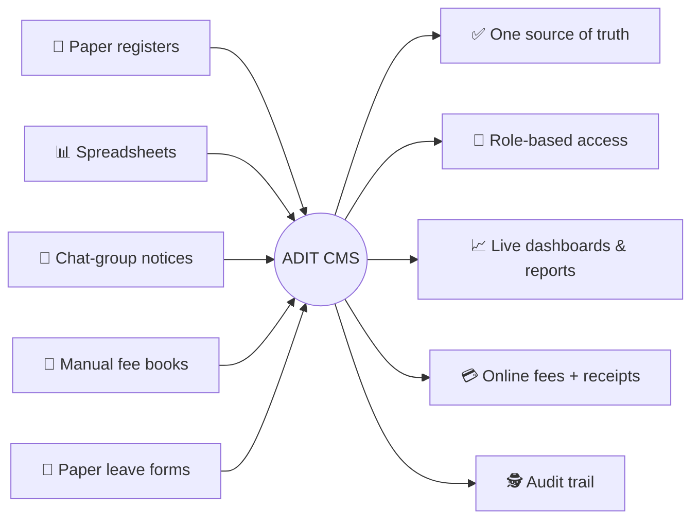

### 1.3 Scope

- **Single-department scope.** Per the [PRD](docs/PRD_ADIT_College_Management_System.md), the system is built for the
  **Computer Engineering** branch only. The database schema is department-aware (`departments`, `department_id`
  columns) so that scope checks exist in code, but other branches are not a product goal.
- **Five roles:** `student`, `faculty`, `hod`, `admin`, `librarian`.
- **Hosting target:** shared PHP/MySQL hosting (the repo ships a root `.htaccess` and a `router.php` fallback for hosts
  where URL rewriting misbehaves).

### 1.4 System at a glance

| Metric | Value |
|---|--:|
| API endpoints | **145** |
| API controllers | 21 |
| Database tables | **39** |
| Foreign-key relations | 69 |
| Frontend routes | 54 |
| React page components | 48 |
| User roles | 5 |

---

## 2. Features by Role

### 2.1 👩‍🎓 Student

| Module | What a student can do |
|---|---|
| **Dashboard** | Overview cards, attendance gauge, performance graph, quick links |
| **Attendance** | Per-subject summary, calendar view, minimum-attendance indicator (default threshold 75%) |
| **Assignments** | See assignments for own subjects, open details, **submit a file**, see marks and review status |
| **Lab manuals** | List manuals, open details, **submit**, track submission status |
| **Study material & syllabus** | Browse syllabus per subject, download materials through short-lived signed links |
| **Timetable** | Weekly timetable for own semester |
| **Results** | Internal + external marks, grades, **marksheet view**, **CGPA calculator**, hall ticket |
| **Fees** | See fee structure, **pay with Razorpay**, view payment history, view/download receipts |
| **Library** | Browse books, see own issue history and fines |
| **Leave** | Apply (sick / personal / official / other), attach a document, track status, **withdraw** |
| **Notices & announcements** | Read notices, mark announcements as read |
| **Profile** | Edit phone, address and photo (semester/batch are deliberately **not** self-editable); digital **ID card** |

### 2.2 👨‍🏫 Faculty

| Module | What faculty can do |
|---|---|
| **Dashboard** | Assigned classes and subjects, quick stats |
| **Attendance** | Mark attendance (`present` / `absent` / `late`) in bulk, edit entries, view reports |
| **Assignments** | Create / edit / delete, view submissions, **review** with marks and `accepted` / `rejected` |
| **Lab manuals** | Create manuals, review student lab submissions |
| **Study material** | Upload, edit, delete materials per subject |
| **Syllabus** | Create and update syllabus entries |
| **Marks** | Enter internal (unit test) marks, update them, view class performance and analytics |
| **Announcements & notices** | Publish announcements (with read-status tracking) and notices |
| **Leave** | First-level review: **forward** to HOD or **reject** |
| **Profile** | Phone, address, photo, qualification, designation, specialization |

### 2.3 🎖️ HOD (Head of Department)

| Module | What the HOD can do |
|---|---|
| **Dashboard** | Department-wide statistics and academic trends |
| **People** | Add / view department students and faculty |
| **Subjects** | Add, update, delete subjects; **assign faculty** to subjects; view faculty load |
| **Classrooms** | Add, update, delete classrooms |
| **Timetable** | Create and delete department timetable entries |
| **Fees** | Department fee report, fee structures |
| **Leave** | Second-level approval: **approve** or **reject** forwarded leave |
| **Reports** | Department reports and academic trends |

### 2.4 🛠️ Admin

| Module | What an admin can do |
|---|---|
| **Dashboard** | System-wide statistics |
| **Users** | List users, create/update/delete students and faculty |
| **Departments / classrooms** | Full CRUD |
| **Fees** | Fee structures, all payments, fee reports |
| **Exams** | Enter external marks, publish results, hall tickets |
| **Timetable / notices** | Full management |
| **Operations** | Audit logs, system settings, **database backup** |

### 2.5 📚 Librarian

| Module | What a librarian can do |
|---|---|
| **Books** | Add books, view catalogue |
| **Circulation** | Issue and return books |
| **History & fines** | View a student's borrowing history and fines |

> ℹ️ Frontend pages for some admin modules and the librarian role are still placeholders — see [Roadmap & Status](#19-roadmap--status).

---

## 3. Tech Stack

### 3.1 Frontend (`frontend/package.json`)

| Concern | Library | Version |
|---|---|---|
| UI library | React | ^18.2.0 |
| Build tool / dev server | Vite (+ `@vitejs/plugin-react`) | ^5.0.8 / ^4.2.1 |
| Routing | react-router-dom | ^6.20.0 |
| State | Redux Toolkit + react-redux (UI/notification slices) and React Context (auth, theme) | ^1.9.5 / ^8.1.3 |
| HTTP | axios | ^1.6.0 |
| Styling | Tailwind CSS + PostCSS + Autoprefixer | ^3.3.6 |
| Component kit / icons | MUI (`@mui/material`, `@mui/icons-material`) + Emotion | ^5.14.0 |
| Charts | chart.js + react-chartjs-2 | ^4.4.0 / ^5.2.0 |
| PDF viewing | react-pdf | ^7.5.0 |
| Toasts | react-hot-toast | ^2.4.1 |
| Lint | ESLint 8 + react, react-hooks, react-refresh plugins | ^8.55.0 |

### 3.2 Backend

| Concern | Choice |
|---|---|
| Language | **PHP 8+** (native, no framework) |
| Style | REST/JSON, hand-written router in `api/routes/api.php` |
| Database access | **PDO** with `ERRMODE_EXCEPTION`, `FETCH_ASSOC`, **prepared statements** (`EMULATE_PREPARES = false`), `utf8mb4` |
| Auth | Custom **JWT HS256** (`helpers/JWT.php`) |
| Passwords | `password_hash()` / `password_verify()` (bcrypt) |
| Email | `helpers/EmailHelper.php` via the **Resend** HTTP API (password reset, leave and assignment templates) |
| Payments | **Razorpay** (order creation + signature verification) |
| Uploads | `helpers/Upload.php` with MIME/extension allow-list |

### 3.3 Database

| Concern | Choice |
|---|---|
| Engine | MySQL 8, InnoDB |
| Charset / collation | `utf8mb4` / `utf8mb4_unicode_ci` |
| Schema file | `database/adit_cms_complete.sql` (schema + seed data) |
| Installer | `database/install.php` (CLI or key-protected web) |
| Migrations | `database/migrate.php` (supports `--dry-run`) |

### 3.4 Design tokens (Tailwind)

The UI is a dark, indigo-accented design system defined in `frontend/tailwind.config.js`:

| Token | Purpose | Example value |
|---|---|---|
| `base` | App background | `#09090b` |
| `surface` (`raised`, `overlay`, `border`, `hover`) | Cards, panels, borders | `#111113` … `#2f2f34` |
| `accent` (`light`, `hover`, `dim`, `glow`) | Primary actions, highlights | `#6366f1` |
| `muted` (`light`, `dark`) | Secondary text | `#a1a1aa` |
| `success` / `danger` | Status colours | `#10b981` / `#ef4444` |

---


## 4. Architecture Diagrams

### 4.1 System context

Who talks to what.

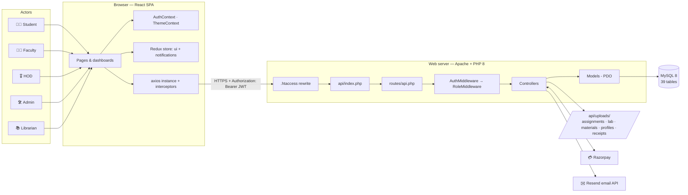

### 4.2 Layered view

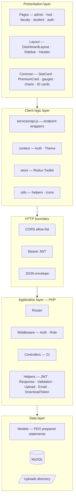

### 4.3 Request lifecycle (every API call)

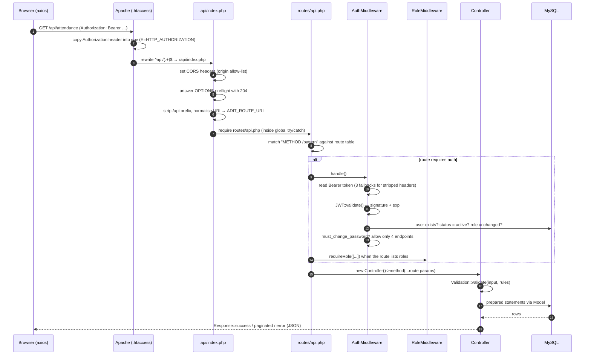

**Status codes returned by the gates**

| Code | Source | Meaning |
|--:|---|---|
| `200` / `201` | Controller | OK / created |
| `204` | `index.php` | CORS preflight answered |
| `400` | Controller | Bad request |
| `401` | `AuthMiddleware` | Missing / invalid / expired token, or account inactive |
| `403` | `RoleMiddleware` / `AuthMiddleware` | Wrong role, or password change still pending |
| `404` | `Response::notFound` | Unknown endpoint or record |
| `422` | `Response::validationError` | Input failed validation |
| `500` | Global `catch` | Generic message in production (details only if `IS_PRODUCTION` is false) |

### 4.4 URL routing — where each URL goes

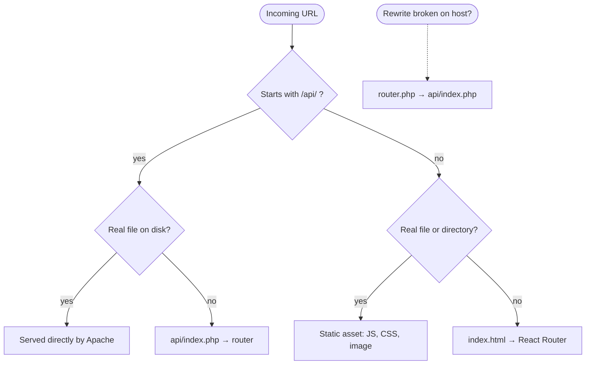

`router.php` is a fallback entry point for hosts where `.htaccess` rewrites are unreliable
(point `VITE_API_URL` at `https://<host>/router.php`).

### 4.5 Frontend architecture

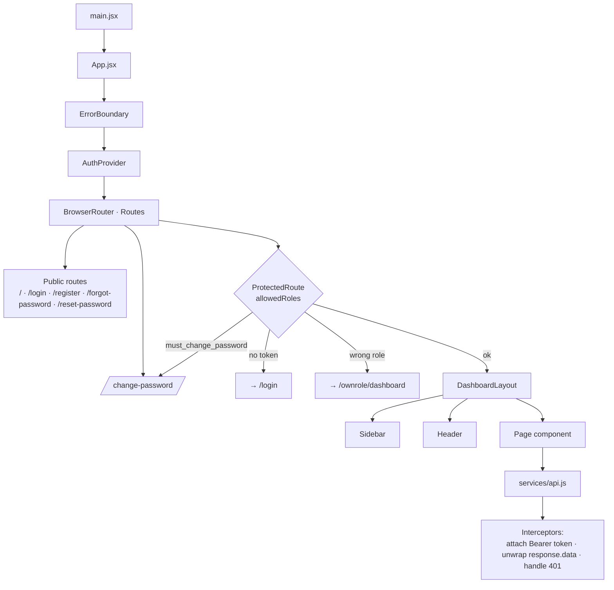

### 4.6 State management map

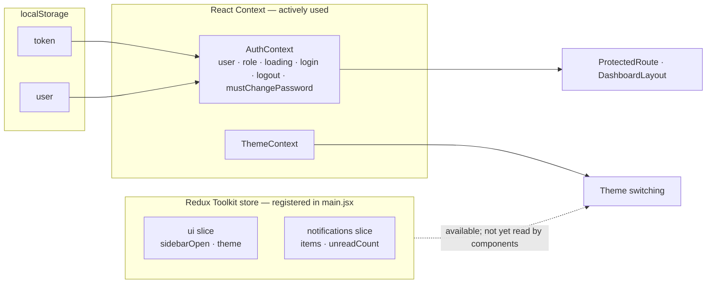

> ℹ️ The Redux store (`ui` and `notifications` slices) is wired into the app via `<Provider>` in `main.jsx`, but at the
> time of writing no component subscribes to it — authentication and theming run on React Context. It is ready for
> sidebar and notification state when you want to move that out of local component state.

### 4.7 Folder responsibility map

```mermaid
flowchart TD
    ROOT[aditcms/]
    ROOT --> FE[frontend/]
    ROOT --> API[api/]
    ROOT --> DBD[database/]
    ROOT --> DOC[docs/]
    ROOT --> HT[.htaccess · router.php · test.php]

    FE --> F1[src/pages — 48 pages by role]
    FE --> F2[src/components — common + layout]
    FE --> F3[src/services/api.js]
    FE --> F4[src/context · src/store · src/utils]
    FE --> F5[public — adit.webp · CVM.webp]

    API --> A1[index.php — entry + CORS]
    API --> A2[routes/api.php — 145 routes]
    API --> A3[controllers — 21]
    API --> A4[models — PDO]
    API --> A5[middleware — Auth · Role]
    API --> A6[helpers — 6 classes]
    API --> A7[config/database.php]
    API --> A8[uploads — 5 sub-folders]

    DBD --> D1[adit_cms_complete.sql]
    DBD --> D2[install.php]
    DBD --> D3[migrate.php]

    DOC --> O1[PRD]
    DOC --> O2[Phase plan]
```

---

## 5. Authentication & Security Flows

### 5.1 Login

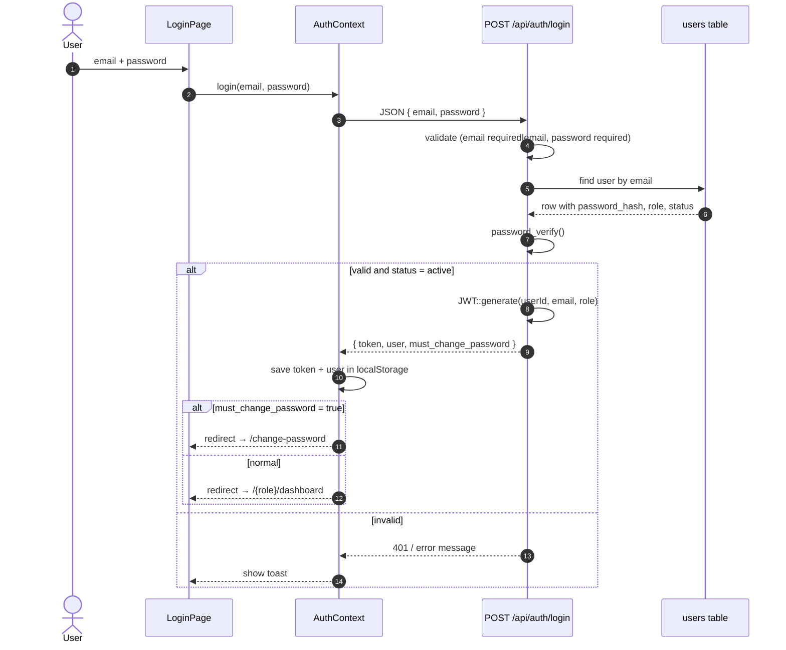

### 5.2 Session restore on page reload

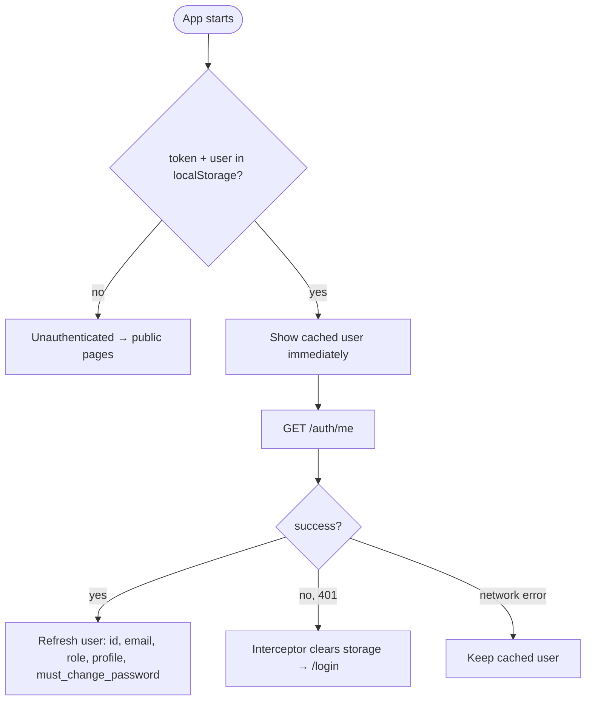

### 5.3 JWT anatomy

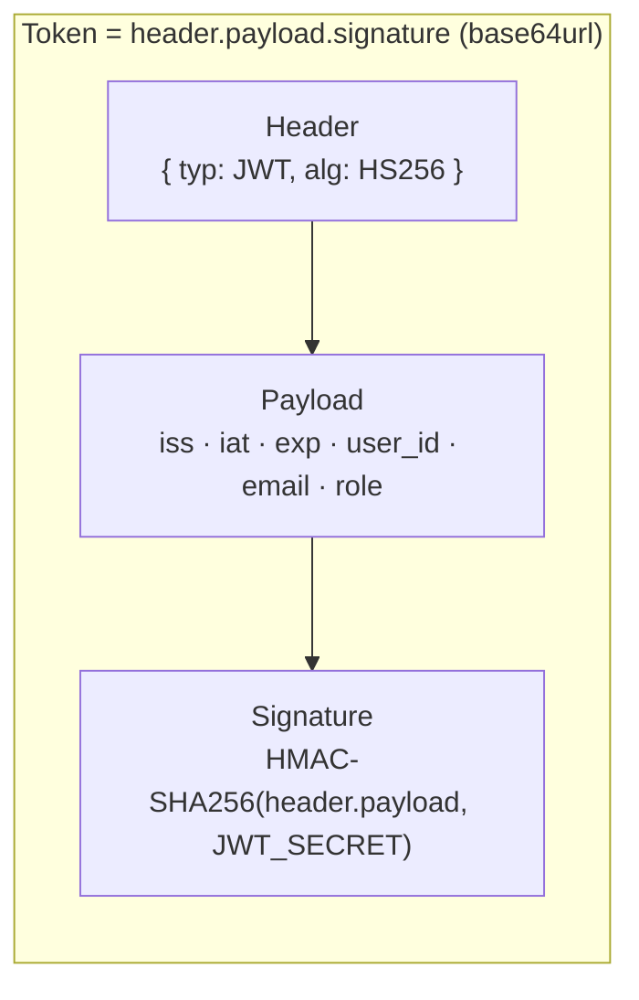

| Claim | Meaning |
|---|---|
| `iss` | `JWT_ISSUER` constant |
| `iat` | Issued-at (unix time) |
| `exp` | `iat + JWT_EXPIRY` |
| `user_id` | `users.id` |
| `email` | Login email |
| `role` | One of `student`, `faculty`, `hod`, `admin`, `librarian` |

### 5.4 What `AuthMiddleware::handle()` checks on every protected call

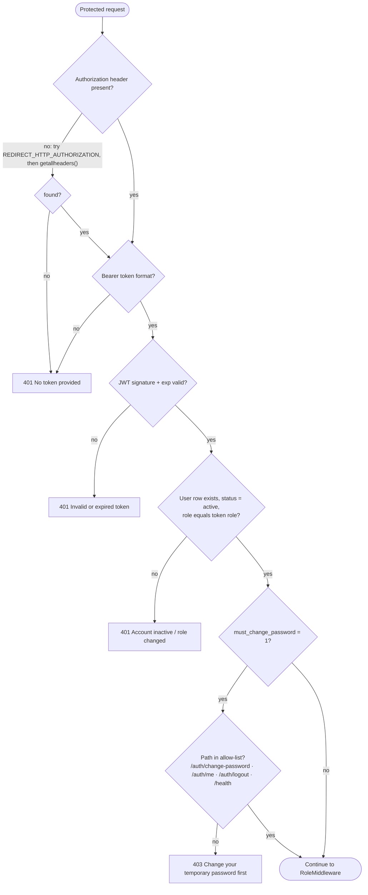

Consequences worth knowing:

- A **deactivated** user is locked out immediately, even with an unexpired token.
- A **role change** invalidates old tokens (token role must match the database role).
- A **provisioning password** can never be used for anything except changing it.

### 5.5 Forced password change

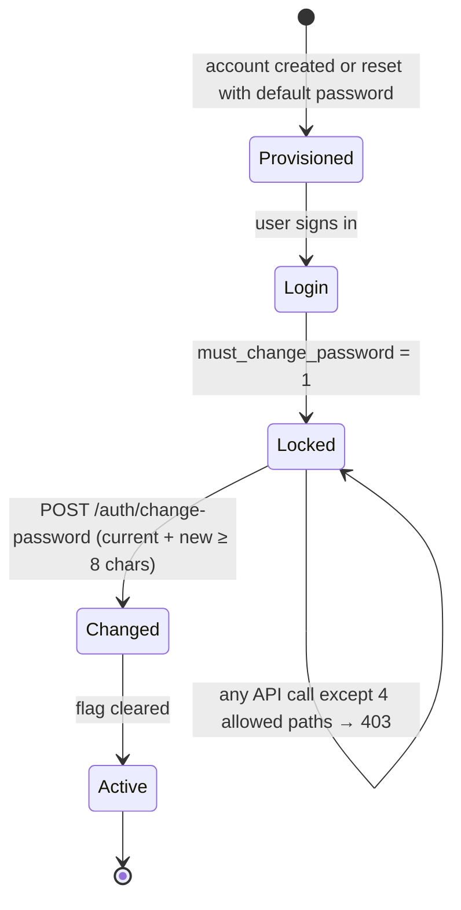

### 5.6 Password reset by email

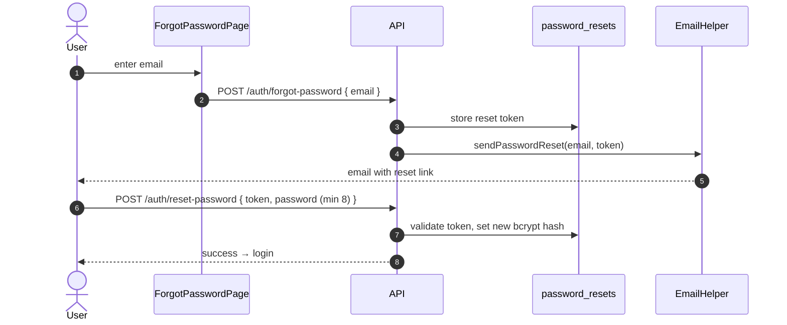

### 5.7 Signed download links (study materials)

A browser cannot attach an `Authorization` header to a plain `<a href>`, and putting a long-lived JWT in a URL would
leak it into logs and history. `helpers/DownloadToken.php` exists for that case: a **short-lived, narrowly scoped,
HMAC-signed token** that is accepted by the download route.

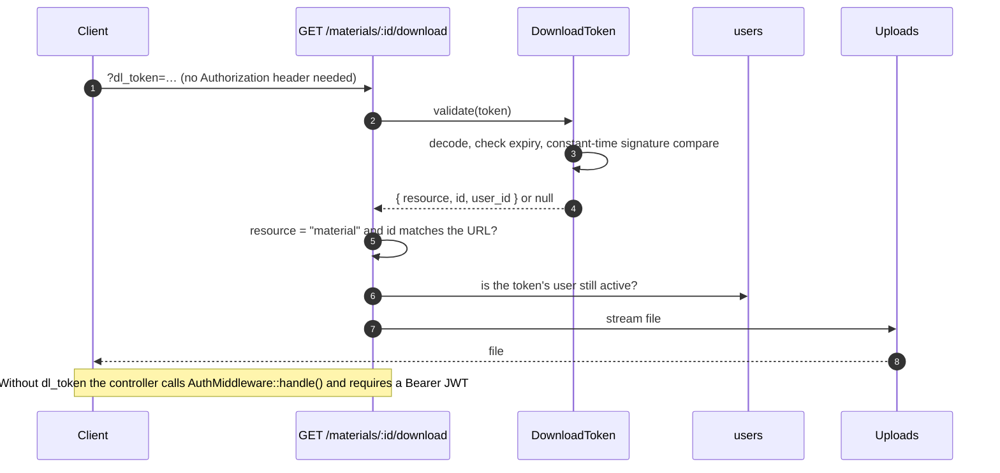

| Property | Value |
|---|---|
| Default lifetime | **300 seconds** (`DownloadToken::DEFAULT_TTL`) |
| Contents | resource name, record id, user id, issued-at, expiry, signature |
| Signing key | Derived from `JWT_SECRET`, so a leaked download token **cannot** be replayed as an API credential |
| Suspended users | A valid token for an account that has since been deactivated is rejected |
| Route | Registered as *public* because the controller accepts **either** a session JWT **or** `?dl_token=` |

> ℹ️ **Current state:** `DownloadToken::issue()` is implemented but **no route calls it yet**. In practice the frontend
> downloads files with its `downloadFile()` helper, which fetches a **blob** through a second axios instance (keeping the
> Bearer token in a header). To hand out signed links, add an endpoint that calls
> `DownloadToken::issue('material', $id, $userId)`.

### 5.8 File upload pipeline

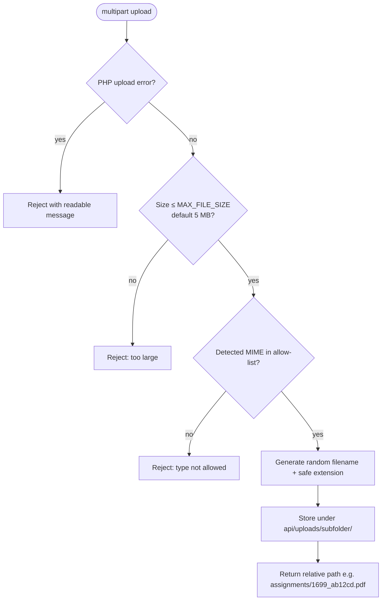

| Allowed groups | Examples |
|---|---|
| Documents | PDF, DOC/DOCX, XLS/XLSX, PPT/PPTX, RTF, TXT, CSV |
| Images | JPEG, PNG, GIF, WebP (profile photos are **image-only**) |
| Never stored | `.php`, `.htaccess` — the helper exists so executable files can never land in the web-accessible uploads folder |

Upload sub-folders: `assignments/`, `lab/`, `materials/`, `profiles/`, `receipts/` (each kept in git via `.gitkeep`).

### 5.9 Layered defence

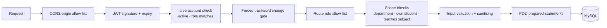

---

## 6. Roles & Permissions

### 6.1 Role landing map

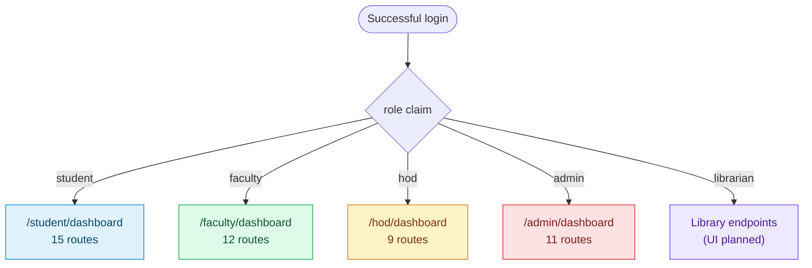

### 6.2 Two enforcement points

| Where | Mechanism | Purpose |
|---|---|---|
| **Frontend** | `ProtectedRoute allowedRoles={[…]}` | Better UX — wrong-role users are bounced to their own dashboard |
| **Backend** | `RoleMiddleware::requireRole([...])` | **The real security boundary** — an explicit allow-list per route |

> ⚠️ Frontend checks are cosmetic. Never rely on them for security; every sensitive route is also restricted in
> `api/routes/api.php`.

### 6.3 Allow-lists are explicit (no inheritance)

`RoleMiddleware::requireRole()` is a plain `in_array` check. An `admin` is **not** implicitly allowed on a route that
lists only `['hod']`; routes admins may use list `'admin'` explicitly.

### 6.4 Scope helpers (beyond role)

A role is often not enough — e.g. a faculty member should only touch *their own* subjects. `RoleMiddleware` also provides:

| Helper | Answers |
|---|---|
| `hodDepartmentId()` | Which department does this HOD head? |
| `ownDepartmentId()` | Which department does this faculty/student belong to? |
| `canAccessDepartment($id)` | May the current user act on this department? |
| `canAccessStudent($studentId)` | May the current user see this student's data? |
| `teachesSubject($facultyId, $subjectId)` | Does this faculty member teach this subject? |
| `scopeDepartmentId()` | Department filter to apply to list queries |

### 6.5 Endpoint access matrix (generated from the route table)

Cell = *endpoints in the group this role can call* / *endpoints in the group*.

| Group | student | faculty | hod | admin | librarian |
|---|:--:|:--:|:--:|:--:|:--:|
| Auth routes (public) | 5/5 | 5/5 | 5/5 | 5/5 | 5/5 |
| Auth routes (protected) | 4/4 | 4/4 | 4/4 | 4/4 | 4/4 |
| Public data routes (for registration form) | 2/2 | 2/2 | 2/2 | 2/2 | 2/2 |
| Department routes (protected) | 0/5 | 0/5 | 2/5 | 5/5 | 0/5 |
| Course routes | 2/2 | 2/2 | 2/2 | 2/2 | 2/2 |
| Classroom routes | 1/4 | 1/4 | 1/4 | 4/4 | 1/4 |
| Student routes | 3/6 | 3/6 | 3/6 | 6/6 | 2/6 |
| Faculty routes | 1/7 | 4/7 | 3/7 | 6/7 | 1/7 |
| Attendance routes | 4/7 | 7/7 | 7/7 | 7/7 | 4/7 |
| Assignment routes | 3/8 | 7/8 | 3/8 | 7/8 | 2/8 |
| Fee routes | 6/12 | 4/12 | 7/12 | 10/12 | 4/12 |
| Library routes | 3/6 | 3/6 | 3/6 | 6/6 | 6/6 |
| Marks routes | 1/3 | 3/3 | 1/3 | 3/3 | 1/3 |
| Exam routes | 2/7 | 5/7 | 3/7 | 7/7 | 1/7 |
| Timetable routes | 1/4 | 1/4 | 4/4 | 4/4 | 1/4 |
| Notice routes | 1/4 | 2/4 | 3/4 | 4/4 | 1/4 |
| Leave Application routes | 4/5 | 3/5 | 3/5 | 3/5 | 2/5 |
| Lab Manual routes | 2/7 | 6/7 | 2/7 | 6/7 | 1/7 |
| Study Material routes | 2/5 | 5/5 | 3/5 | 5/5 | 2/5 |
| Syllabus routes | 3/6 | 6/6 | 4/6 | 6/6 | 3/6 |
| Announcement routes | 2/6 | 6/6 | 4/6 | 6/6 | 2/6 |
| Student-specific routes | 3/3 | 0/3 | 0/3 | 0/3 | 0/3 |
| HOD routes | 0/21 | 0/21 | 21/21 | 0/21 | 0/21 |
| Admin routes | 0/6 | 0/6 | 0/6 | 6/6 | 0/6 |

---

## 7. Business Workflows

### 7.1 Assignment lifecycle

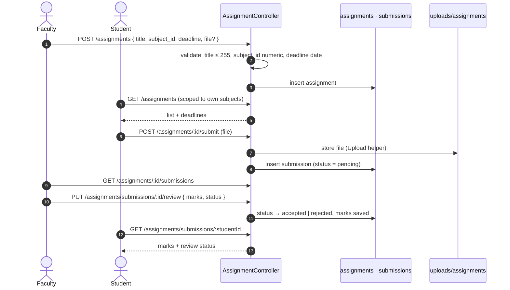

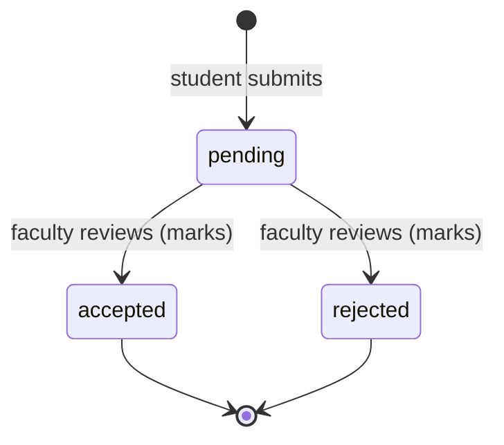

### 7.2 Lab manual lifecycle

Same shape as assignments, with an extra **progress** state per student.

```mermaid
flowchart LR
    A[Faculty creates lab manual<br/>per subject] --> B[Student opens manual]
    B --> C[Student submits lab work]
    C --> D[(lab_submissions<br/>pending)]
    D --> E[Faculty reviews]
    E --> F{Decision}
    F -- accepted --> G[Marks visible to student]
    F -- rejected --> H[Student sees feedback]
    G --> I[Student: Lab Manual Status page]
    H --> I
```

`lab_manuals` tracks progress as `not_started` → `in_progress` → `completed`.

### 7.3 Attendance

```mermaid
sequenceDiagram
    autonumber
    actor F as Faculty
    participant API as AttendanceController
    participant DB as attendance
    actor S as Student

    F->>API: POST /attendance/mark<br/>{ subject_id, date, records: [{ student_id, status }] }
    Note over API: status ∈ present · absent · late
    API->>DB: insert rows (marked_by = faculty)
    F->>API: PUT /attendance/:id { status } (correct a mistake)
    S->>API: GET /attendance/student/:id/summary
    API-->>S: per-subject totals + percentage
    S->>API: GET /attendance/student/:id/calendar
    API-->>S: day-by-day calendar data
    F->>API: GET /attendance/report
    API-->>F: class report
```

Faculty can only mark attendance for subjects they teach (`assertCanMark` → `RoleMiddleware::teachesSubject`).
The endpoint accepts either a single record or a bulk `records` array that shares one `subject_id` and `date`.

**`late` counts as attended** in the percentage: `(present + late) / total × 100`.

```mermaid
flowchart TD
    M[Attendance rows] --> SUM[Summary per subject:<br/>present + late vs total]
    SUM --> G[AttendanceGauge]
    M --> CAL[AttendanceCalendar]
    SET[(system_settings<br/>min_attendance_percentage = 75)] --> G
```

### 7.4 Leave — two-level approval

```mermaid
stateDiagram-v2
    [*] --> pending: Student applies<br/>(type, from, to, reason ≥ 10 chars, optional document)
    pending --> withdrawn: Student withdraws
    pending --> forwarded: Faculty action = forward
    pending --> rejected: Faculty action = reject
    forwarded --> approved: HOD action = approve
    forwarded --> rejected: HOD action = reject
    approved --> [*]
    rejected --> [*]
    withdrawn --> [*]
```

```mermaid
sequenceDiagram
    autonumber
    actor S as Student
    actor F as Faculty
    actor H as HOD
    participant API as LeaveApplicationController
    participant DB as leave_applications

    S->>API: POST /leave-applications { leave_type, from_date, to_date, reason }
    API->>DB: status = pending
    F->>API: PUT /leave-applications/:id { action: forward | reject, comments }
    API->>DB: faculty_reviewed_by / _at / comments saved
    H->>API: PUT /leave-applications/:id { action: approve | reject, comments }
    API->>DB: hod_reviewed_by / _at / comments saved
    S->>API: GET /leave-applications (see status + both comments)
```

| Field | Allowed values |
|---|---|
| `leave_type` | `sick`, `personal`, `official`, `other` |
| `status` | `pending`, `forwarded`, `approved`, `rejected`, `withdrawn` |
| Faculty `action` | `forward`, `reject` |
| HOD `action` | `approve`, `reject` |

The email helper includes templates for leave submission and leave status changes (`sendLeaveNotification`,
`sendLeaveStatusNotification`).

### 7.5 Fee payment (Razorpay)

```mermaid
sequenceDiagram
    autonumber
    actor A as Admin / HOD
    actor S as Student
    participant API as FeeController
    participant DB as fee_structures · fee_payments
    participant RZ as Razorpay

    A->>API: POST /fees/structure { course_id, semester, fee_type, amount }
    API->>DB: save fee structure
    S->>API: GET /fees/structure
    S->>API: POST /fees/create-order { fee_structure_id }
    API->>RZ: create order
    RZ-->>API: razorpay_order_id
    API->>DB: fee_payments row (status = pending)
    API-->>S: order details for Checkout
    S->>RZ: pay in Razorpay Checkout
    RZ-->>S: razorpay_payment_id + signature
    S->>API: POST /fees/verify-payment { razorpay_order_id, razorpay_payment_id, razorpay_signature }
    API->>API: verify HMAC-SHA256 signature (hash_equals) BEFORE touching the DB
    alt signature valid
        API->>DB: status = completed, paid_at = now
        API-->>S: success + receipt available
    else signature mismatch
        API-->>S: 400 Payment verification failed (no DB change)
    end
    S->>API: GET /fees/receipt/:id · /fees/receipt/:id/download
```

```mermaid
stateDiagram-v2
    [*] --> pending: order created
    pending --> completed: signature verified
    completed --> refunded: refund
    pending --> failed: payment failed
    failed --> [*]
    completed --> [*]
    refunded --> [*]
```

> The `failed` and `refunded` values exist in the `fee_payments.status` enum. A **signature mismatch** at
> `/fees/verify-payment` is rejected with `400` and deliberately leaves the order untouched, so a forged request cannot
> flip a real order to `failed`.

### 7.6 Marks → results → marksheet

```mermaid
flowchart TD
    UT[Faculty enters unit-test marks<br/>POST /marks/internal] --> UTT[(unit_tests)]
    EX[Admin / faculty enters external marks<br/>POST /exams/external-marks] --> EXT[(external_marks)]
    UTT --> CALC
    EXT --> CALC
    GD[(grade_definitions<br/>O=10, A+=9, A=8, B+=7, B=6, C=5, F=0)] --> CALC
    CALC[Compute grades, SGPA, CGPA] --> RES[(results<br/>sgpa · cgpa · status pass/fail)]
    RES --> PUB[Admin: POST /exams/publish-results]
    PUB --> STU[Student: GET /exams/results · /exams/student-marks]
    STU --> MS[MarksheetView + CGPACalculator]
    RES --> HT[Hall ticket: GET /exams/hall-ticket]
    UTT --> AN[Faculty / HOD analytics<br/>GET /exams/analytics/:subjectId · /exams/performance]
```

**Grade scale seeded in the database**

| Marks | Grade | Grade point | Meaning |
|:--:|:--:|:--:|---|
| 90 – 100 | `O` | 10.0 | Outstanding |
| 80 – 89.99 | `A+` | 9.0 | Excellent |
| 70 – 79.99 | `A` | 8.0 | Very Good |
| 60 – 69.99 | `B+` | 7.0 | Good |
| 50 – 59.99 | `B` | 6.0 | Above Average |
| 40 – 49.99 | `C` | 5.0 | Average |
| 0 – 39.99 | `F` | 0.0 | Fail |

### 7.7 Library circulation

```mermaid
sequenceDiagram
    autonumber
    actor L as Librarian / Admin
    actor S as Student
    participant API as LibraryController
    participant DB as books · book_issues

    L->>API: POST /library/books { title, author, total_copies }
    S->>API: GET /library/books
    L->>API: POST /library/issue { book_id, student_id }
    API->>DB: book_issues (issued, issue_date, due_date)
    L->>API: POST /library/return { issue_id }
    API->>DB: return_date set, fine_amount calculated if late
    S->>API: GET /library/history/:studentId
    S->>API: GET /library/fines/:studentId
```

```mermaid
stateDiagram-v2
    [*] --> issued
    issued --> returned: returned on time
    issued --> overdue: past due date
    overdue --> returned: returned (fine applied)
    overdue --> fine_paid: fine paid
    returned --> [*]
    fine_paid --> [*]
```

Seeded library settings in `system_settings`: fine **₹5 / day**, max **3 books** per student, loan period **14 days**.

> ⚠️ **Heads-up:** the fine calculation in `api/models/Library.php` currently uses a **hard-coded ₹5 per day** rather than
> reading `library_fine_per_day`. Editing that setting will not change the fine until the model reads it.

### 7.8 Notices & announcements

```mermaid
flowchart LR
    subgraph Notices
        N1[Admin / HOD / Faculty: POST /notices] --> N2[(notices<br/>type: college · department · class<br/>audience: all · student · faculty · both)]
        N2 --> N3[Student: GET /notices/student]
    end
    subgraph Announcements
        A1[Faculty / HOD / Admin: POST /announcements] --> A2[(announcements<br/>per subject / class)]
        A2 --> A3[Student reads → POST /announcements/:id/read]
        A3 --> A4[(announcement_reads)]
        A4 --> A5[Faculty: GET /announcements/:id/reads<br/>who has read it]
    end
```

| | Notices | Announcements |
|---|---|---|
| Scope | College / department / class | A subject or class |
| Author | admin, hod, faculty | faculty, hod, admin |
| Edit / delete | update: admin, hod · delete: admin | update/delete: faculty, admin |
| Read tracking | No | **Yes** (`announcement_reads`) |

### 7.9 Timetable

```mermaid
flowchart TD
    HOD[HOD / Admin] -->|"POST /timetable or /hod/add-timetable"| T[(timetables<br/>day · period · subject · faculty · classroom · start/end)]
    T --> SV[Student view — by semester]
    T --> FV[Faculty view — own periods]
    T --> HV[HOD view — department grid]
    C[(classrooms)] --> T
    SU[(subjects)] --> T
```

Days allowed: `Monday` … `Saturday`. Required fields: `day_of_week`, `period_number`, `classroom`, `start_time`, `end_time`.

### 7.10 HOD operations map

```mermaid
mindmap
  root((HOD))
    People
      Add student
      Add faculty
      View students
      View faculty
    Academics
      Add subject
      Update subject
      Delete subject
      Assign faculty to subject
      Faculty load
    Infrastructure
      Add classroom
      Update classroom
      Delete classroom
    Schedule
      Department timetable
      Add entry
      Delete entry
    Finance
      Fee report
    Insight
      Dashboard
      Academic trends
      Department reports
    Approvals
      Leave final approval
```

### 7.11 Student onboarding

```mermaid
flowchart LR
    A[Admin or HOD creates student<br/>POST /students · /hod/add-student] --> B[users row + students row]
    B --> C[Provisioning password set<br/>must_change_password = 1]
    C --> D[Student logs in]
    D --> E[Forced to /change-password]
    E --> F[Dashboard unlocked]
    G[Public: /register page] -.-> B
    H[GET /departments public list] --> G
```

---

## 8. Database Design

**Engine:** MySQL 8 · InnoDB · `utf8mb4_unicode_ci` · **39 tables** · **69 foreign keys**.
A complete column-level listing is in [Section 9](#9-data-dictionary-all-tables).

### 8.1 Table groups

```mermaid
flowchart TB
    subgraph IDENT["🔐 Identity"]
        users
        students
        faculty
        librarians
        password_resets
        email_verifications
    end
    subgraph STRUCT["🏫 Academic structure"]
        departments
        courses
        semesters
        batches
        subjects
        classrooms
        timetables
        syllabus
        academic_calendar
        holidays
    end
    subgraph WORK["📝 Daily academic work"]
        attendance
        assignments
        submissions
        lab_manuals
        lab_submissions
        study_materials
        material_downloads
        leave_applications
    end
    subgraph EXAM["🎯 Examinations"]
        unit_tests
        external_marks
        results
        grade_definitions
        hall_tickets
    end
    subgraph MONEY["💰 Finance"]
        fee_structures
        fee_payments
    end
    subgraph LIB["📚 Library"]
        books
        book_issues
    end
    subgraph COMM["📣 Communication"]
        notices
        announcements
        announcement_reads
    end
    subgraph SYS["⚙️ System"]
        system_settings
        audit_logs
        system_backups
    end
```

### 8.2 Core ER diagram — identity & structure

```mermaid
erDiagram
    USERS ||--o| STUDENTS : "profile (user_id)"
    USERS ||--o| FACULTY : "profile (user_id)"
    USERS ||--o| LIBRARIANS : "profile (user_id)"
    DEPARTMENTS ||--o{ COURSES : "has"
    DEPARTMENTS ||--o{ FACULTY : "employs"
    DEPARTMENTS ||--o{ STUDENTS : "enrols"
    FACULTY ||--o| DEPARTMENTS : "heads as HOD (hod_id)"
    COURSES ||--o{ SEMESTERS : "has"
    COURSES ||--o{ BATCHES : "has"
    SEMESTERS ||--o{ SUBJECTS : "contains"
    DEPARTMENTS ||--o{ SUBJECTS : "owns"
    FACULTY ||--o{ SUBJECTS : "teaches"
    DEPARTMENTS ||--o{ CLASSROOMS : "has"

    USERS {
        int id PK
        string email UK
        string password_hash
        enum role "student faculty hod admin librarian"
        enum status "active inactive suspended"
        bool must_change_password
    }
    STUDENTS {
        int id PK
        int user_id FK
        string roll_number
        int department_id FK
        int semester
        string batch
    }
    FACULTY {
        int id PK
        int user_id FK
        string employee_id
        int department_id FK
        string designation
    }
    DEPARTMENTS {
        int id PK
        string name
        string code UK
        int hod_id FK
    }
    SUBJECTS {
        int id PK
        int semester_id FK
        int department_id FK
        int faculty_id FK
    }
```

### 8.3 ER diagram — academic activity

```mermaid
erDiagram
    STUDENTS ||--o{ ATTENDANCE : "has"
    SUBJECTS ||--o{ ATTENDANCE : "tracked in"
    FACULTY ||--o{ ATTENDANCE : "marked_by"

    SUBJECTS ||--o{ ASSIGNMENTS : "has"
    FACULTY ||--o{ ASSIGNMENTS : "creates"
    ASSIGNMENTS ||--o{ SUBMISSIONS : "receives"
    STUDENTS ||--o{ SUBMISSIONS : "submits"

    SUBJECTS ||--o{ LAB_MANUALS : "has"
    LAB_MANUALS ||--o{ LAB_SUBMISSIONS : "receives"
    STUDENTS ||--o{ LAB_SUBMISSIONS : "submits"

    SUBJECTS ||--o{ STUDY_MATERIALS : "has"
    STUDY_MATERIALS ||--o{ MATERIAL_DOWNLOADS : "logged in"

    SUBJECTS ||--o{ SYLLABUS : "described by"
    SUBJECTS ||--o{ TIMETABLES : "scheduled in"
    FACULTY ||--o{ TIMETABLES : "teaches in"

    STUDENTS ||--o{ LEAVE_APPLICATIONS : "applies"
    FACULTY ||--o{ LEAVE_APPLICATIONS : "level-1 review"
    FACULTY ||--o{ LEAVE_APPLICATIONS : "HOD level-2 review"
```

### 8.4 ER diagram — exams, money, library, communication

```mermaid
erDiagram
    STUDENTS ||--o{ UNIT_TESTS : "takes"
    STUDENTS ||--o{ EXTERNAL_MARKS : "scores"
    SUBJECTS ||--o{ UNIT_TESTS : "assessed in"
    SUBJECTS ||--o{ EXTERNAL_MARKS : "assessed in"
    STUDENTS ||--o{ RESULTS : "receives"
    SEMESTERS ||--o{ RESULTS : "for"
    STUDENTS ||--o{ HALL_TICKETS : "gets"
    SEMESTERS ||--o{ HALL_TICKETS : "for"

    COURSES ||--o{ FEE_STRUCTURES : "priced by"
    FEE_STRUCTURES ||--o{ FEE_PAYMENTS : "paid via"
    STUDENTS ||--o{ FEE_PAYMENTS : "pays"

    BOOKS ||--o{ BOOK_ISSUES : "issued as"
    STUDENTS ||--o{ BOOK_ISSUES : "borrows"

    USERS ||--o{ NOTICES : "creates"
    DEPARTMENTS ||--o{ NOTICES : "targets"
    FACULTY ||--o{ ANNOUNCEMENTS : "creates"
    SUBJECTS ||--o{ ANNOUNCEMENTS : "about"
    ANNOUNCEMENTS ||--o{ ANNOUNCEMENT_READS : "tracked by"
    USERS ||--o{ ANNOUNCEMENT_READS : "reads"

    USERS ||--o{ AUDIT_LOGS : "actions logged"
    USERS ||--o{ SYSTEM_SETTINGS : "updated_by"
    USERS ||--o{ PASSWORD_RESETS : "requests"
    USERS ||--o{ EMAIL_VERIFICATIONS : "verifies"
```

### 8.5 Delete behaviour (cascade rules)

| Pattern | Used for | Effect |
|---|---|---|
| `ON DELETE CASCADE` | child rows that make no sense alone — a student's attendance, submissions, payments, a subject's assignments | Deleting the parent deletes the children |
| `ON DELETE SET NULL` | audit-style references — `marked_by`, `reviewed_by`, `created_by`, `faculty_id` on subjects, `hod_id` on departments | Deleting the person keeps the record but clears the reference |

### 8.6 Seeded system settings

Stored as key/value rows in `system_settings` and editable through `GET/PUT /api/admin/settings`. Some behaviours (for example the library fine rate) are still hard-coded in PHP — see the note in [7.7](#77-library-circulation).

| Key | Default |
|---|---|
| `college_name` | A.D. Institute of Technology (ADIT) |
| `college_address` | ADIT Campus, Ahmedabad, Gujarat, India |
| `college_phone` / `college_email` | placeholders in the seed file |
| `academic_year` | 2026-27 |
| `min_attendance_percentage` | 75 |
| `library_fine_per_day` | 5 |
| `max_books_issue` | 3 |
| `book_issue_duration_days` | 14 |
| `razorpay_key_id` | test placeholder |

### 8.7 Seeded demo data

`database/install.php` loads demo data and sets real bcrypt hashes. Demo accounts created:

| Role | Email |
|---|---|
| Admin | `admin@adit.edu` |
| HOD | `hod.ce@adit.edu` |
| Faculty | `ravi.sharma@adit.edu`, `priya.patel@adit.edu`, `amit.trivedi@adit.edu` |
| Librarian | `librarian@adit.edu` |
| Students | `student01@adit.edu` … `student06@adit.edu` |

> 🔐 The demo passwords are defined in `database/install.php`. **Change or delete every demo account before going live.**

---


## 9. Data Dictionary (all tables)

How to read it: **PK** primary key · **auto** auto-increment · **required** `NOT NULL` · **unique** unique constraint.
Foreign keys list their delete action (`on delete cascade` / `on delete set null`).

> **39 tables.** Generated from [`database/adit_cms_complete.sql`](database/adit_cms_complete.sql).


### `users`

| Column | Type | Notes |
|---|---|---|
| `id` | `INT` | PK, auto |
| `email` | `VARCHAR(255)` | required, unique |
| `password_hash` | `VARCHAR(255)` | required |
| `role` | `ENUM('student', 'faculty', 'hod', 'admin', 'librarian')` | required |
| `status` | `ENUM('active', 'inactive', 'suspended')` | default 'active' |
| `must_change_password` | `TINYINT(1)` | required, default 0 |
| `created_at` | `TIMESTAMP` | default CURRENT_TIMESTAMP |
| `updated_at` | `TIMESTAMP` | default CURRENT_TIMESTAMP |

**Indexes / keys**

- `INDEX idx_email (email)`
- `INDEX idx_role (role)`
- `INDEX idx_status (status)`

### `departments`

| Column | Type | Notes |
|---|---|---|
| `id` | `INT` | PK, auto |
| `name` | `VARCHAR(100)` | required |
| `code` | `VARCHAR(10)` | required, unique |
| `hod_id` | `INT` | — |
| `description` | `TEXT` | — |
| `created_at` | `TIMESTAMP` | default CURRENT_TIMESTAMP |
| `updated_at` | `TIMESTAMP` | default CURRENT_TIMESTAMP |

### `courses`

| Column | Type | Notes |
|---|---|---|
| `id` | `INT` | PK, auto |
| `name` | `VARCHAR(150)` | required |
| `code` | `VARCHAR(20)` | required, unique |
| `department_id` | `INT` | required |
| `duration_years` | `INT` | default 4 |
| `total_semesters` | `INT` | default 8 |
| `created_at` | `TIMESTAMP` | default CURRENT_TIMESTAMP |

**Foreign keys**

- `department_id` → `departments.id` on delete cascade

### `semesters`

| Column | Type | Notes |
|---|---|---|
| `id` | `INT` | PK, auto |
| `course_id` | `INT` | required |
| `semester_number` | `INT` | required |
| `start_date` | `DATE` | — |
| `end_date` | `DATE` | — |
| `created_at` | `TIMESTAMP` | default CURRENT_TIMESTAMP |

**Foreign keys**

- `course_id` → `courses.id` on delete cascade

**Indexes / keys**

- `UNIQUE KEY unique_semester (course_id, semester_number)`

### `batches`

| Column | Type | Notes |
|---|---|---|
| `id` | `INT` | PK, auto |
| `name` | `VARCHAR(50)` | required |
| `course_id` | `INT` | required |
| `department_id` | `INT` | required |
| `start_year` | `YEAR` | required |
| `end_year` | `YEAR` | required |
| `created_at` | `TIMESTAMP` | default CURRENT_TIMESTAMP |

**Foreign keys**

- `course_id` → `courses.id` on delete cascade
- `department_id` → `departments.id` on delete cascade

### `faculty`

| Column | Type | Notes |
|---|---|---|
| `id` | `INT` | PK, auto |
| `user_id` | `INT` | required |
| `employee_id` | `VARCHAR(20)` | required, unique |
| `first_name` | `VARCHAR(100)` | required |
| `last_name` | `VARCHAR(100)` | required |
| `qualification` | `VARCHAR(100)` | — |
| `experience_years` | `INT` | default 0 |
| `department_id` | `INT` | — |
| `designation` | `VARCHAR(50)` | — |
| `phone` | `VARCHAR(15)` | — |
| `photo` | `VARCHAR(255)` | — |
| `created_at` | `TIMESTAMP` | default CURRENT_TIMESTAMP |
| `updated_at` | `TIMESTAMP` | default CURRENT_TIMESTAMP |

**Foreign keys**

- `user_id` → `users.id` on delete cascade
- `department_id` → `departments.id` on delete set null

**Indexes / keys**

- `INDEX idx_employee_id (employee_id)`
- `INDEX idx_department (department_id)`

### `librarians`

| Column | Type | Notes |
|---|---|---|
| `id` | `INT` | PK, auto |
| `user_id` | `INT` | required |
| `employee_id` | `VARCHAR(20)` | required, unique |
| `first_name` | `VARCHAR(100)` | required |
| `last_name` | `VARCHAR(100)` | required |
| `phone` | `VARCHAR(15)` | — |
| `created_at` | `TIMESTAMP` | default CURRENT_TIMESTAMP |
| `updated_at` | `TIMESTAMP` | default CURRENT_TIMESTAMP |

**Foreign keys**

- `user_id` → `users.id` on delete cascade

**Indexes / keys**

- `UNIQUE KEY unique_user (user_id)`
- `INDEX idx_employee_id (employee_id)`

### `students`

| Column | Type | Notes |
|---|---|---|
| `id` | `INT` | PK, auto |
| `user_id` | `INT` | required |
| `roll_number` | `VARCHAR(20)` | required, unique |
| `first_name` | `VARCHAR(100)` | required |
| `last_name` | `VARCHAR(100)` | required |
| `dob` | `DATE` | — |
| `gender` | `ENUM('male', 'female', 'other')` | — |
| `phone` | `VARCHAR(15)` | — |
| `address` | `TEXT` | — |
| `photo` | `VARCHAR(255)` | — |
| `department_id` | `INT` | — |
| `semester` | `INT` | default 1 |
| `batch` | `VARCHAR(20)` | — |
| `admission_date` | `DATE` | — |
| `created_at` | `TIMESTAMP` | default CURRENT_TIMESTAMP |
| `updated_at` | `TIMESTAMP` | default CURRENT_TIMESTAMP |

**Foreign keys**

- `user_id` → `users.id` on delete cascade
- `department_id` → `departments.id` on delete set null

**Indexes / keys**

- `INDEX idx_roll_number (roll_number)`
- `INDEX idx_department_semester (department_id, semester)`
- `INDEX idx_batch (batch)`

### `subjects`

| Column | Type | Notes |
|---|---|---|
| `id` | `INT` | PK, auto |
| `name` | `VARCHAR(150)` | required |
| `code` | `VARCHAR(20)` | required, unique |
| `semester_id` | `INT` | required |
| `department_id` | `INT` | required |
| `faculty_id` | `INT` | — |
| `credits` | `INT` | default 3 |
| `type` | `ENUM('theory', 'practical', 'theory_practical')` | default 'theory' |
| `created_at` | `TIMESTAMP` | default CURRENT_TIMESTAMP |

**Foreign keys**

- `semester_id` → `semesters.id` on delete cascade
- `department_id` → `departments.id` on delete cascade
- `faculty_id` → `faculty.id` on delete set null

**Indexes / keys**

- `INDEX idx_code (code)`
- `INDEX idx_semester (semester_id)`

### `classrooms`

| Column | Type | Notes |
|---|---|---|
| `id` | `INT` | PK, auto |
| `name` | `VARCHAR(50)` | required |
| `building` | `VARCHAR(50)` | — |
| `floor` | `INT` | — |
| `capacity` | `INT` | default 60 |
| `type` | `ENUM('classroom', 'lab', 'seminar_hall')` | default 'classroom' |
| `department_id` | `INT` | — |
| `created_at` | `TIMESTAMP` | default CURRENT_TIMESTAMP |

**Foreign keys**

- `department_id` → `departments.id` on delete set null

### `attendance`

| Column | Type | Notes |
|---|---|---|
| `id` | `INT` | PK, auto |
| `student_id` | `INT` | required |
| `subject_id` | `INT` | required |
| `date` | `DATE` | required |
| `status` | `ENUM('present', 'absent', 'late')` | required |
| `marked_by` | `INT` | — |
| `created_at` | `TIMESTAMP` | default CURRENT_TIMESTAMP |

**Foreign keys**

- `student_id` → `students.id` on delete cascade
- `subject_id` → `subjects.id` on delete cascade
- `marked_by` → `faculty.id` on delete set null

**Indexes / keys**

- `UNIQUE KEY unique_attendance (student_id, subject_id, date)`
- `INDEX idx_date (date)`
- `INDEX idx_subject_date (subject_id, date)`

### `assignments`

| Column | Type | Notes |
|---|---|---|
| `id` | `INT` | PK, auto |
| `title` | `VARCHAR(255)` | required |
| `description` | `TEXT` | — |
| `subject_id` | `INT` | required |
| `faculty_id` | `INT` | required |
| `deadline` | `DATETIME` | required |
| `max_marks` | `INT` | default 100 |
| `attachments` | `VARCHAR(500)` | — |
| `created_at` | `TIMESTAMP` | default CURRENT_TIMESTAMP |
| `updated_at` | `TIMESTAMP` | default CURRENT_TIMESTAMP |

**Foreign keys**

- `subject_id` → `subjects.id` on delete cascade
- `faculty_id` → `faculty.id` on delete cascade

**Indexes / keys**

- `INDEX idx_subject (subject_id)`
- `INDEX idx_deadline (deadline)`

### `submissions`

| Column | Type | Notes |
|---|---|---|
| `id` | `INT` | PK, auto |
| `assignment_id` | `INT` | required |
| `student_id` | `INT` | required |
| `file_path` | `VARCHAR(500)` | — |
| `submitted_at` | `TIMESTAMP` | default CURRENT_TIMESTAMP |
| `marks` | `INT` | — |
| `feedback` | `TEXT` | — |
| `status` | `ENUM('pending', 'accepted', 'rejected')` | default 'pending' |
| `reviewed_by` | `INT` | — |
| `reviewed_by_user` | `INT` | — |
| `created_at` | `TIMESTAMP` | default CURRENT_TIMESTAMP |
| `updated_at` | `TIMESTAMP` | default CURRENT_TIMESTAMP |

**Foreign keys**

- `assignment_id` → `assignments.id` on delete cascade
- `student_id` → `students.id` on delete cascade
- `reviewed_by` → `faculty.id` on delete set null
- `reviewed_by_user` → `users.id` on delete set null

**Indexes / keys**

- `UNIQUE KEY unique_submission (assignment_id, student_id)`

### `lab_manuals`

| Column | Type | Notes |
|---|---|---|
| `id` | `INT` | PK, auto |
| `title` | `VARCHAR(255)` | required |
| `subject_id` | `INT` | required |
| `experiment_number` | `INT` | — |
| `description` | `TEXT` | — |
| `faculty_id` | `INT` | required |
| `created_at` | `TIMESTAMP` | default CURRENT_TIMESTAMP |

**Foreign keys**

- `subject_id` → `subjects.id` on delete cascade
- `faculty_id` → `faculty.id` on delete cascade

### `lab_submissions`

| Column | Type | Notes |
|---|---|---|
| `id` | `INT` | PK, auto |
| `lab_manual_id` | `INT` | required |
| `student_id` | `INT` | required |
| `file_path` | `VARCHAR(500)` | — |
| `submitted_at` | `TIMESTAMP` | default CURRENT_TIMESTAMP |
| `marks` | `INT` | — |
| `feedback` | `TEXT` | — |
| `status` | `ENUM('pending', 'accepted', 'rejected')` | default 'pending' |
| `reviewed_by` | `INT` | — |
| `reviewed_by_user` | `INT` | — |

**Foreign keys**

- `lab_manual_id` → `lab_manuals.id` on delete cascade
- `student_id` → `students.id` on delete cascade
- `reviewed_by` → `faculty.id` on delete set null
- `reviewed_by_user` → `users.id` on delete set null

**Indexes / keys**

- `UNIQUE KEY unique_lab_submission (lab_manual_id, student_id)`

### `study_materials`

| Column | Type | Notes |
|---|---|---|
| `id` | `INT` | PK, auto |
| `title` | `VARCHAR(255)` | required |
| `description` | `TEXT` | — |
| `subject_id` | `INT` | required |
| `faculty_id` | `INT` | required |
| `file_path` | `VARCHAR(500)` | — |
| `file_type` | `ENUM('pdf', 'ppt', 'video', 'document', 'other')` | default 'pdf' |
| `topic` | `VARCHAR(100)` | — |
| `created_at` | `TIMESTAMP` | default CURRENT_TIMESTAMP |

**Foreign keys**

- `subject_id` → `subjects.id` on delete cascade
- `faculty_id` → `faculty.id` on delete cascade

### `fee_structures`

| Column | Type | Notes |
|---|---|---|
| `id` | `INT` | PK, auto |
| `course_id` | `INT` | required |
| `semester` | `INT` | required |
| `fee_type` | `VARCHAR(50)` | required |
| `amount` | `DECIMAL(10, 2)` | required |
| `due_date` | `DATE` | — |
| `created_at` | `TIMESTAMP` | default CURRENT_TIMESTAMP |

**Foreign keys**

- `course_id` → `courses.id` on delete cascade

**Indexes / keys**

- `INDEX idx_course_semester (course_id, semester)`

### `fee_payments`

| Column | Type | Notes |
|---|---|---|
| `id` | `INT` | PK, auto |
| `student_id` | `INT` | required |
| `fee_structure_id` | `INT` | required |
| `amount` | `DECIMAL(10, 2)` | required |
| `payment_method` | `VARCHAR(50)` | default 'razorpay' |
| `razorpay_order_id` | `VARCHAR(100)` | — |
| `razorpay_payment_id` | `VARCHAR(100)` | — |
| `status` | `ENUM('pending', 'completed', 'failed', 'refunded')` | default 'pending' |
| `paid_at` | `TIMESTAMP` | — |
| `created_at` | `TIMESTAMP` | default CURRENT_TIMESTAMP |

**Foreign keys**

- `student_id` → `students.id` on delete cascade
- `fee_structure_id` → `fee_structures.id` on delete cascade

**Indexes / keys**

- `INDEX idx_student (student_id)`
- `INDEX idx_status (status)`
- `INDEX idx_order_id (razorpay_order_id)`

### `unit_tests`

| Column | Type | Notes |
|---|---|---|
| `id` | `INT` | PK, auto |
| `student_id` | `INT` | required |
| `subject_id` | `INT` | required |
| `test_number` | `INT` | required |
| `marks_obtained` | `DECIMAL(5, 2)` | — |
| `max_marks` | `DECIMAL(5, 2)` | default 30 |
| `entered_by` | `INT` | — |
| `entered_by_user` | `INT` | — |
| `created_at` | `TIMESTAMP` | default CURRENT_TIMESTAMP |

**Foreign keys**

- `student_id` → `students.id` on delete cascade
- `subject_id` → `subjects.id` on delete cascade
- `entered_by` → `faculty.id` on delete set null
- `entered_by_user` → `users.id` on delete set null

**Indexes / keys**

- `UNIQUE KEY unique_test (student_id, subject_id, test_number)`

### `external_marks`

| Column | Type | Notes |
|---|---|---|
| `id` | `INT` | PK, auto |
| `student_id` | `INT` | required |
| `subject_id` | `INT` | required |
| `marks_obtained` | `DECIMAL(5, 2)` | — |
| `max_marks` | `DECIMAL(5, 2)` | default 100 |
| `entered_by` | `INT` | — |
| `created_at` | `TIMESTAMP` | default CURRENT_TIMESTAMP |

**Foreign keys**

- `student_id` → `students.id` on delete cascade
- `subject_id` → `subjects.id` on delete cascade
- `entered_by` → `users.id` on delete set null

**Indexes / keys**

- `UNIQUE KEY unique_external (student_id, subject_id)`

### `results`

| Column | Type | Notes |
|---|---|---|
| `id` | `INT` | PK, auto |
| `student_id` | `INT` | required |
| `semester_id` | `INT` | required |
| `sgpa` | `DECIMAL(4, 2)` | — |
| `total_credits` | `DECIMAL(6, 2)` | default 0 |
| `total_grade_points` | `DECIMAL(7, 2)` | default 0 |
| `cgpa` | `DECIMAL(4, 2)` | — |
| `status` | `ENUM('pass', 'fail')` | default 'pass' |
| `published_at` | `TIMESTAMP` | — |
| `created_at` | `TIMESTAMP` | default CURRENT_TIMESTAMP |

**Foreign keys**

- `student_id` → `students.id` on delete cascade
- `semester_id` → `semesters.id` on delete cascade

**Indexes / keys**

- `UNIQUE KEY unique_result (student_id, semester_id)`
- `INDEX idx_semester (semester_id)`

### `grade_definitions`

| Column | Type | Notes |
|---|---|---|
| `id` | `INT` | PK, auto |
| `min_marks` | `DECIMAL(5, 2)` | required |
| `max_marks` | `DECIMAL(5, 2)` | required |
| `grade` | `VARCHAR(5)` | required |
| `grade_point` | `DECIMAL(3, 1)` | required |
| `description` | `VARCHAR(50)` | — |

### `hall_tickets`

| Column | Type | Notes |
|---|---|---|
| `id` | `INT` | PK, auto |
| `student_id` | `INT` | required |
| `semester_id` | `INT` | required |
| `hall_ticket_number` | `VARCHAR(50)` | required, unique |
| `generated_at` | `TIMESTAMP` | default CURRENT_TIMESTAMP |

**Foreign keys**

- `student_id` → `students.id` on delete cascade
- `semester_id` → `semesters.id` on delete cascade

### `timetables`

| Column | Type | Notes |
|---|---|---|
| `id` | `INT` | PK, auto |
| `branch_id` | `INT` | required |
| `semester` | `INT` | required |
| `day_of_week` | `ENUM('Monday', 'Tuesday', 'Wednesday', 'Thursday', 'Friday', 'Saturday')` | required |
| `period_number` | `INT` | required |
| `subject_id` | `INT` | required |
| `faculty_id` | `INT` | required |
| `classroom` | `VARCHAR(50)` | required |
| `start_time` | `TIME` | required |
| `end_time` | `TIME` | required |
| `created_at` | `TIMESTAMP` | default CURRENT_TIMESTAMP |

**Foreign keys**

- `branch_id` → `departments.id` on delete cascade
- `subject_id` → `subjects.id` on delete cascade
- `faculty_id` → `faculty.id` on delete cascade

**Indexes / keys**

- `INDEX idx_branch_semester (branch_id, semester)`
- `INDEX idx_day (day_of_week)`

### `books`

| Column | Type | Notes |
|---|---|---|
| `id` | `INT` | PK, auto |
| `title` | `VARCHAR(255)` | required |
| `author` | `VARCHAR(255)` | required |
| `isbn` | `VARCHAR(20)` | unique |
| `publisher` | `VARCHAR(255)` | — |
| `category` | `VARCHAR(100)` | — |
| `total_copies` | `INT` | default 1 |
| `available_copies` | `INT` | default 1 |
| `created_at` | `TIMESTAMP` | default CURRENT_TIMESTAMP |

**Indexes / keys**

- `INDEX idx_title (title)`
- `INDEX idx_isbn (isbn)`
- `INDEX idx_category (category)`

### `book_issues`

| Column | Type | Notes |
|---|---|---|
| `id` | `INT` | PK, auto |
| `book_id` | `INT` | required |
| `student_id` | `INT` | required |
| `issue_date` | `DATE` | required |
| `due_date` | `DATE` | required |
| `return_date` | `DATE` | — |
| `fine_amount` | `DECIMAL(10, 2)` | default 0 |
| `status` | `ENUM('issued', 'returned', 'overdue', 'fine_paid')` | default 'issued' |
| `created_at` | `TIMESTAMP` | default CURRENT_TIMESTAMP |

**Foreign keys**

- `book_id` → `books.id` on delete cascade
- `student_id` → `students.id` on delete cascade

**Indexes / keys**

- `INDEX idx_student (student_id)`
- `INDEX idx_status (status)`
- `INDEX idx_due_date (due_date)`

### `notices`

| Column | Type | Notes |
|---|---|---|
| `id` | `INT` | PK, auto |
| `title` | `VARCHAR(255)` | required |
| `content` | `TEXT` | required |
| `type` | `ENUM('college', 'department', 'class')` | default 'college' |
| `department_id` | `INT` | — |
| `target_audience` | `ENUM('all', 'student', 'faculty', 'both')` | default 'all' |
| `created_by` | `INT` | — |
| `published_at` | `TIMESTAMP` | default CURRENT_TIMESTAMP |
| `attachments` | `VARCHAR(500)` | — |

**Foreign keys**

- `department_id` → `departments.id` on delete set null
- `created_by` → `users.id` on delete set null

**Indexes / keys**

- `INDEX idx_type (type)`
- `INDEX idx_published (published_at)`

### `announcements`

| Column | Type | Notes |
|---|---|---|
| `id` | `INT` | PK, auto |
| `title` | `VARCHAR(255)` | required |
| `content` | `TEXT` | required |
| `subject_id` | `INT` | — |
| `faculty_id` | `INT` | required |
| `class_id` | `INT` | — |
| `created_at` | `TIMESTAMP` | default CURRENT_TIMESTAMP |

**Foreign keys**

- `subject_id` → `subjects.id` on delete set null
- `faculty_id` → `faculty.id` on delete cascade

**Indexes / keys**

- `INDEX idx_subject (subject_id)`
- `INDEX idx_created (created_at)`

### `leave_applications`

| Column | Type | Notes |
|---|---|---|
| `id` | `INT` | PK, auto |
| `student_id` | `INT` | required |
| `leave_type` | `ENUM('sick', 'personal', 'official', 'other')` | required |
| `from_date` | `DATE` | required |
| `to_date` | `DATE` | required |
| `reason` | `TEXT` | required |
| `document_path` | `VARCHAR(500)` | — |
| `status` | `ENUM('pending', 'forwarded', 'approved', 'rejected', 'withdrawn')` | default 'pending' |
| `faculty_reviewed_by` | `INT` | — |
| `faculty_reviewed_by_user` | `INT` | — |
| `faculty_reviewed_at` | `TIMESTAMP` | — |
| `faculty_comments` | `TEXT` | — |
| `hod_reviewed_by` | `INT` | — |
| `hod_reviewed_by_user` | `INT` | — |
| `hod_reviewed_at` | `TIMESTAMP` | — |
| `hod_comments` | `TEXT` | — |
| `created_at` | `TIMESTAMP` | default CURRENT_TIMESTAMP |

**Foreign keys**

- `student_id` → `students.id` on delete cascade
- `faculty_reviewed_by` → `faculty.id` on delete set null
- `faculty_reviewed_by_user` → `users.id` on delete set null
- `hod_reviewed_by` → `faculty.id` on delete set null
- `hod_reviewed_by_user` → `users.id` on delete set null

**Indexes / keys**

- `INDEX idx_student (student_id)`
- `INDEX idx_status (status)`

### `syllabus`

| Column | Type | Notes |
|---|---|---|
| `id` | `INT` | PK, auto |
| `subject_id` | `INT` | required |
| `unit_number` | `INT` | required |
| `unit_title` | `VARCHAR(100)` | required |
| `topics` | `TEXT` | — |
| `status` | `ENUM('not_started', 'in_progress', 'completed')` | default 'not_started' |
| `uploaded_by` | `INT` | — |
| `file_path` | `VARCHAR(500)` | — |
| `created_at` | `TIMESTAMP` | default CURRENT_TIMESTAMP |

**Foreign keys**

- `subject_id` → `subjects.id` on delete cascade
- `uploaded_by` → `faculty.id` on delete set null

**Indexes / keys**

- `INDEX idx_subject (subject_id)`

### `academic_calendar`

| Column | Type | Notes |
|---|---|---|
| `id` | `INT` | PK, auto |
| `event_title` | `VARCHAR(255)` | required |
| `event_type` | `ENUM('exam', 'holiday', 'event', 'deadline', 'other')` | required |
| `start_date` | `DATE` | required |
| `end_date` | `DATE` | — |
| `description` | `TEXT` | — |
| `created_by` | `INT` | — |
| `created_at` | `TIMESTAMP` | default CURRENT_TIMESTAMP |

**Foreign keys**

- `created_by` → `users.id` on delete set null

**Indexes / keys**

- `INDEX idx_dates (start_date, end_date)`

### `holidays`

| Column | Type | Notes |
|---|---|---|
| `id` | `INT` | PK, auto |
| `name` | `VARCHAR(255)` | required |
| `date` | `DATE` | required |
| `type` | `ENUM('national', 'regional', 'college')` | default 'college' |
| `created_by` | `INT` | — |
| `created_at` | `TIMESTAMP` | default CURRENT_TIMESTAMP |

**Foreign keys**

- `created_by` → `users.id` on delete set null

**Indexes / keys**

- `INDEX idx_date (date)`

### `system_settings`

| Column | Type | Notes |
|---|---|---|
| `id` | `INT` | PK, auto |
| `setting_key` | `VARCHAR(100)` | required, unique |
| `setting_value` | `TEXT` | — |
| `updated_by` | `INT` | — |
| `updated_at` | `TIMESTAMP` | default CURRENT_TIMESTAMP |

**Foreign keys**

- `updated_by` → `users.id` on delete set null

### `audit_logs`

| Column | Type | Notes |
|---|---|---|
| `id` | `INT` | PK, auto |
| `user_id` | `INT` | — |
| `action` | `VARCHAR(50)` | required |
| `table_name` | `VARCHAR(50)` | — |
| `record_id` | `INT` | — |
| `old_value` | `JSON` | — |
| `new_value` | `JSON` | — |
| `ip_address` | `VARCHAR(45)` | — |
| `created_at` | `TIMESTAMP` | default CURRENT_TIMESTAMP |

**Foreign keys**

- `user_id` → `users.id` on delete set null

**Indexes / keys**

- `INDEX idx_user (user_id)`
- `INDEX idx_action (action)`
- `INDEX idx_created (created_at)`

### `system_backups`

| Column | Type | Notes |
|---|---|---|
| `id` | `INT` | PK, auto |
| `filename` | `VARCHAR(255)` | required |
| `file_path` | `VARCHAR(500)` | required |
| `size` | `BIGINT` | — |
| `created_by` | `INT` | — |
| `created_at` | `TIMESTAMP` | default CURRENT_TIMESTAMP |

**Foreign keys**

- `created_by` → `users.id` on delete set null

### `password_resets`

| Column | Type | Notes |
|---|---|---|
| `id` | `INT` | PK, auto |
| `user_id` | `INT` | required |
| `token` | `VARCHAR(64)` | required |
| `expires_at` | `DATETIME` | required |
| `used` | `TINYINT(1)` | default 0 |
| `created_at` | `TIMESTAMP` | default CURRENT_TIMESTAMP |

**Foreign keys**

- `user_id` → `users.id` on delete cascade

**Indexes / keys**

- `INDEX idx_token (token)`
- `INDEX idx_user_id (user_id)`

### `email_verifications`

| Column | Type | Notes |
|---|---|---|
| `id` | `INT` | PK, auto |
| `user_id` | `INT` | required |
| `token` | `VARCHAR(64)` | required |
| `expires_at` | `DATETIME` | required |
| `verified` | `TINYINT(1)` | default 0 |
| `created_at` | `TIMESTAMP` | default CURRENT_TIMESTAMP |

**Foreign keys**

- `user_id` → `users.id` on delete cascade

**Indexes / keys**

- `INDEX idx_token (token)`
- `INDEX idx_user_id (user_id)`

### `material_downloads`

| Column | Type | Notes |
|---|---|---|
| `id` | `INT` | PK, auto |
| `material_id` | `INT` | required |
| `user_id` | `INT` | required |
| `downloaded_at` | `DATETIME` | default CURRENT_TIMESTAMP |

**Foreign keys**

- `material_id` → `study_materials.id` on delete cascade

**Indexes / keys**

- `INDEX idx_material (material_id)`

### `announcement_reads`

| Column | Type | Notes |
|---|---|---|
| `id` | `INT` | PK, auto |
| `announcement_id` | `INT` | required |
| `user_id` | `INT` | required |
| `read_at` | `DATETIME` | default CURRENT_TIMESTAMP |

**Foreign keys**

- `announcement_id` → `announcements.id` on delete cascade

**Indexes / keys**

- `UNIQUE KEY unique_read (announcement_id, user_id)`
- `INDEX idx_announcement (announcement_id)`


---

## 10. API Reference

### 10.1 Base URL & conventions

| Item | Value |
|---|---|
| Base URL (production) | `https://adit.shahdhairyah.in/api` |
| Base URL (local) | `http://localhost/api` (or wherever Apache serves the project root) |
| Format | JSON in, JSON out (`Content-Type: application/json; charset=UTF-8`) — file endpoints use `multipart/form-data` |
| Auth | `Authorization: Bearer <JWT>` on every protected route |
| CORS | Origin must be in `CORS_ORIGINS`; allowed methods `GET POST PUT PATCH DELETE OPTIONS` |
| Preflight | `OPTIONS` is answered with `204` and cached for 86 400 s |
| Route params | `:id` in this document = a numeric path segment (matched by `([^/]+)` in the router) |

Set two shell variables to try the examples below:

```bash
export API="http://localhost/api"
export TOKEN="paste-the-jwt-from-/auth/login-here"
```

### 10.2 Response envelope

**Success**

```json
{
  "success": true,
  "message": "Success",
  "data": { }
}
```

**Paginated list**

```json
{
  "success": true,
  "data": [ ],
  "pagination": {
    "total": 125,
    "page": 2,
    "page_size": 20,
    "total_pages": 7
  }
}
```

Query parameters: `?page=2&page_size=20` (`per_page` is accepted as an alias). Invalid or negative values fall back to
safe defaults; `page_size` is capped by `MAX_PAGE_SIZE` when defined.

**Error**

```json
{
  "success": false,
  "message": "Validation failed",
  "errors": {
    "email": ["Email is required"]
  }
}
```

### 10.3 Validation rules available

The `Validation::validate($data, $rules)` helper accepts pipe-separated rule strings.

| Rule | Meaning | Example |
|---|---|---|
| `required` | Must be present and non-empty | `required` |
| `nullable` | Empty allowed, other rules skipped when empty | `nullable\|max:20` |
| `string` / `integer` / `numeric` | Type checks | `numeric` |
| `min:n` / `max:n` | Length (or size) bounds | `min:8`, `max:255` |
| `in:a,b,c` | Value must be one of the list | `in:present,absent,late` |
| `date` | Parseable date | `required\|date` |
| `after_or_equal:field` | Date not before another field | — |
| `phone` | Phone number format | — |
| `enum` | Only letters, digits, `_` and `-` | — |
| `password` | ≥ 8 chars with an uppercase letter, a lowercase letter and a digit | — |

> ⚠️ **Known gap:** several controllers pass `'email' => 'required|email'`, but `Validation::validate()` has no `email`
> case and no default branch, so an unrecognised rule is silently ignored — only the `required` part is enforced today.
> Adding a `case 'email': filter_var($value, FILTER_VALIDATE_EMAIL)` branch would close this.

### 10.4 Status codes

| Code | When |
|--:|---|
| `200` | OK |
| `201` | Created (e.g. new book, notice) |
| `204` | CORS preflight |
| `400` | Bad request / business-rule failure (e.g. `Payment verification failed`) |
| `401` | No token, invalid/expired token, inactive account |
| `403` | Wrong role, scope violation, or password change pending |
| `404` | Unknown route (`API endpoint not found: METHOD /uri`) or record |
| `410` | Legacy script permanently disabled |
| `422` | Validation failed |
| `500` | Server error (details hidden in production) |

### 10.5 Worked examples

#### Login

```bash
curl -X POST "$API/auth/login" \
  -H "Content-Type: application/json" \
  -d '{ "email": "student01@adit.edu", "password": "<your password>" }'
```

```json
{
  "success": true,
  "message": "Login successful",
  "data": {
    "token": "eyJ0eXAiOiJKV1QiLCJhbGciOiJIUzI1NiJ9…",
    "user": { "id": 7, "email": "student01@adit.edu", "role": "student" },
    "must_change_password": false
  }
}
```

If `must_change_password` is `true`, the frontend sends the user to `/change-password`; every other endpoint answers `403`
until the password is changed.

#### Who am I?

```bash
curl "$API/auth/me" -H "Authorization: Bearer $TOKEN"
```

Returns `id`, `email`, `role`, `status`, `created_at`, `must_change_password` and a `profile` object (the student row for
students, the faculty row for faculty/HOD).

#### Change password

```bash
curl -X POST "$API/auth/change-password" \
  -H "Authorization: Bearer $TOKEN" -H "Content-Type: application/json" \
  -d '{ "current_password": "old-password", "new_password": "NewStrongPass1" }'
```

`new_password` must be at least 8 characters.

#### Forgot / reset password

```bash
curl -X POST "$API/auth/forgot-password" -H "Content-Type: application/json" \
  -d '{ "email": "student01@adit.edu" }'

curl -X POST "$API/auth/reset-password" -H "Content-Type: application/json" \
  -d '{ "token": "<token from email>", "password": "NewStrongPass1" }'
```

#### Update own profile

```bash
curl -X PUT "$API/auth/profile" -H "Authorization: Bearer $TOKEN" \
  -H "Content-Type: application/json" -d '{ "phone": "9876543210", "address": "Anand, Gujarat" }'
```

Editable fields are an **allow-list per role** — students: `phone`, `address`, `photo`; faculty/HOD additionally
`qualification`, `designation`, `specialization`. Anything else is silently dropped, so a student cannot rewrite their own
`semester` (which would change their subjects, fees and results).

#### Mark attendance in bulk (faculty)

```bash
curl -X POST "$API/attendance/mark" \
  -H "Authorization: Bearer $TOKEN" -H "Content-Type: application/json" \
  -d '{
        "subject_id": 3,
        "date": "2026-10-02",
        "records": [
          { "student_id": 1, "status": "present" },
          { "student_id": 2, "status": "absent"  },
          { "student_id": 3, "status": "late"    }
        ]
      }'
```

`status` ∈ `present | absent | late`. The faculty member must teach the subject.

#### Correct one attendance record

```bash
curl -X PUT "$API/attendance/42" -H "Authorization: Bearer $TOKEN" \
  -H "Content-Type: application/json" -d '{ "status": "present" }'
```

#### Student attendance summary & calendar

```bash
curl "$API/attendance/student/1/summary"  -H "Authorization: Bearer $TOKEN"
curl "$API/attendance/student/1/calendar" -H "Authorization: Bearer $TOKEN"
```

#### Create an assignment (faculty)

```bash
curl -X POST "$API/assignments" -H "Authorization: Bearer $TOKEN" \
  -F "title=DBMS Assignment 1" \
  -F "subject_id=3" \
  -F "deadline=2026-10-20" \
  -F "file=@assignment1.pdf"
```

Required: `title` (≤ 255), `subject_id` (numeric), `deadline` (date).

#### Submit an assignment (student)

```bash
curl -X POST "$API/assignments/5/submit" -H "Authorization: Bearer $TOKEN" \
  -F "file=@my-solution.pdf"
```

#### Review a submission (faculty)

```bash
curl -X PUT "$API/assignments/submissions/12/review" \
  -H "Authorization: Bearer $TOKEN" -H "Content-Type: application/json" \
  -d '{ "marks": 18, "status": "accepted" }'
```

`status` ∈ `accepted | rejected`; `marks` numeric.

#### Apply for leave (student)

```bash
curl -X POST "$API/leave-applications" -H "Authorization: Bearer $TOKEN" \
  -H "Content-Type: application/json" \
  -d '{
        "leave_type": "sick",
        "from_date": "2026-10-05",
        "to_date":   "2026-10-07",
        "reason":    "Viral fever, doctor advised rest."
      }'
```

`leave_type` ∈ `sick | personal | official | other`; `reason` at least 10 characters.

#### Review leave

```bash
# Faculty — first level
curl -X PUT "$API/leave-applications/9" -H "Authorization: Bearer $TOKEN" \
  -H "Content-Type: application/json" -d '{ "action": "forward", "comments": "Genuine." }'

# HOD — final level
curl -X PUT "$API/leave-applications/9" -H "Authorization: Bearer $TOKEN" \
  -H "Content-Type: application/json" -d '{ "action": "approve", "comments": "Approved." }'
```

Faculty `action` ∈ `forward | reject`; HOD `action` ∈ `approve | reject`; `comments` ≤ 1000 chars.

#### Withdraw leave (student)

```bash
curl -X PUT "$API/leave-applications/9/withdraw" -H "Authorization: Bearer $TOKEN"
```

#### Create a fee structure (admin / HOD)

```bash
curl -X POST "$API/fees/structure" -H "Authorization: Bearer $TOKEN" \
  -H "Content-Type: application/json" \
  -d '{ "course_id": 1, "semester": 3, "fee_type": "Tuition", "amount": 45000 }'
```

#### Pay a fee (student) — two calls around Razorpay Checkout

```bash
# 1) create a Razorpay order for a fee structure
curl -X POST "$API/fees/create-order" -H "Authorization: Bearer $TOKEN" \
  -H "Content-Type: application/json" -d '{ "fee_structure_id": 4 }'

# 2) after Checkout succeeds, verify the signature
curl -X POST "$API/fees/verify-payment" -H "Authorization: Bearer $TOKEN" \
  -H "Content-Type: application/json" \
  -d '{
        "razorpay_order_id":   "order_XXXXXXXX",
        "razorpay_payment_id": "pay_XXXXXXXX",
        "razorpay_signature":  "<hex signature from Checkout>"
      }'
```

#### Library

```bash
# add a book (librarian/admin)
curl -X POST "$API/library/books" -H "Authorization: Bearer $TOKEN" \
  -H "Content-Type: application/json" \
  -d '{ "title": "Database System Concepts", "author": "Silberschatz", "total_copies": 5 }'

# issue / return
curl -X POST "$API/library/issue"  -H "Authorization: Bearer $TOKEN" \
  -H "Content-Type: application/json" -d '{ "book_id": 1, "student_id": 1 }'
curl -X POST "$API/library/return" -H "Authorization: Bearer $TOKEN" \
  -H "Content-Type: application/json" -d '{ "issue_id": 1 }'
```

#### Publish a notice

```bash
curl -X POST "$API/notices" -H "Authorization: Bearer $TOKEN" \
  -H "Content-Type: application/json" \
  -d '{ "title": "Mid-sem schedule", "content": "Mid-semester exams start 15 Oct." }'
```

`title` (≤ 255) and `content` are required. The table also supports `type` (`college | department | class`) and
`target_audience` (`all | student | faculty | both`).

#### Add a timetable entry

Required fields: `day_of_week` (`Monday`…`Saturday`), `period_number`, `classroom`, `start_time`, `end_time` — plus the
subject / faculty / semester columns documented in the [`timetables`](#timetables) table.

#### Download a study material

```bash
# with a session token
curl -L "$API/materials/12/download" -H "Authorization: Bearer $TOKEN" -o material.pdf

# or with a short-lived signed link (valid ~5 minutes) — only if your code mints one via DownloadToken::issue()
curl -L "$API/materials/12/download?dl_token=<signed token>" -o material.pdf
```

### 10.6 Access matrix by endpoint group

See the generated matrix in [6.5](#65-endpoint-access-matrix-generated-from-the-route-table).

### 10.7 Complete endpoint list

> **145 endpoints** across **24 groups**. Source of truth: [`api/routes/api.php`](api/routes/api.php).

**Legend:** 🌐 public · 🔒 any logged-in user · 🔑 role-restricted


### Auth routes (public)

| Method | Endpoint | Access | Controller → method |
|:--:|---|---|---|
| `POST` | `/api/auth/register` | 🌐 public | `AuthController::register()` |
| `POST` | `/api/auth/login` | 🌐 public | `AuthController::login()` |
| `POST` | `/api/auth/forgot-password` | 🌐 public | `AuthController::forgotPassword()` |
| `POST` | `/api/auth/reset-password` | 🌐 public | `AuthController::resetPassword()` |
| `GET` | `/api/auth/verify-email` | 🌐 public | `AuthController::verifyEmail()` |

### Auth routes (protected)

| Method | Endpoint | Access | Controller → method |
|:--:|---|---|---|
| `GET` | `/api/auth/me` | 🔒 any role | `AuthController::me()` |
| `POST` | `/api/auth/logout` | 🔒 any role | `AuthController::logout()` |
| `PUT` | `/api/auth/profile` | 🔒 any role | `AuthController::updateProfile()` |
| `POST` | `/api/auth/change-password` | 🔒 any role | `AuthController::changePassword()` |

### Public data routes (for registration form)

| Method | Endpoint | Access | Controller → method |
|:--:|---|---|---|
| `GET` | `/api/departments` | 🌐 public | `DepartmentController::publicIndex()` |
| `GET` | `/api/public/stats` | 🌐 public | `PublicController::stats()` |

### Department routes (protected)

| Method | Endpoint | Access | Controller → method |
|:--:|---|---|---|
| `GET` | `/api/departments/manage` | 🔑 `admin`, `hod` | `DepartmentController::index()` |
| `GET` | `/api/departments/:id` | 🔑 `admin`, `hod` | `DepartmentController::show()` |
| `POST` | `/api/departments` | 🔑 `admin` | `DepartmentController::store()` |
| `PUT` | `/api/departments/:id` | 🔑 `admin` | `DepartmentController::update()` |
| `DELETE` | `/api/departments/:id` | 🔑 `admin` | `DepartmentController::destroy()` |

### Course routes

| Method | Endpoint | Access | Controller → method |
|:--:|---|---|---|
| `GET` | `/api/courses` | 🔒 any role | `CourseController::index()` |
| `GET` | `/api/courses/subjects` | 🔒 any role | `CourseController::subjects()` |

### Classroom routes

| Method | Endpoint | Access | Controller → method |
|:--:|---|---|---|
| `GET` | `/api/classrooms` | 🔒 any role | `ClassroomController::index()` |
| `POST` | `/api/classrooms` | 🔑 `admin` | `ClassroomController::store()` |
| `PUT` | `/api/classrooms/:id` | 🔑 `admin` | `ClassroomController::update()` |
| `DELETE` | `/api/classrooms/:id` | 🔑 `admin` | `ClassroomController::destroy()` |

### Student routes

| Method | Endpoint | Access | Controller → method |
|:--:|---|---|---|
| `GET` | `/api/students` | 🔑 `admin`, `hod`, `faculty` | `StudentController::index()` |
| `POST` | `/api/students/:id/photo` | 🔒 any role | `StudentController::uploadPhoto()` |
| `GET` | `/api/students/:id` | 🔒 any role | `StudentController::show()` |
| `POST` | `/api/students` | 🔑 `admin` | `StudentController::store()` |
| `PUT` | `/api/students/:id` | 🔑 `admin`, `student` | `StudentController::update()` |
| `DELETE` | `/api/students/:id` | 🔑 `admin` | `StudentController::destroy()` |

### Faculty routes

| Method | Endpoint | Access | Controller → method |
|:--:|---|---|---|
| `GET` | `/api/faculty/subjects` | 🔑 `faculty`, `hod`, `admin` | `FacultyController::subjects()` |
| `GET` | `/api/faculty/assigned-classes` | 🔑 `faculty` | `FacultyController::assignedClasses()` |
| `GET` | `/api/faculty` | 🔑 `admin`, `hod` | `FacultyController::index()` |
| `GET` | `/api/faculty/:id` | 🔒 any role | `FacultyController::show()` |
| `POST` | `/api/faculty` | 🔑 `admin` | `FacultyController::store()` |
| `PUT` | `/api/faculty/:id` | 🔑 `admin`, `faculty` | `FacultyController::update()` |
| `DELETE` | `/api/faculty/:id` | 🔑 `admin` | `FacultyController::destroy()` |

### Attendance routes

| Method | Endpoint | Access | Controller → method |
|:--:|---|---|---|
| `POST` | `/api/attendance/mark` | 🔑 `faculty`, `hod`, `admin` | `AttendanceController::mark()` |
| `PUT` | `/api/attendance/:id` | 🔑 `faculty`, `hod`, `admin` | `AttendanceController::update()` |
| `GET` | `/api/attendance` | 🔒 any role | `AttendanceController::index()` |
| `GET` | `/api/attendance/report` | 🔑 `faculty`, `hod`, `admin` | `AttendanceController::report()` |
| `GET` | `/api/attendance/student/:id/summary` | 🔒 any role | `AttendanceController::getStudentSummary()` |
| `GET` | `/api/attendance/student/:id/calendar` | 🔒 any role | `AttendanceController::getStudentCalendar()` |
| `GET` | `/api/attendance/calendar` | 🔒 any role | `AttendanceController::calendar()` |

### Assignment routes

| Method | Endpoint | Access | Controller → method |
|:--:|---|---|---|
| `GET` | `/api/assignments` | 🔒 any role | `AssignmentController::index()` |
| `POST` | `/api/assignments` | 🔑 `faculty`, `hod`, `admin` | `AssignmentController::store()` |
| `PUT` | `/api/assignments/:id` | 🔑 `faculty`, `admin` | `AssignmentController::update()` |
| `DELETE` | `/api/assignments/:id` | 🔑 `faculty`, `admin` | `AssignmentController::destroy()` |
| `POST` | `/api/assignments/:id/submit` | 🔑 `student` | `AssignmentController::submit()` |
| `GET` | `/api/assignments/:id/submissions` | 🔑 `faculty`, `admin` | `AssignmentController::submissions()` |
| `GET` | `/api/assignments/submissions/:id` | 🔒 any role | `AssignmentController::studentSubmissions()` |
| `PUT` | `/api/assignments/submissions/:id/review` | 🔑 `faculty`, `admin` | `AssignmentController::reviewSubmission()` |

### Fee routes

| Method | Endpoint | Access | Controller → method |
|:--:|---|---|---|
| `GET` | `/api/fees/structure` | 🔒 any role | `FeeController::getStructure()` |
| `POST` | `/api/fees/structure` | 🔑 `admin`, `hod` | `FeeController::createStructure()` |
| `PUT` | `/api/fees/structure/:id` | 🔑 `admin`, `hod` | `FeeController::updateStructure()` |
| `DELETE` | `/api/fees/structure/:id` | 🔑 `admin` | `FeeController::deleteStructure()` |
| `POST` | `/api/fees/create-order` | 🔑 `student` | `FeeController::createOrder()` |
| `POST` | `/api/fees/verify-payment` | 🔑 `student` | `FeeController::verifyPayment()` |
| `GET` | `/api/fees/payments/:id` | 🔒 any role | `FeeController::getPayments()` |
| `GET` | `/api/fees/receipt/:id` | 🔒 any role | `FeeController::getReceipt()` |
| `GET` | `/api/fees/receipt/:id/download` | 🔒 any role | `FeeController::downloadReceipt()` |
| `GET` | `/api/fees/all-payments` | 🔑 `admin` | `FeeController::getAllPayments()` |
| `GET` | `/api/fees/all-structures` | 🔑 `admin`, `hod` | `FeeController::getAllStructures()` |
| `GET` | `/api/fees/reports` | 🔑 `admin` | `FeeController::getFeeReport()` |

### Library routes

| Method | Endpoint | Access | Controller → method |
|:--:|---|---|---|
| `GET` | `/api/library/books` | 🔒 any role | `LibraryController::getBooks()` |
| `POST` | `/api/library/books` | 🔑 `admin`, `librarian` | `LibraryController::addBook()` |
| `POST` | `/api/library/issue` | 🔑 `admin`, `librarian` | `LibraryController::issueBook()` |
| `POST` | `/api/library/return` | 🔑 `admin`, `librarian` | `LibraryController::returnBook()` |
| `GET` | `/api/library/history/:id` | 🔒 any role | `LibraryController::getHistory()` |
| `GET` | `/api/library/fines/:id` | 🔒 any role | `LibraryController::getFines()` |

### Marks routes

| Method | Endpoint | Access | Controller → method |
|:--:|---|---|---|
| `GET` | `/api/marks` | 🔒 any role | `ExamController::getResults()` |
| `POST` | `/api/marks/internal` | 🔑 `faculty`, `admin` | `ExamController::enterInternalMarks()` |
| `PUT` | `/api/marks/internal/:id` | 🔑 `faculty`, `admin` | `ExamController::updateInternalMarks()` |

### Exam routes

| Method | Endpoint | Access | Controller → method |
|:--:|---|---|---|
| `POST` | `/api/exams/internal-marks` | 🔑 `faculty`, `admin` | `ExamController::enterInternalMarks()` |
| `POST` | `/api/exams/external-marks` | 🔑 `admin`, `faculty` | `ExamController::enterExternalMarks()` |
| `GET` | `/api/exams/results` | 🔒 any role | `ExamController::getResults()` |
| `GET` | `/api/exams/performance` | 🔑 `faculty`, `hod`, `admin` | `ExamController::getClassPerformance()` |
| `GET` | `/api/exams/hall-ticket/:id` | 🔑 `student`, `admin` | `ExamController::getHallTicket()` |
| `POST` | `/api/exams/publish-results` | 🔑 `admin` | `ExamController::publishResults()` |
| `GET` | `/api/exams/analytics/:id` | 🔑 `faculty`, `hod`, `admin` | `ExamController::getPerformanceAnalytics()` |

### Timetable routes

| Method | Endpoint | Access | Controller → method |
|:--:|---|---|---|
| `GET` | `/api/timetable` | 🔒 any role | `TimetableController::index()` |
| `POST` | `/api/timetable` | 🔑 `admin`, `hod` | `TimetableController::store()` |
| `PUT` | `/api/timetable/:id` | 🔑 `admin`, `hod` | `TimetableController::update()` |
| `DELETE` | `/api/timetable/:id` | 🔑 `admin`, `hod` | `TimetableController::destroy()` |

### Notice routes

| Method | Endpoint | Access | Controller → method |
|:--:|---|---|---|
| `GET` | `/api/notices` | 🔒 any role | `NoticeController::index()` |
| `POST` | `/api/notices` | 🔑 `admin`, `hod`, `faculty` | `NoticeController::store()` |
| `PUT` | `/api/notices/:id` | 🔑 `admin`, `hod` | `NoticeController::update()` |
| `DELETE` | `/api/notices/:id` | 🔑 `admin` | `NoticeController::destroy()` |

### Leave Application routes

| Method | Endpoint | Access | Controller → method |
|:--:|---|---|---|
| `GET` | `/api/leave-applications` | 🔒 any role | `LeaveApplicationController::index()` |
| `POST` | `/api/leave-applications` | 🔑 `student` | `LeaveApplicationController::store()` |
| `PUT` | `/api/leave-applications/:id` | 🔑 `faculty`, `hod`, `admin` | `LeaveApplicationController::update()` |
| `PUT` | `/api/leave-applications/:id/withdraw` | 🔑 `student` | `LeaveApplicationController::withdraw()` |
| `GET` | `/api/leave-applications/:id/document` | 🔒 any role | `LeaveApplicationController::getDocument()` |

### Lab Manual routes

| Method | Endpoint | Access | Controller → method |
|:--:|---|---|---|
| `GET` | `/api/lab-manuals` | 🔒 any role | `LabManualController::index()` |
| `POST` | `/api/lab-manuals` | 🔑 `faculty`, `hod`, `admin` | `LabManualController::store()` |
| `PUT` | `/api/lab-manuals/:id` | 🔑 `faculty`, `admin` | `LabManualController::update()` |
| `DELETE` | `/api/lab-manuals/:id` | 🔑 `faculty`, `admin` | `LabManualController::destroy()` |
| `POST` | `/api/lab-manuals/:id/submit` | 🔑 `student` | `LabManualController::submit()` |
| `GET` | `/api/lab-manuals/:id/submissions` | 🔑 `faculty`, `admin` | `LabManualController::submissions()` |
| `PUT` | `/api/lab-manuals/submissions/:id/review` | 🔑 `faculty`, `admin` | `LabManualController::reviewSubmission()` |

### Study Material routes

| Method | Endpoint | Access | Controller → method |
|:--:|---|---|---|
| `GET` | `/api/materials` | 🔒 any role | `StudyMaterialController::index()` |
| `POST` | `/api/materials` | 🔑 `faculty`, `hod`, `admin` | `StudyMaterialController::store()` |
| `PUT` | `/api/materials/:id` | 🔑 `faculty`, `admin` | `StudyMaterialController::update()` |
| `DELETE` | `/api/materials/:id` | 🔑 `faculty`, `admin` | `StudyMaterialController::destroy()` |
| `GET` | `/api/materials/:id/download` | 🌐 public | `StudyMaterialController::download()` |

### Syllabus routes

| Method | Endpoint | Access | Controller → method |
|:--:|---|---|---|
| `GET` | `/api/syllabus` | 🔒 any role | `SyllabusController::index()` |
| `POST` | `/api/syllabus` | 🔑 `faculty`, `hod`, `admin` | `SyllabusController::store()` |
| `PUT` | `/api/syllabus/:id` | 🔑 `faculty`, `admin` | `SyllabusController::update()` |
| `DELETE` | `/api/syllabus/:id` | 🔑 `faculty`, `admin` | `SyllabusController::destroy()` |
| `GET` | `/api/syllabus/subject/:id` | 🔒 any role | `SyllabusController::getBySubject()` |
| `GET` | `/api/syllabus/:id` | 🔒 any role | `SyllabusController::show()` |

### Announcement routes

| Method | Endpoint | Access | Controller → method |
|:--:|---|---|---|
| `GET` | `/api/announcements` | 🔒 any role | `AnnouncementController::index()` |
| `POST` | `/api/announcements` | 🔑 `faculty`, `hod`, `admin` | `AnnouncementController::store()` |
| `PUT` | `/api/announcements/:id` | 🔑 `faculty`, `admin` | `AnnouncementController::update()` |
| `DELETE` | `/api/announcements/:id` | 🔑 `faculty`, `admin` | `AnnouncementController::destroy()` |
| `POST` | `/api/announcements/:id/read` | 🔒 any role | `AnnouncementController::markRead()` |
| `GET` | `/api/announcements/:id/reads` | 🔑 `faculty`, `hod`, `admin` | `AnnouncementController::readStatus()` |

### Student-specific routes

| Method | Endpoint | Access | Controller → method |
|:--:|---|---|---|
| `GET` | `/api/exams/student-marks` | 🔑 `student` | `ExamController::getStudentMarks()` |
| `GET` | `/api/lab-manuals/student-submissions` | 🔑 `student` | `LabManualController::studentSubmissions()` |
| `GET` | `/api/notices/student` | 🔑 `student` | `NoticeController::studentNotices()` |

### HOD routes

| Method | Endpoint | Access | Controller → method |
|:--:|---|---|---|
| `GET` | `/api/hod/dashboard` | 🔑 `hod` | `HODController::dashboard()` |
| `GET` | `/api/hod/students` | 🔑 `hod` | `HODController::getDepartmentStudents()` |
| `GET` | `/api/hod/faculty` | 🔑 `hod` | `HODController::getDepartmentFaculty()` |
| `GET` | `/api/hod/subjects` | 🔑 `hod` | `HODController::getDepartmentSubjects()` |
| `GET` | `/api/hod/faculty-load` | 🔑 `hod` | `HODController::getFacultyLoad()` |
| `GET` | `/api/hod/fee-report` | 🔑 `hod` | `HODController::getFeeReport()` |
| `GET` | `/api/hod/timetable` | 🔑 `hod` | `HODController::getDepartmentTimetable()` |
| `POST` | `/api/hod/add-student` | 🔑 `hod` | `HODController::addStudent()` |
| `POST` | `/api/hod/add-faculty` | 🔑 `hod` | `HODController::addFaculty()` |
| `POST` | `/api/hod/add-subject` | 🔑 `hod` | `HODController::addSubject()` |
| `PUT` | `/api/hod/update-subject/:id` | 🔑 `hod` | `HODController::updateSubject()` |
| `DELETE` | `/api/hod/delete-subject/:id` | 🔑 `hod` | `HODController::deleteSubject()` |
| `PUT` | `/api/hod/assign-faculty/:id` | 🔑 `hod` | `HODController::assignSubjectFaculty()` |
| `GET` | `/api/hod/classrooms` | 🔑 `hod` | `HODController::getDepartmentClassrooms()` |
| `POST` | `/api/hod/add-classroom` | 🔑 `hod` | `HODController::addClassroom()` |
| `PUT` | `/api/hod/update-classroom/:id` | 🔑 `hod` | `HODController::updateClassroom()` |
| `DELETE` | `/api/hod/delete-classroom/:id` | 🔑 `hod` | `HODController::deleteClassroom()` |
| `POST` | `/api/hod/add-timetable` | 🔑 `hod` | `HODController::addTimetableEntry()` |
| `DELETE` | `/api/hod/delete-timetable/:id` | 🔑 `hod` | `HODController::deleteTimetableEntry()` |
| `GET` | `/api/hod/academic-trends` | 🔑 `hod` | `HODController::getAcademicTrends()` |
| `GET` | `/api/hod/reports` | 🔑 `hod` | `HODController::getDepartmentReports()` |

### Admin routes

| Method | Endpoint | Access | Controller → method |
|:--:|---|---|---|
| `GET` | `/api/admin/dashboard` | 🔑 `admin` | `AdminController::dashboard()` |
| `GET` | `/api/admin/users` | 🔑 `admin` | `AdminController::getUsers()` |
| `POST` | `/api/admin/backup` | 🔑 `admin` | `AdminController::backup()` |
| `GET` | `/api/admin/audit-logs` | 🔑 `admin` | `AdminController::getAuditLogs()` |
| `GET` | `/api/admin/settings` | 🔑 `admin` | `AdminController::getSettings()` |
| `PUT` | `/api/admin/settings` | 🔑 `admin` | `AdminController::updateSettings()` |


---


## 11. Frontend Guide

### 11.1 Directory layout

```text
frontend/
├── index.html
├── package.json
├── vite.config.js            # React plugin, dev server on port 3000
├── tailwind.config.js        # dark design tokens (base · surface · accent · muted · success · danger)
├── postcss.config.js
├── .eslintrc.cjs
├── .htaccess                 # SPA fallback + Authorization header passthrough
├── public/                   # adit.webp · CVM.webp · vite.svg · .htaccess
└── src/
    ├── main.jsx              # Redux <Provider> + ThemeProvider + <App/>
    ├── App.jsx               # all routes + ProtectedRoute wiring
    ├── index.css             # Tailwind layers + component classes (card, etc.)
    ├── context/              # AuthContext.jsx · ThemeContext.jsx
    ├── store/index.js        # Redux Toolkit: ui + notifications slices
    ├── services/api.js       # axios instances, interceptors, endpoint wrappers, downloadFile()
    ├── utils/                # helpers.js · icons.jsx
    ├── components/
    │   ├── common/           # reusable widgets (see 11.5)
    │   └── layout/           # DashboardLayout · Header · Sidebar
    └── pages/
        ├── auth/             # Login · Register · ForgotPassword · ResetPassword · ChangePassword
        ├── student/          # 16 files
        ├── faculty/          # 13 files
        ├── hod/              # 9 files
        └── admin/            # 4 files (+ placeholders defined in App.jsx)
```

### 11.2 Scripts

| Command | What it does |
|---|---|
| `npm run dev` | Vite dev server on **http://localhost:3000** |
| `npm run build` | Production build into `frontend/dist/` |
| `npm run preview` | Serve the production build locally |
| `npm run lint` | ESLint with `--max-warnings 0` |

### 11.3 API client behaviour (`src/services/api.js`)

```mermaid
flowchart TD
    CALL[Component calls authAPI / xxxAPI] --> REQ[axios request interceptor]
    REQ --> ATT[Read token from localStorage → Authorization: Bearer]
    ATT --> NET[(API)]
    NET --> RESP[axios response interceptor]
    RESP --> OK{HTTP success?}
    OK -- yes --> UNWRAP[Return response.data directly]
    OK -- no --> S401{status 401?}
    S401 -- yes, not on an auth page --> LOGOUT[Clear token + user → redirect /login]
    S401 -- no --> ERR[Reject with extractError payload]
    OK -- no response --> NETERR[Reject: Unable to reach server]
```

Key points:

- Base URL = `import.meta.env.VITE_API_URL`, falling back to `https://adit.shahdhairyah.in/api`.
- The main instance **unwraps `response.data`**, so callers `await` the JSON envelope directly (`res.success`, `res.data`).
- A **second instance (`downloadApi`)** keeps the full axios response, which `downloadFile(path, filename)` needs to read
  blob + `Content-Disposition`. It turns JSON error bodies (returned as Blobs) back into readable messages.
- `downloadFile()` replaces the old `window.open(...?token=JWT)` pattern, which could not send headers and leaked tokens.

### 11.4 Route table

`ProtectedRoute` guarantees: not logged in → `/login`; password change pending → `/change-password`; wrong role → own dashboard.


### Public routes (7)

| Path | Page / component | Status |
|---|---|:--:|
| `/login` | LoginPage | ✅ built |
| `/forgot-password` | ForgotPasswordPage | ✅ built |
| `/reset-password` | ResetPasswordPage | ✅ built |
| `/change-password` | ChangePasswordPage | ✅ built |
| `/register` | RegisterPage | ✅ built |
| `/` | HomePage | ✅ built |
| `*` | — | ✅ built |

### Admin routes (11)

| Path | Page / component | Status |
|---|---|:--:|
| `/admin/dashboard` | AdminDashboard | ✅ built |
| `/admin/students` | Student Management | 🚧 placeholder |
| `/admin/faculty` | AdminFaculty | ✅ built |
| `/admin/departments` | Department Management | 🚧 placeholder |
| `/admin/fees` | AdminFees | ✅ built |
| `/admin/timetable` | AdminTimetable | ✅ built |
| `/admin/exams` | Examination Management | 🚧 placeholder |
| `/admin/notices` | Notice Board | 🚧 placeholder |
| `/admin/library` | Library Management | 🚧 placeholder |
| `/admin/reports` | Reports | 🚧 placeholder |
| `/admin/settings` | System Settings | 🚧 placeholder |

### Hod routes (9)

| Path | Page / component | Status |
|---|---|:--:|
| `/hod/dashboard` | HODDashboard | ✅ built |
| `/hod/students` | HODStudents | ✅ built |
| `/hod/faculty` | HODFaculty | ✅ built |
| `/hod/subjects` | HODSubjects | ✅ built |
| `/hod/classrooms` | HODClassrooms | ✅ built |
| `/hod/fees` | HODFeeReport | ✅ built |
| `/hod/timetable` | HODTimetable | ✅ built |
| `/hod/leave` | HODLeave | ✅ built |
| `/hod/reports` | HODReports | ✅ built |

### Faculty routes (12)

| Path | Page / component | Status |
|---|---|:--:|
| `/faculty` | — | ✅ built |
| `/faculty/dashboard` | FacultyDashboard | ✅ built |
| `/faculty/attendance` | FacultyAttendance | ✅ built |
| `/faculty/assignments` | FacultyAssignments | ✅ built |
| `/faculty/marks` | FacultyMarks | ✅ built |
| `/faculty/materials` | FacultyMaterials | ✅ built |
| `/faculty/lab-manuals` | FacultyLabManuals | ✅ built |
| `/faculty/attendance-reports` | FacultyAttendanceReports | ✅ built |
| `/faculty/announcements` | FacultyAnnouncements | ✅ built |
| `/faculty/notices` | FacultyNotices | ✅ built |
| `/faculty/leave` | FacultyLeave | ✅ built |
| `/faculty/profile` | FacultyProfile | ✅ built |

### Student routes (15)

| Path | Page / component | Status |
|---|---|:--:|
| `/student/dashboard` | StudentDashboard | ✅ built |
| `/student/attendance` | StudentAttendance | ✅ built |
| `/student/assignments` | StudentAssignments | ✅ built |
| `/student/assignments/:id` | StudentAssignmentDetail | ✅ built |
| `/student/timetable` | StudentTimetable | ✅ built |
| `/student/fees` | StudentFees | ✅ built |
| `/student/results` | StudentResults | ✅ built |
| `/student/notices` | StudentNotices | ✅ built |
| `/student/syllabus` | StudentSyllabus | ✅ built |
| `/student/lab-manuals` | StudentLabManualList | ✅ built |
| `/student/lab-manuals/status` | StudentLabManualStatus | ✅ built |
| `/student/lab-manuals/:id` | StudentLabManualDetail | ✅ built |
| `/student/library` | StudentLibrary | ✅ built |
| `/student/leave` | StudentLeave | ✅ built |
| `/student/profile` | StudentProfile | ✅ built |


> 🚧 **placeholder** = the route exists and is role-protected, but renders a `PlaceholderPage` ("This page is under development")
> instead of a real screen.

### 11.5 Reusable components


#### `src/components/common/`

| File | Lines | Exports |
|---|--:|---|
| `AttendanceCalendar.jsx` | 69 | AttendanceCalendar |
| `AttendanceGauge.jsx` | 54 | AttendanceGauge |
| `CGPACalculator.jsx` | 52 | CGPACalculator |
| `EmptyState.jsx` | 14 | EmptyState |
| `ErrorBoundary.jsx` | 57 | class |
| `IDCard.jsx` | 34 | IDCard |
| `LoadingSpinner.jsx` | 20 | LoadingSpinner |
| `MarksheetView.jsx` | 102 | MarksheetView |
| `PageHeader.jsx` | 13 | PageHeader |
| `PerformanceGraph.jsx` | 30 | PerformanceGraph |
| `PremiumCard.jsx` | 10 | PremiumCard |
| `ProtectedRoute.jsx` | 41 | ProtectedRoute |
| `StatCard.jsx` | 58 | StatCard |
| `StatusBadge.jsx` | 39 | StatusBadge |
| `StudentIDCard.jsx` | 431 | StudentIDCard |

#### `src/components/layout/`

| File | Lines | Exports |
|---|--:|---|
| `DashboardLayout.jsx` | 38 | DashboardLayout |
| `Header.jsx` | 131 | Header |
| `Sidebar.jsx` | 184 | Sidebar |


| Component | Purpose |
|---|---|
| `ProtectedRoute` | Auth + role + forced-password-change gate |
| `ErrorBoundary` | Keeps one broken page from white-screening the whole app |
| `StatCard`, `PremiumCard` | Dashboard tiles and surfaces |
| `AttendanceGauge`, `AttendanceCalendar` | Attendance visualisation (colour thresholds at 75% and above) |
| `PerformanceGraph` | Chart.js performance trends |
| `MarksheetView`, `CGPACalculator` | Results display and CGPA what-if tool |
| `StudentIDCard`, `IDCard` | Digital ID cards |
| `StatusBadge`, `EmptyState`, `LoadingSpinner`, `PageHeader` | Consistent UI states |

### 11.6 Page inventory (lines of code per page)

| Page | Role | Lines |
|---|---|--:|
| `ChangePasswordPage.jsx` | auth | 205 |
| `ForgotPasswordPage.jsx` | auth | 145 |
| `LoginPage.jsx` | auth | 234 |
| `RegisterPage.jsx` | auth | 130 |
| `ResetPasswordPage.jsx` | auth | 202 |
| `StudentAssignmentDetail.jsx` | student | 221 |
| `StudentAssignments.jsx` | student | 187 |
| `StudentAttendance.jsx` | student | 193 |
| `StudentDashboard.jsx` | student | 322 |
| `StudentFees.jsx` | student | 328 |
| `StudentLabManualDetail.jsx` | student | 264 |
| `StudentLabManualList.jsx` | student | 165 |
| `StudentLabManualStatus.jsx` | student | 183 |
| `StudentLabManuals.jsx` | student | 164 |
| `StudentLeave.jsx` | student | 418 |
| `StudentLibrary.jsx` | student | 149 |
| `StudentNotices.jsx` | student | 204 |
| `StudentProfile.jsx` | student | 396 |
| `StudentResults.jsx` | student | 380 |
| `StudentSyllabus.jsx` | student | 292 |
| `StudentTimetable.jsx` | student | 109 |
| `FacultyAnnouncements.jsx` | faculty | 268 |
| `FacultyAssignmentCreate.jsx` | faculty | 134 |
| `FacultyAssignments.jsx` | faculty | 501 |
| `FacultyAttendance.jsx` | faculty | 487 |
| `FacultyAttendanceReports.jsx` | faculty | 189 |
| `FacultyDashboard.jsx` | faculty | 113 |
| `FacultyLabManuals.jsx` | faculty | 358 |
| `FacultyLeave.jsx` | faculty | 136 |
| `FacultyMarks.jsx` | faculty | 402 |
| `FacultyMaterials.jsx` | faculty | 248 |
| `FacultyNotices.jsx` | faculty | 188 |
| `FacultyProfile.jsx` | faculty | 280 |
| `FacultySubmissions.jsx` | faculty | 129 |
| `HODClassrooms.jsx` | hod | 170 |
| `HODDashboard.jsx` | hod | 170 |
| `HODFaculty.jsx` | hod | 194 |
| `HODFeeReport.jsx` | hod | 84 |
| `HODLeave.jsx` | hod | 174 |
| `HODReports.jsx` | hod | 109 |
| `HODStudents.jsx` | hod | 186 |
| `HODSubjects.jsx` | hod | 238 |
| `HODTimetable.jsx` | hod | 631 |
| `AdminDashboard.jsx` | admin | 216 |
| `AdminFaculty.jsx` | admin | 452 |
| `AdminFees.jsx` | admin | 439 |
| `AdminTimetable.jsx` | admin | 371 |


### 11.7 Theming

`ThemeContext` provides theme switching and Tailwind supplies the token palette. Prefer the semantic tokens
(`bg-surface`, `border-surface-border`, `text-muted`, `bg-accent`) over raw hex values so the whole UI stays consistent.

---

## 12. Backend Internals

### 12.1 Directory layout

```text
api/
├── index.php                 # entry: CORS, URI normalisation, global try/catch, requires routes
├── routes/api.php            # the route table + matcher (145 routes)
├── config/
│   ├── database.php          # PDO singleton (Database::getInstance())
│   └── config.php            # ← YOU create this; gitignored
├── controllers/              # 21 controllers
├── models/                   # PDO models
├── middleware/               # AuthMiddleware · RoleMiddleware
├── helpers/                  # JWT · Response · Validation · Upload · DownloadToken · EmailHelper
├── uploads/                  # assignments · lab · materials · profiles · receipts
├── setup_passwords.php       # gated default-password provisioning (CLI or ?key=JWT_SECRET)
└── *.php                     # legacy scripts, now HTTP 410 stubs (see section 16)
```

### 12.2 How the router works

`routes/api.php` declares an array keyed by `"METHOD /regex-path"`:

```php
'PUT /assignments/submissions/([^/]+)/review'
    => ['AssignmentController', 'reviewSubmission', true, ['faculty', 'admin']],
//     controller              method              auth  allowed roles (optional)
```

```mermaid
flowchart TD
    A[Loop routes in declaration order] --> B{HTTP method equal?}
    B -- no --> A
    B -- yes --> C{"preg_match( '#^pattern$#', uri )"}
    C -- no --> A
    C -- yes --> D{requiresAuth?}
    D -- yes --> E[AuthMiddleware::handle]
    E --> F{roles listed?}
    F -- yes --> G[RoleMiddleware::requireRole]
    F -- no --> H
    G --> H[new Controller → method with captured params]
    D -- no --> H
    H --> I([Response::… calls exit])
    A -- no match --> J[404 API endpoint not found]
```

> ⚠️ **Order matters.** The first matching route wins, so a literal path must be declared **before** a wildcard on the same
> method that could capture it. The existing table already does this — e.g. `GET /faculty/subjects` precedes
> `GET /faculty/([^/]+)`, and `GET /departments/manage` precedes `GET /departments/([^/]+)`. Follow the same rule when adding routes.

### 12.3 Controllers

| Controller | Lines | Public methods |
|---|--:|---|
| `AdminController.php` | 349 | `dashboard()`, `getUsers()`, `backup()`, `getAuditLogs()`, `getSettings()`, `updateSettings()` |
| `AnnouncementController.php` | 183 | `index()`, `store()`, `update()`, `destroy()`, `markRead()`, `readStatus()` |
| `AssignmentController.php` | 348 | `index()`, `store()`, `update()`, `destroy()`, `submit()`, `submissions()`, `studentSubmissions()`, `reviewSubmission()` |
| `AttendanceController.php` | 398 | `mark()`, `update()`, `index()`, `getStudentSummary()`, `getStudentCalendar()`, `calendar()`, `report()` |
| `AuthController.php` | 339 | `register()`, `login()`, `me()`, `updateProfile()`, `logout()`, `forgotPassword()`, `resetPassword()`, `verifyEmail()`, `changePassword()` |
| `ClassroomController.php` | 116 | `index()`, `store()`, `update()`, `destroy()` |
| `CourseController.php` | 69 | `index()`, `subjects()` |
| `DepartmentController.php` | 152 | `publicIndex()`, `index()`, `show()`, `store()`, `update()`, `destroy()` |
| `ExamController.php` | 474 | `enterInternalMarks()`, `enterExternalMarks()`, `updateInternalMarks()`, `getResults()`, `getHallTicket()`, `getPerformanceAnalytics()`, `getClassPerformance()`, `publishResults()`, `getStudentMarks()` |
| `FacultyController.php` | 220 | `index()`, `show()`, `store()`, `destroy()`, `subjects()`, `assignedClasses()`, `update()` |
| `FeeController.php` | 594 | `getStructure()`, `createStructure()`, `createOrder()`, `verifyPayment()`, `getPayments()`, `getReceipt()`, `downloadReceipt()`, `getAllPayments()`, `getAllStructures()`, `updateStructure()`, `deleteStructure()`, `getFeeReport()` |
| `HODController.php` | 746 | `dashboard()`, `getDepartmentStudents()`, `getDepartmentFaculty()`, `getDepartmentSubjects()`, `getFacultyLoad()`, `getFeeReport()`, `getDepartmentTimetable()`, `addStudent()`, `addFaculty()`, `addSubject()`, `updateSubject()`, `deleteSubject()`, `assignSubjectFaculty()`, `getDepartmentClassrooms()`, `addClassroom()`, `updateClassroom()`, `deleteClassroom()`, `addTimetableEntry()`, `deleteTimetableEntry()`, `getAcademicTrends()`, `getDepartmentReports()` |
| `LabManualController.php` | 317 | `index()`, `store()`, `update()`, `destroy()`, `submit()`, `submissions()`, `reviewSubmission()`, `studentSubmissions()` |
| `LeaveApplicationController.php` | 383 | `index()`, `store()`, `update()`, `getDocument()`, `withdraw()` |
| `LibraryController.php` | 168 | `getBooks()`, `addBook()`, `issueBook()`, `returnBook()`, `getHistory()`, `getFines()` |
| `NoticeController.php` | 224 | `index()`, `store()`, `update()`, `destroy()`, `studentNotices()` |
| `PublicController.php` | 63 | `stats()` |
| `StudentController.php` | 208 | `index()`, `show()`, `store()`, `update()`, `uploadPhoto()`, `destroy()` |
| `StudyMaterialController.php` | 355 | `index()`, `store()`, `update()`, `destroy()`, `download()` |
| `SyllabusController.php` | 195 | `index()`, `store()`, `update()`, `destroy()`, `show()`, `getBySubject()` |
| `TimetableController.php` | 256 | `index()`, `store()`, `update()`, `destroy()` |


### 12.4 Models

| Model | Lines | Methods |
|---|--:|---|
| `Announcement.php` | 153 | `getById()`, `getAll()`, `create()`, `update()`, `delete()`, `markAsRead()`, `getReadStatus()` |
| `Assignment.php` | 215 | `getById()`, `getAll()`, `getDepartmentIdForSubject()`, `create()`, `update()`, `delete()`, `submitAssignment()`, `getSubmissions()`, `getSubmissionById()`, `reviewSubmission()`, `getStudentSubmissions()` |
| `Attendance.php` | 247 | `mark()`, `bulkMark()`, `update()`, `getByStudent()`, `findById()`, `getRosterForSubject()`, `getBySubject()`, `getSummary()`, `getStudentSummary()`, `getStudentCalendar()`, `getSubjectWiseStats()`, `getMonthlyStats()`, `getReport()` |
| `Classroom.php` | 73 | `getAll()`, `findById()`, `create()`, `update()`, `delete()` |
| `Course.php` | 51 | `getAll()`, `findById()`, `create()` |
| `Department.php` | 69 | `findById()`, `getAll()`, `create()`, `update()`, `delete()` |
| `Exam.php` | 463 | `enterInternalMarks()`, `updateInternalMarks()`, `getInternalMarkById()`, `getInternalMarks()`, `enterExternalMarks()`, `getExternalMarks()`, `generateResults()`, `getResults()`, `getPerformanceAnalytics()`, `publishResults()`, `getClassPerformance()`, `getHallTicket()`, `generateHallTicket()` |
| `Faculty.php` | 225 | `findByUserId()`, `findById()`, `create()`, `update()`, `getAll()`, `count()`, `getByDepartment()`, `getDepartmentFor()`, `getSubjects()`, `delete()`, `getAssignedClasses()` |
| `Fee.php` | 369 | `getStructure()`, `createStructure()`, `createPayment()`, `updatePaymentStatus()`, `findStructureById()`, `getStructuresForStudent()`, `getStudentPayments()`, `getPendingDues()`, `getPaymentOwner()`, `getReceipt()`, `getAllPayments()`, `getAllPaymentsAdmin()`, `getAllStructures()`, `updateStructure()` … |
| `LabManual.php` | 197 | `getById()`, `getAll()`, `create()`, `update()`, `delete()`, `getSubmissions()`, `submitLab()`, `getSubmissionById()`, `reviewSubmission()`, `getStudentSubmissions()` |
| `LeaveApplication.php` | 162 | `getById()`, `getAll()`, `create()`, `withdraw()`, `getByStudent()`, `facultyReview()`, `hodReview()` |
| `Library.php` | 194 | `getBooks()`, `getBookById()`, `addBook()`, `updateBook()`, `issueBook()`, `returnBook()`, `getStudentHistory()`, `getStudentFines()`, `getOverdueBooks()`, `getStatistics()` |
| `Notice.php` | 93 | `getById()`, `getAll()`, `create()`, `update()`, `delete()` |
| `Student.php` | 174 | `findByUserId()`, `findById()`, `findByRollNumber()`, `create()`, `update()`, `getAll()`, `count()`, `delete()`, `getSubjects()` |
| `StudyMaterial.php` | 133 | `getById()`, `getAll()`, `create()`, `update()`, `delete()`, `recordDownload()`, `getDownloadCount()` |
| `Subject.php` | 137 | `findById()`, `getDepartmentId()`, `assignFaculty()`, `clearFaculty()`, `getAll()`, `create()`, `update()`, `delete()` |
| `Syllabus.php` | 99 | `getById()`, `getAll()`, `create()`, `update()`, `delete()`, `getBySubject()` |
| `Timetable.php` | 174 | `getTimetable()`, `checkConflict()`, `create()`, `update()`, `delete()`, `findById()`, `getByFaculty()` |
| `User.php` | 183 | `findByEmail()`, `findById()`, `create()`, `updatePassword()`, `updateStatus()`, `verifyPassword()`, `getAll()`, `count()`, `createPasswordResetToken()`, `validatePasswordResetToken()`, `usePasswordResetToken()`, `deleteExpiredTokens()`, `createVerificationToken()`, `validateVerificationToken()` … |


### 12.5 Helpers


#### `helpers/DownloadToken.php`

| Method | Signature |
|---|---|
| `issue()` | `issue(string $resource, int $id, int $userId, ?int $ttl = null)` |
| `validate()` | `validate(string $token)` |

#### `helpers/EmailHelper.php`

| Method | Signature |
|---|---|
| `send()` | `send($to, $subject, $htmlBody)` |
| `sendPasswordReset()` | `sendPasswordReset($email, $token)` |
| `sendLeaveNotification()` | `sendLeaveNotification($studentEmail, $studentName, $leaveData)` |
| `sendLeaveStatusNotification()` | `sendLeaveStatusNotification($studentEmail, $studentName, $leaveData)` |
| `sendAssignmentNotification()` | `sendAssignmentNotification($studentEmail, $studentName, $assignmentData)` |
| `sendLeaveApplication()` | `sendLeaveApplication($studentEmail, $studentName, $leaveData)` |
| `sendLeaveStatus()` | `sendLeaveStatus($studentEmail, $studentName, $status, $comments = '')` |
| `sendAssignmentReminder()` | `sendAssignmentReminder($studentEmail, $studentName, $assignmentTitle, $deadline)` |
| `sendVerification()` | `sendVerification($email, $token)` |

#### `helpers/JWT.php`

| Method | Signature |
|---|---|
| `generate()` | `generate($userId, $email, $role)` |
| `validate()` | `validate($token)` |
| `getPayload()` | `getPayload($token)` |
| `getUserIdFromToken()` | `getUserIdFromToken($token)` |
| `getRoleFromToken()` | `getRoleFromToken($token)` |

#### `helpers/Response.php`

| Method | Signature |
|---|---|
| `json()` | `json($data, $statusCode = 200)` |
| `success()` | `success($data = null, $message = 'Success', $statusCode = 200)` |
| `error()` | `error($message = 'Error', $statusCode = 400, $errors = null)` |
| `paginated()` | `paginated($data, $total, $page, $pageSize)` |
| `unauthorized()` | `unauthorized($message = 'Unauthorized')` |
| `forbidden()` | `forbidden($message = 'Forbidden')` |
| `notFound()` | `notFound($message = 'Not found')` |
| `validationError()` | `validationError($errors)` |
| `serverError()` | `serverError($message = 'Internal server error')` |

#### `helpers/Upload.php`

| Method | Signature |
|---|---|
| `store()` | `store(array $file, string $subfolder, bool $imageOnly = false)` |
| `storeOrNull()` | `storeOrNull(?array $file, string $subfolder, bool $imageOnly = false)` |
| `delete()` | `delete(?string $relativePath)` |
| `storeBase64Image()` | `storeBase64Image(string $payload, string $subfolder)` |
| `resolvePath()` | `resolvePath(?string $relativePath)` |
| `url()` | `url(?string $relativePath)` |

#### `helpers/Validation.php`

| Method | Signature |
|---|---|
| `validate()` | `validate($data, $rules)` |
| `sanitize()` | `sanitize($data)` |
| `sanitizeInput()` | `sanitizeInput($data)` |
| `getJsonInput()` | `getJsonInput()` |
| `getInput()` | `getInput()` |
| `id()` | `id($value)` |
| `pagination()` | `pagination(array $source = null)` |
| `offset()` | `offset(int $page, int $pageSize)` |


### 12.6 Middleware summary

| Class | Responsibility |
|---|---|
| `AuthMiddleware` | Extract Bearer token (with three header fallbacks for Apache/CGI), validate JWT, verify the account is **active** and role unchanged, enforce the **forced password change** allow-list, expose `getUserId()`, `getUserRole()`, `getUserEmail()`, `getPayload()` |
| `RoleMiddleware` | Explicit role allow-list plus department / student / subject scope checks (see [6.4](#64-scope-helpers-beyond-role)) |

### 12.7 Database access pattern

```php
$db   = Database::getInstance()->getConnection();   // PDO singleton
$stmt = $db->prepare('SELECT id FROM departments WHERE hod_id = ? LIMIT 1');
$stmt->execute([$facultyId]);
$row  = $stmt->fetch();                              // FETCH_ASSOC by default
```

Connection options: `ERRMODE_EXCEPTION`, `FETCH_ASSOC`, real prepared statements (`EMULATE_PREPARES = false`),
`STRINGIFY_FETCHES = false` (numbers stay numbers), charset `utf8mb4`.

### 12.8 Adding a new endpoint — checklist

```mermaid
flowchart LR
    A[1. Model method<br/>api/models/X.php] --> B[2. Controller method<br/>validate → model → Response]
    B --> C[3. Route in routes/api.php<br/>with roles]
    C --> D[4. require_once the controller/model if new]
    D --> E[5. Wrapper in frontend/src/services/api.js]
    E --> F[6. Page / component]
    F --> G[7. Route in App.jsx with allowedRoles]
```

Controller skeleton:

```php
public function store() {
    $data   = Validation::getJsonInput();
    $errors = Validation::validate($data, [
        'title'      => 'required|max:255',
        'subject_id' => 'required|numeric',
    ]);
    if ($errors !== true) {
        Response::validationError($errors);        // 422
    }

    $id = $this->model->create($data);
    Response::success(['id' => $id], 'Created successfully', 201);
}
```

---

## 13. Installation & Setup

### 13.1 Requirements

| Tool | Version |
|---|---|
| PHP | 8.0 or newer (with `pdo_mysql`, `mbstring`, `json`; `curl` for email/payments and `fileinfo` for upload MIME detection are recommended) |
| MySQL / MariaDB | MySQL 8 recommended |
| Node.js + npm | 18+ |
| Web server | Apache with `mod_rewrite` and `AllowOverride All` (or equivalent rules for Nginx) |

### 13.2 Setup flow

```mermaid
flowchart TD
    A[1. Clone the repo] --> B[2. Create an empty MySQL database]
    B --> C[3. Create api/config/config.php]
    C --> D[4. Run database/install.php]
    D --> E[5. Serve the project root with Apache + PHP]
    E --> F[6. Configure frontend env]
    F --> G[7. npm install · npm run dev]
    G --> H[8. Log in with a demo account]
    H --> I[9. Change demo passwords]
```

### 13.3 Step by step

**1. Clone**

```bash
git clone https://github.com/shahdhairyah/aditcms.git
cd aditcms
```

**2. Create the database**

```bash
mysql -u root -p -e "CREATE DATABASE adit_cms CHARACTER SET utf8mb4 COLLATE utf8mb4_unicode_ci;"
```

**3. Create `api/config/config.php`** — it is gitignored, so you must add it (full template in [Section 14](#14-configuration)).

**4. Install schema + demo data**

```bash
php database/install.php
```

The installer: applies the schema and seed data, writes **real bcrypt hashes** for the demo accounts, verifies them with
`password_verify`, and writes `database/.installed.lock` so it cannot be replayed.
Re-running requires deleting the lock file (CLI) or passing `?force=1` (web).

Web mode (only if you cannot use the CLI):

```text
https://<host>/database/install.php?key=<INSTALL_KEY>
```

**Alternative — SQL only**

```bash
mysql -u root -p adit_cms < database/adit_cms_complete.sql
php api/setup_passwords.php --status      # shows which accounts are still locked
php api/setup_passwords.php               # sets a default password on locked accounts (must be changed at first login)
```

**5. Serve the backend**

Point Apache's document root at the project root so that `/api/...` hits `api/index.php` through the root `.htaccess`.
For a quick local test with PHP's built-in server you can use `router.php` as the router script:

```bash
php -S localhost:8000 router.php
# API-only: answers at http://localhost:8000/api/...  (router.php includes api/index.php).
# Serve the React app separately with `npm run dev`.
```

**6. Frontend environment**

```bash
cd frontend
echo "VITE_API_URL=http://localhost/api" > .env.local     # adjust host/port to your server
```

**7. Run the frontend**

```bash
npm install
npm run dev          # http://localhost:3000
```

**8. Log in**

Use one of the [demo accounts](#87-seeded-demo-data) (passwords are in `database/install.php`) and change them immediately.

### 13.4 Database migrations

```bash
php database/migrate.php --help
php database/migrate.php --dry-run                       # show what would change
php database/migrate.php --host=127.0.0.1 --user=root --pass=secret --name=adit_cms
```

Credentials are resolved in this order: CLI flags → environment variables (`DB_HOST`, `DB_PORT`, `DB_USER`, `DB_PASS`,
`DB_NAME`) → `api/config/config.php`.

---

## 14. Configuration

### 14.1 `api/config/config.php` (create it yourself)

Constants the code reads:

| Constant | Used by | Purpose |
|---|---|---|
| `DB_HOST`, `DB_NAME`, `DB_USER`, `DB_PASS` (`DB_PORT` optional) | `config/database.php`, installer, migrator | Database connection |
| `JWT_SECRET` | `JWT`, `DownloadToken`, `setup_passwords.php` | Signing key — **must be long and random** |
| `JWT_ISSUER` | `JWT::generate` | `iss` claim |
| `JWT_EXPIRY` | `JWT::generate` | Token lifetime in seconds |
| `FRONTEND_URL` | CORS fallback, upload URLs | Public site origin |
| `CORS_ORIGINS` | `index.php` | Array of allowed browser origins |
| `IS_PRODUCTION` | `index.php` | `true` hides error details from responses |
| `UPLOAD_PATH` | `Upload` | Absolute path of `api/uploads` |
| `MAX_FILE_SIZE` | `Upload` | Max upload bytes (default 5 MB if undefined) |
| `DEFAULT_PAGE_SIZE`, `MAX_PAGE_SIZE` | `Response`, `Validation` | Pagination limits |
| `RAZORPAY_KEY_ID`, `RAZORPAY_KEY_SECRET` | `FeeController` | Payments |
| `RESEND_API_KEY`, `EMAIL_FROM`, `EMAIL_FROM_NAME` | `EmailHelper` | Transactional email via Resend |
| `INSTALL_KEY` | `database/install.php`, `test.php` | Guards the web installer / diagnostic page |

Template:

```php
<?php
// ---- Database ---------------------------------------------------------
define('DB_HOST', getenv('DB_HOST') ?: 'localhost');
define('DB_PORT', getenv('DB_PORT') ?: '3306');
define('DB_NAME', getenv('DB_NAME') ?: 'adit_cms');
define('DB_USER', getenv('DB_USER') ?: 'root');
define('DB_PASS', getenv('DB_PASS') ?: '');

// ---- Auth -------------------------------------------------------------
define('JWT_SECRET', getenv('JWT_SECRET') ?: 'CHANGE-ME-use-64-random-characters');
define('JWT_ISSUER', 'adit-cms');
define('JWT_EXPIRY', 60 * 60 * 24);             // 24 hours

// ---- Web / CORS -------------------------------------------------------
define('FRONTEND_URL', 'http://localhost:3000');
define('CORS_ORIGINS', ['http://localhost:3000']);
define('IS_PRODUCTION', false);                 // true on the live server

// ---- Uploads & paging -------------------------------------------------
define('UPLOAD_PATH', __DIR__ . '/../uploads');
define('MAX_FILE_SIZE', 5 * 1024 * 1024);       // 5 MB
define('DEFAULT_PAGE_SIZE', 20);
define('MAX_PAGE_SIZE', 100);

// ---- Payments ---------------------------------------------------------
define('RAZORPAY_KEY_ID', getenv('RAZORPAY_KEY_ID') ?: '');
define('RAZORPAY_KEY_SECRET', getenv('RAZORPAY_KEY_SECRET') ?: '');

// ---- Email (Resend) ---------------------------------------------------
define('RESEND_API_KEY', getenv('RESEND_API_KEY') ?: '');
define('EMAIL_FROM', 'noreply@your-domain.example');
define('EMAIL_FROM_NAME', 'ADIT CMS');

// ---- Installer guard --------------------------------------------------
define('INSTALL_KEY', getenv('ADIT_INSTALL_KEY') ?: 'change-me-install-key');
```

> 🔒 Never commit this file (it is in `.gitignore`). Prefer real environment variables on the server.

### 14.2 Frontend environment

| Variable | Default | Purpose |
|---|---|---|
| `VITE_API_URL` | `https://adit.shahdhairyah.in/api` | API base URL baked in at build time |

Put it in `frontend/.env.local` for dev or `frontend/.env.production` for builds.

### 14.3 Configuration map

```mermaid
flowchart LR
    ENV[Server environment variables] --> CFG[api/config/config.php]
    CFG --> DB[Database connection]
    CFG --> JWTC[JWT secret · issuer · expiry]
    CFG --> CORS[CORS origins · frontend URL]
    CFG --> UP[Upload path · max size]
    CFG --> PAY[Razorpay keys]
    CFG --> MAILC[Resend key · sender]
    CFG --> INST[Install key]
    VITE[frontend/.env.*] --> FEAPI[VITE_API_URL → axios baseURL]
```

---

## 15. Deployment

### 15.1 Topology

```mermaid
flowchart LR
    DEV[Developer machine] -->|"npm run build"| DIST[frontend/dist]
    DIST -->|upload contents to web root| HOST
    DEV -->|upload api/ · database/ · .htaccess · router.php| HOST

    subgraph HOST["Shared hosting / VPS — Apache + PHP 8 + MySQL"]
        direction TB
        HT[".htaccess<br/>/api/* → api/index.php<br/>everything else → index.html"]
        RT["router.php<br/>fallback if rewrites fail"]
        CFG["api/config/config.php<br/>(created on the server)"]
        UPL["api/uploads/<br/>writable"]
    end

    HOST --> U[🌐 Users — https://adit.shahdhairyah.in]
```

### 15.2 Steps

1. **Build the frontend** with the production API URL:
   ```bash
   cd frontend
   echo "VITE_API_URL=https://your-domain/api" > .env.production
   npm ci && npm run build
   ```
2. **Upload** the *contents* of `frontend/dist/` to the web root (so `index.html` sits beside `.htaccess`).
3. **Upload** `api/`, `database/`, `.htaccess` and `router.php` to the same web root.
4. **Create** `api/config/config.php` on the server with production values (`IS_PRODUCTION = true`, strong `JWT_SECRET`,
   real `CORS_ORIGINS`, live Razorpay keys, `RESEND_API_KEY`).
5. **Create the database** and run the installer once (CLI if available, else the key-protected web URL).
6. **Make `api/uploads/` writable** by PHP, and ensure PHP execution is disabled there if your host allows it.
7. **Smoke test:** open the site, log in, open `/api/auth/me` with a token, upload a file, try a test payment.
8. **Lock down** — remove the installer and diagnostics (checklist below).

### 15.3 Request path in production

| URL | Handled by |
|---|---|
| `/`, `/login`, `/student/dashboard`, … | `index.html` (React Router) |
| `/assets/*.js`, `/adit.webp`, … | Static files |
| `/api/auth/login`, `/api/...` | `.htaccess` → `api/index.php` → router |
| `/router.php/auth/login` | Fallback entry if rewrites are unavailable |

### 15.4 Go-live checklist

- [ ] `IS_PRODUCTION` is `true`
- [ ] `JWT_SECRET` is long, random and **not** the template value
- [ ] `CORS_ORIGINS` lists only your real origin(s)
- [ ] `INSTALL_KEY` changed from the template value
- [ ] **Delete** `database/install.php` and root `test.php` after setup
- [ ] **Delete or protect** `api/setup_passwords.php` once accounts are provisioned
- [ ] Demo accounts deleted or passwords changed; every provisioned account has changed its first-login password
- [ ] `api/uploads/` writable but not executable; no `.php` can be served from it
- [ ] HTTPS enforced
- [ ] Razorpay **live** keys set (not test keys)
- [ ] `RESEND_API_KEY` and a verified sender domain configured
- [ ] Database backups scheduled (also available as `POST /api/admin/backup`)
- [ ] Error log location checked and not web-accessible

---

## 16. Security Notes

### 16.1 Controls in place

| Control | Where | Notes |
|---|---|---|
| Password hashing | `password_hash` / `password_verify` | bcrypt; installer uses cost 12 |
| Signed tokens | `helpers/JWT.php` | HS256, expiry enforced |
| Live account check | `AuthMiddleware` | Deactivated users and role changes invalidate tokens immediately |
| Forced password change | `AuthMiddleware` + `ProtectedRoute` | Provisioning passwords can only be used to change the password |
| Role allow-lists | `RoleMiddleware`, route table | Explicit per route; no implicit admin superpowers |
| Scope checks | `RoleMiddleware` helpers | Department, own-student, teaches-subject |
| Profile field allow-list | `AuthController::updateProfile` | Students cannot edit `semester` / `batch` |
| SQL injection | PDO prepared statements, `EMULATE_PREPARES = false` | |
| Payment integrity | `FeeController::verifyPayment` | HMAC check with `hash_equals` **before** any DB write |
| File upload safety | `helpers/Upload.php` | MIME allow-list, size cap, generated names, no `.php`/`.htaccess` |
| Output hygiene | `Response`, `Validation::sanitize` | Tag stripping, `nosniff` header |
| Error disclosure | `index.php` | Details only when `IS_PRODUCTION` is false |
| CORS | `index.php` | Exact-origin allow-list; token is a header, not a cookie |
| Audit trail | `audit_logs` table | Admin can read via `GET /api/admin/audit-logs` |

### 16.2 Legacy scripts in `api/`

Several old standalone scripts used to live in `api/` and **bypassed the router and all middleware**. They have been
replaced with **HTTP 410** stubs: `login_direct.php`, `me_direct.php`, `change_password_direct.php`,
`forgot_password_direct.php`, `reset_password_direct.php`, `update_profile_direct.php`, `debug.php`, `fix_passwords.php`,
`fix_all_passwords.php`, `setup.php`, `diagnose.php`, `test.php`, `test_login.php`.

Two scripts are **still active** and are gated:

| Script | Gate |
|---|---|
| `api/setup_passwords.php` | Only touches accounts still in the *locked* state; browser access needs `?key=<JWT_SECRET>`; flags accounts `must_change_password = 1`; records the run in `audit_logs` |
| `test.php` (project root) | Needs `?key=<INSTALL_KEY>`, answers 404 otherwise; **delete after deployment** |

> 🧹 Recommended: delete the 410 stubs from the repository entirely — they add nothing now that the real routes exist.

### 16.3 Hardening ideas (not yet implemented)

| Idea | Why |
|---|---|
| Add an `email` case to `Validation::validate()` | `required\|email` currently enforces only `required` |
| Login rate-limiting / lockout | No throttling exists on `/auth/login` |
| Read library fine and other rules from `system_settings` | `Library.php` hard-codes ₹5/day |
| Wire `DownloadToken::issue()` to a route | Signed download links are validated but never minted |
| Add a `LICENSE` file | The repo has none, so the licence is currently undefined |
| Move JWT to an httpOnly cookie (plus CSRF protection) | Reduces XSS exposure of `localStorage` tokens |
| Security headers (CSP, HSTS, Referrer-Policy) in `.htaccess` | Defence in depth |

---

## 17. Troubleshooting

| Symptom | Likely cause | Fix |
|---|---|---|
| `401 No token provided` on every call, but you are logged in | Apache stripped the `Authorization` header | Keep the `RewriteCond %{HTTP:Authorization} .` / `E=HTTP_AUTHORIZATION` lines from `.htaccess`; ensure `AllowOverride All` |
| `404 API endpoint not found: GET /…` | Wrong base URL, or route order/typo | Check `VITE_API_URL`; compare with the [endpoint list](#107-complete-endpoint-list) |
| Every `/api/...` request returns the React `index.html` | `.htaccess` not applied / `mod_rewrite` off | Enable `mod_rewrite`; or point `VITE_API_URL` at `https://host/router.php` |
| CORS error in the browser console | Origin missing from `CORS_ORIGINS` | Add the exact origin (scheme + host + port) |
| `403 You must change your temporary password…` | Account still holds a provisioning password | Log in and complete `/change-password` |
| `401 Your account is inactive` | `users.status` is not `active` | Re-activate the account in the database / admin tools |
| Login works but the dashboard shows 403 | Role in token differs from database role | Log out and in again |
| `Payment verification failed` (400) | Wrong `RAZORPAY_KEY_SECRET`, or tampered payload | Confirm key pair matches test/live mode |
| Upload rejected | Over `MAX_FILE_SIZE`, MIME not allowed, or PHP `upload_max_filesize` smaller than app limit | Raise `upload_max_filesize` / `post_max_size`; check allowed types |
| Installer says *403 Forbidden* | Wrong `?key=` | Use the value of `INSTALL_KEY` |
| Installer says *409 Already installed* | `database/.installed.lock` exists | Delete the lock file, or add `?force=1` |
| `SQLSTATE[HY000] [1045] Access denied` | Bad DB credentials | Fix `DB_USER` / `DB_PASS` in `config.php` |
| Blank page after deploy | Built with the wrong `VITE_API_URL`, or `index.html` not at web root | Rebuild with the right URL; check file placement |
| Page refresh on `/student/fees` gives a server 404 | SPA fallback rule missing | Ensure the final `RewriteRule ^(.*)$ index.html [L]` is present |
| Blob download opens a file containing `undefined` | Using the JSON-unwrapping axios instance for blobs | Use `downloadFile()` from `services/api.js` |

---

## 18. FAQ

**Is this only for one department?**
Yes by product scope — Computer Engineering at ADIT (see the PRD). The schema and scope checks are department-aware, so
extending it later is feasible.

**Which password do the demo accounts use?**
They are set by `database/install.php` (or `api/setup_passwords.php`). Change them straight away; flagged accounts are forced to.

**Can an admin do everything?**
No. Role lists are explicit per route — an admin cannot call HOD-only routes unless `admin` is listed there.

**Why does the frontend call `response.data` only once?**
The main axios instance unwraps it in an interceptor, so `await authAPI.me()` already returns the JSON envelope.

**Where are uploaded files stored?**
Under `api/uploads/<subfolder>/` with generated file names; the database stores the relative path.

**Can I use Nginx?**
Yes, but you must translate the `.htaccess` rules: pass `/api/*` to `api/index.php`, fall back to `index.html` for
everything else, and forward the `Authorization` header to PHP-FPM.

**How do I add a new role?**
Add it to the `users.role` enum, add the role to the relevant route allow-lists, add a `ProtectedRoute` section and pages
in `App.jsx`, and add a sidebar entry.

**Why do some admin pages say "under development"?**
They are placeholders — the API for most of them exists; the screens are not built yet (see the roadmap).

---

## 19. Roadmap & Status

### 19.1 Status by module

| Module | Backend | Frontend |
|---|:--:|:--:|
| Authentication, password reset, forced password change | ✅ | ✅ |
| Student portal | ✅ | ✅ |
| Faculty portal | ✅ | ✅ |
| HOD portal | ✅ | ✅ |
| Fees (Razorpay) | ✅ | ✅ student · ✅ admin · ✅ HOD report |
| Admin — faculty, fees, timetable | ✅ | ✅ |
| Admin — students, departments, exams, notices, library, reports, settings | ✅ API | 🚧 placeholder pages |
| Librarian dashboard | ✅ API | 🚧 not started |
| Email notifications | 🟡 templates exist | — |
| Redux notification/UI state | — | 🟡 store ready, unused |

### 19.2 Suggested next steps

```mermaid
flowchart LR
    N1[Admin screens:<br/>students · departments · exams] --> N2[Admin screens:<br/>notices · library · reports · settings]
    N2 --> N3[Librarian dashboard]
    N3 --> N4[Email notifications<br/>for leave + assignments]
    N4 --> N5[Rate limiting + email validation]
    N5 --> N6[Automated tests<br/>PHPUnit + Vitest]
    N6 --> N7[CI: lint + build + tests]
```

### 19.3 Phase plan overview

The original [phase plan](docs/Phase_Plan_ADIT_College_Management_System.md) breaks delivery into weekly phases:

| Phase | Theme |
|--:|---|
| 0 | Project setup & foundation |
| 1 | Authentication & user management |
| 2 | Student module core |
| 3 | Faculty module |
| 4 | Fee payment & finance |
| 5 | HOD & department module |
| 6 | Library module |
| … | Further phases are described in the document |

---

## 20. Contributing

```mermaid
gitGraph
    commit id: "main"
    branch feature/admin-students
    checkout feature/admin-students
    commit id: "build page"
    commit id: "wire API"
    checkout main
    merge feature/admin-students id: "PR merged"
    commit id: "release"
```

1. Fork and create a branch: `git checkout -b feature/short-description`
2. Keep changes focused; follow the existing structure (controller → model → route → api.js wrapper → page).
3. Backend: use prepared statements, `Validation::validate`, `Response::*`, and an explicit role list on every route.
4. Frontend: use design tokens, `PageHeader`, `EmptyState`, `LoadingSpinner`; run `npm run lint`.
5. Never commit secrets, `config.php`, uploads or `.env*` files.
6. Commit style: `feat: …`, `fix: …`, `docs: …`, `refactor: …`.
7. Open a Pull Request describing *what* and *why*, with screenshots for UI changes.

---

## 21. Author

**Dhairya Shah** — full-stack developer

- 🌐 Portfolio: [shahdhairyah.in](https://shahdhairyah.in)
- 🐙 GitHub: [@shahdhairyah](https://github.com/shahdhairyah)

---

<div align="center">

**ADIT CMS** · Built for the Computer Engineering department at A.D. Institute of Technology

⭐ If this project helps you, consider giving the repository a star.

</div>
